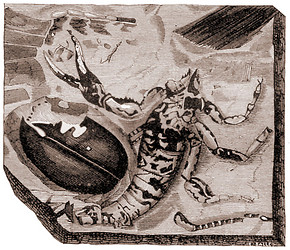

---
aliases:
- Ajarankhu
- Akrep
- Akrepi
- Alakdan
- Alikdana
- Amamatak
- Bọ cạp
- Celedu
- Chayonlar
- Chinyaridi
- Colōtl
- Dabaqaroof
- Dûpişk
- Eferen̄
- escorpião
- escorpión
- Escorpí
- Eskorpioi
- Giat-á
- hɔnklekle
- Japeusaroto
- Je'yulu
- Kala jengking
- Kalajengking
- Kalamangghâ
- Kiék
- Krug
- Kruktutere
- Kunama
- Langir
- Maingoka
- Naŋ
- naŋaa
- Nge
- nyang
- Nɔŋa
- Pɩcɩka
- Qaajjibuu
- scairp
- schorpioenen
- Scoirpion
- scorpion
- Scorpiones
- Scorpionida
- scorpions
- Scurpiuni
- Scurpiòṅ
- Sgorpion
- Sira-sira
- Skerpioen
- Skorpio
- skorpion
- Skorpionai
- skorpionar
- Skorpione
- skorpioner
- Skorpioni
- Skorpionilised
- skorpionit
- Skorpiono
- Skorpiony
- Skorpioonen
- skorpiók
- skorpyon
- Sporðdrekar
- Séigoʼ
- Tiɣirdemt
- Tongo
- þrowend
- Škorpija
- Škorpion
- štipavci
- štíři
- ščipalci
- šťúry
- Əqrəblər
- Σκορπιός
- Каждум
- Къæдздым
- Сарышаяндар
- Саяндар
- скарпіёны
- скорпіони
- Скорпија
- Скорпион
- скорпиони
- Скорпионсем
- скорпионы
- Чаяндар
- Чаяннар
- шкорпије
- կարիճներ
- עקדיש
- עקרבאים
- اقربلر
- بِچھ
- بچھو
- دووپشک
- عقرب
- لړم
- وڇون
- کژدم
- ܥܩܪܒܐ
- ߖߐ߲߭ߞߐ߲߬ߞߐ߲
- बिच्छी
- बिच्छू
- विंचू
- वृश्चिकः
- বৃশ্চিক
- ਬਿੱਛੂ
- વિંછી (પ્રાણી)
- தேள்
- తేలు
- ಚೇಳು, ವೃಶ್ಚಿಕ
- തേൾ
- แมงป่อง
- ကင်းမြီးကောက်
- မႅင်းၵူၼ်ႈငေႃး
- მორიელები
- ጊንጥ
- ᡳᠰᡝᠯᡝᡴᡠ ᡠᠮᡳᠶᠠᡥᠠ
- ᱠᱤᱫᱤᱢ ᱠᱟᱴᱠᱚᱢ
- ᷅̀̀̀̀̀̀̀̀hu᷆rdù
- サソリ
- 剪人蟲
- 蝎子
- 蝎目
- 蠍
- 蠍子
- 蠍目
- 전갈
title: Scorpionida
has_id_wikidata: Q19125
dv_has_:
  name_:
    af: Skerpioen
    am: ጊንጥ
    an: Scorpiones
    ang: þrowend
    ann: Eferen̄
    ar: عقرب
    arc: ܥܩܪܒܐ
    arz: عقرب
    as: বৃশ্চিক
    ast: Scorpiones
    ay: Ajarankhu
    az: Əqrəblər
    azb: اقربلر
    ba: Саяндар
    ban: Celedu
    bar: Scorpiones
    bcl: Amamatak
    be: скарпіёны
    be_tarask: скарпіёны
    bg: скорпиони
    bn: বৃশ্চিক
    br: Krug
    bs: Škorpija
    ca: Escorpí
    cdo: Kiék
    ceb: Alikdana
    ckb: دووپشک
    co: Scorpiones
    cs: štíři
    cv: Скорпионсем
    cy: Sgorpion
    da: skorpion
    dag: Nɔŋa
    de: Skorpione
    de-at: Scorpiones
    de_ch: Scorpiones
    dga: naŋaa
    el: Σκορπιός
    eml: Scurpiòṅ
    en: scorpion
    en_ca: Scorpiones
    en_gb: Scorpiones
    eo: Skorpio
    es: escorpión
    et: Skorpionilised
    eu: Eskorpioi
    fa: کژدم
    fi: skorpionit
    fo: Sporðdrekar
    fon: hɔnklekle
    fr: scorpions
    frp: Scorpiones
    frr: Skorpioonen
    fur: Scorpiones
    ga: scairp
    gan: 剪人蟲
    gd: Scorpiones
    gl: Escorpión
    gn: Japeusaroto
    gsw: Scorpiones
    gu: વિંછી (પ્રાણી)
    guc: Je'yulu
    ha: Kunama
    he: עקרבאים
    hi: बिच्छू
    hr: štipavci
    hu: skorpiók
    hy: կարիճներ
    ia: Scorpiones
    id: Kalajengking
    ie: Scorpiones
    io: Skorpiono
    is: Scorpiones
    it: Scorpiones
    ja: サソリ
    jv: Kalajengking
    ka: მორიელები
    kab: Tiɣirdemt
    kbp: Pɩcɩka
    kcg: nyang
    kg: Scorpiones
    kk: Сарышаяндар
    kn: ಚೇಳು, ವೃಶ್ಚಿಕ
    ko: 전갈
    ks: بِچھ
    ku: Dûpişk
    kus: Naŋ
    kw: skorpyon
    ky: Чаяндар
    la: Scorpiones
    lb: Scorpiones
    lfn: Scorpion
    li: Scorpiones
    lij: Scorpiones
    lt: Skorpionai
    lv: Skorpioni
    lzh: 蠍
    mad: Kalamangghâ
    mcn: ᷅̀̀̀̀̀̀̀̀hu᷆rdù
    mg: Maingoka
    min: Scorpiones
    mk: Скорпија
    ml: തേൾ
    mnc: ᡳᠰᡝᠯᡝᡴᡠ ᡠᠮᡳᠶᠠᡥᠠ
    mr: विंचू
    mrj: Скорпион
    ms: Kala jengking
    mul: Scorpiones
    my: ကင်းမြီးကောက်
    nah: Colōtl
    nan: Giat-á
    nap: Scorpiones
    nb: skorpioner
    nds: Scorpiones
    nds_nl: Scorpiones
    ne: बिच्छी
    nia: Tongo
    nl: schorpioenen
    nn: skorpionar
    nqo: ߖߐ߲߭ߞߐ߲߬ߞߐ߲
    nrm: Scorpiones
    nv: Séigoʼ
    nys: Scorpiones
    oc: Scorpiones
    om: Qaajjibuu
    os: Къæдздым
    pa: ਬਿੱਛੂ
    pcd: Scorpiones
    pl: Skorpiony
    pms: Scorpiones
    pnb: بچھو
    ps: لړم
    pt: escorpião
    pt_br: Scorpiones
    qu: Sira-sira
    rm: Scorpiones
    ro: Scorpion
    ru: скорпионы
    sa: वृश्चिकः
    sat: ᱠᱤᱫᱤᱢ ᱠᱟᱴᱠᱚᱢ
    sc: Scorpiones
    scn: Scurpiuni
    sco: scorpion
    sd: وڇون
    sh: Škorpion
    shn: မႅင်းၵူၼ်ႈငေႃး
    sk: šťúry
    sl: ščipalci
    sn: Chinyaridi
    so: Dabaqaroof
    sq: Akrepi
    sr: шкорпије
    sr_ec: шкорпије
    srn: Kruktutere
    su: Langir
    sv: skorpioner
    sw: Nge
    ta: தேள்
    te: తేలు
    tg: Каждум
    th: แมงป่อง
    tl: Alakdan
    tr: Akrep
    tt: Чаяннар
    uk: скорпіони
    ur: بچھو
    uz: Chayonlar
    vec: Scorpiones
    vi: Bọ cạp
    vls: Scorpiones
    vo: Scorpiones
    wa: Scoirpion
    war: Scorpiones
    wo: Scorpiones
    wuu: 蝎子
    yi: עקדיש
    yue: 蠍子
    zh: 蠍目
    zh_cn: 蝎目
    zh_hans: 蝎目
    zh_hant: 蝎目
    zh_tw: 蠍目
    zu: Scorpiones
---
# [[Scorpionida]]

Scorpions and their extinct relatives 
 

## #has_/text_of_/abstract 

> Scorpions are predatory arachnids of the order Scorpiones. 
> They have eight legs and are easily recognized by a pair of grasping pincers 
> and a narrow, segmented tail, often carried in a characteristic forward curve over the back 
> and always ending with a stinger. 
> 
> The evolutionary history of scorpions goes back 435 million years. 
> They mainly live in deserts but have adapted to a wide range of environmental conditions, 
> and can be found on all continents except Antarctica. 
> There are over 2,500 described species, with 22 extant (living) families recognized to date. 
> Their taxonomy is being revised to account for 21st-century genomic studies.
>
> Scorpions primarily prey on insects and other invertebrates, but some species hunt vertebrates. 
> They use their pincers to restrain and kill prey, or to prevent their own predation. 
> 
> The venomous sting is used for offense and defense. 
> During courtship, the male and female grasp each other's pincers 
> and dance while he tries to move her onto his sperm packet. 
> 
> All known species give live birth and the female cares for the young as their exoskeletons harden, 
> transporting them on her back. 
> The exoskeleton contains fluorescent chemicals and glows under ultraviolet light.
>
> The vast majority of species do not seriously threaten humans, 
> and healthy adults usually do not need medical treatment after a sting. 
> 
> About 25 species (fewer than one percent) have venom capable of killing a human, 
> which happens frequently in the parts of the world where they live, 
> primarily where access to medical treatment is unlikely.
>
> Scorpions appear in art, folklore, mythology, and commercial brands. 
> Scorpion motifs are woven into kilim carpets for protection from their sting. 
> 
> Scorpius is the name of a constellation; the corresponding astrological sign is Scorpio. 
> A classical myth about Scorpius tells how the giant scorpion 
> and its enemy Orion became constellations on opposite sides of the sky.
>
> [Wikipedia](https://en.wikipedia.org/wiki/Scorpion) 

## Phylogeny 

-   « Ancestral Groups  
    -  [Arachnida](../Arachnida.md) 
    -  [Arthropoda](../../../Arthropoda.md) 
    -  [Bilateria](../../../../Bilateria.md) 
    -  [Animals](../../../../../Animals.md) 
    -  [Eukarya](../../../../../../Eukarya.md) 
    -   [Tree of Life](../../../../../../Tree_of_Life.md)

-   ◊ Sibling Groups of  Arachnida
    -  [Solifugae](Solifugae.md) 
    -   [Spider](Spider.md)
    -   [Mite](Mite.md)
    -   Scorpionida

-   » Sub-Groups
    -  [Protoscorpiones](Scorpionida/Protoscorpiones.md) 
    -  [Palaeoscorpiones](Scorpionida/Palaeoscorpiones.md) 
    -   [Scorpion](Scorpionida/Scorpion.md)

## Introduction

[Scott A. Stockwell]()

Scorpions are easily distinguished from other arachnids by their large,
well developed claws (pedipalps) and distinct division of the abdomen
(opisthosoma) into a broad preabdomen (mesosoma) and narrow, tail-like
postabdomen (metasoma). All scorpions possess a poisonous sting (telson)
and a pair of peculiar, comb-like, sensory appendages called pectens.

There about 1100 species of scorpions known worldwide, and probably that
many more still to be discovered. Although they are normally associated
with hot, dry areas like deserts, scorpions are found in a variety of
habitats including cool, wet forests and grasslands.

Scorpions are among the oldest arachnids. The earliest fossils date from
the middle Silurian rocks, over 400 million years old. Early scorpions
had large compound eyes, but were otherwise similar to living forms.

Scorpions are generally large arachnids. Adults range in size from 1.5
cm to 21 cm in length. Some fossil scorpions are thought to have been up
to 1 meter in length! All are predatory. Their prey includes a variety
of arthropods and other invertebrates, and the larger species are known
to prey on small vertebrates.

The scorpion\'s most notorious feature is its poisonous sting. While all
scorpions are venomous, only about twenty species worldwide possess
venom of sufficient toxicity to kill humans.

### Discussion of Phylogenetic Relationships

The phylogeny of the Scorpionida is highly controversial. The
phylogenies shown here and on subsequent pages are based on my
dissertation work (Stockwell 1989). They are provisional, though the
corresponding classification has already been adopted by some fossil
workers (Selden 1993, Jeram 1994). The placement of the Scorpionida is
disputed among workers. The most recent phylogeny (Shultz 1990) places
the Scorpionida as the sister group of the Pseudoscorpiones + Solifugae,
but other workers, including myself, consider the recent scorpions
(Scorpiones) to be the sister group of all other arachnids, or an
altogether separate eurypterid clade. Unfortunately, this will remain
difficult to test due to the lack of resolution in the otherwise
obviously paraphyletic Eurypterida.

In an effort to rectify the fossil and recent classifications of
scorpions, which were hitherto incompatible (Kjellesvig-Waering, 1986),
I proposed to raise the Scorpionida to the rank of class with three
orders, Protoscorpiones, Palaeoscorpiones, and Scorpiones (Stockwell
1989). The strictly phenetic suborders and infraorders of
Kjellesvig-Waering (1986) were largely abandoned.

The fossil group, Protoscorpiones, is not demonstrably monophyletic, but
is included for the sake of completeness and clarity. They possess the
most plesiomorphic, euypterid-like legs and sternocoxal arrangements, as
well as well-develpoed lateral compound eyes. It is possible that these
early scorpions are the actual ancestors of other groups. Geological
range: middle Silurian to lower Devonian.

The fossil group, Palaeoscorpiones, possesses an enlarged prosomal
sternum that completely separates the midcoxae. Their legs are
cylindrical, like those of eurypterids and protoscorpions, but the tarsi
are showing plantigrade features that could be considered land
adaptations. Could the Palaeoscorpiones share a most recent common
ancestor with the non-scorpion arachnids? Geological range: upper
Silurian to middle Carboniferous.

The group Scorpiones encompasses most known scorpions, both fossil and
Recent. All show development of an increasingly sophisticated preoral
chamber comprised of the first and second leg coxae. The reduction of
compound eyes and loss of one pair (and in some extinct groups, two
pair) of pulmonary books (and the corresponding fusion of opisthosomal
sternites), so characteristic of modern scorpions, occurs in this group.
Scorpiones contains a great many fossil specimens that I consider
*incertae sedis*. Some might one day be classified, but most lack
critical characters that could be used to ally them with any group more
inclusive than the Scorpiones. Geological range: lower Devonian to
Recent.

## Title Illustrations

---------------------------------- 
 
scientific_name ::     Cyclophthalmus senior
location ::           Bohemia
Reference            Nicholson, H. A. 1897. Ancient Life-History of the Earth. D. Appleton and Company, New York.
Creator              E. Salle
specimen_condition ::  Fossil \-- Period: Carboniferous

## Confidential Links & Embeds: 

### #is_/same_as :: [[/_Standards/bio/bio~Domain/Eukarya/Animal/Bilateria/Arthropoda/Chelicerata/Arachnida/Scorpionida|Scorpionida]] 

### #is_/same_as :: [[/_public/bio/bio~Domain/Eukarya/Animal/Bilateria/Arthropoda/Chelicerata/Arachnida/Scorpionida.public|Scorpionida.public]] 

### #is_/same_as :: [[/_internal/bio/bio~Domain/Eukarya/Animal/Bilateria/Arthropoda/Chelicerata/Arachnida/Scorpionida.internal|Scorpionida.internal]] 

### #is_/same_as :: [[/_protect/bio/bio~Domain/Eukarya/Animal/Bilateria/Arthropoda/Chelicerata/Arachnida/Scorpionida.protect|Scorpionida.protect]] 

### #is_/same_as :: [[/_private/bio/bio~Domain/Eukarya/Animal/Bilateria/Arthropoda/Chelicerata/Arachnida/Scorpionida.private|Scorpionida.private]] 

### #is_/same_as :: [[/_personal/bio/bio~Domain/Eukarya/Animal/Bilateria/Arthropoda/Chelicerata/Arachnida/Scorpionida.personal|Scorpionida.personal]] 

### #is_/same_as :: [[/_secret/bio/bio~Domain/Eukarya/Animal/Bilateria/Arthropoda/Chelicerata/Arachnida/Scorpionida.secret|Scorpionida.secret]] 

