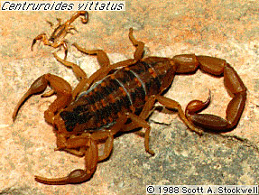

---
aliases:
- Ajarankhu
- Akrep
- Akrepi
- Alakdan
- Alikdana
- Amamatak
- Bọ cạp
- Celedu
- Chayonlar
- Chinyaridi
- Colōtl
- Dabaqaroof
- Dûpişk
- Eferen̄
- escorpião
- escorpión
- Escorpí
- Eskorpioi
- Giat-á
- hɔnklekle
- Japeusaroto
- Je'yulu
- Kala jengking
- Kalajengking
- Kalamangghâ
- Kiék
- Krug
- Kruktutere
- Kunama
- Langir
- Maingoka
- Naŋ
- naŋaa
- Nge
- nyang
- Nɔŋa
- Pɩcɩka
- Qaajjibuu
- scairp
- schorpioenen
- Scoirpion
- Scorpion
- Scorpiones
- Scorpions
- Scurpiuni
- Scurpiòṅ
- Sgorpion
- Sira-sira
- Skerpioen
- Skorpio
- skorpion
- Skorpionai
- skorpionar
- Skorpione
- skorpioner
- Skorpioni
- Skorpionilised
- skorpionit
- Skorpiono
- Skorpiony
- Skorpioonen
- skorpiók
- skorpyon
- Sporðdrekar
- Séigoʼ
- Tiɣirdemt
- Tongo
- þrowend
- Škorpija
- Škorpion
- štipavci
- štíři
- ščipalci
- šťúry
- Əqrəblər
- Σκορπιός
- Каждум
- Къæдздым
- Сарышаяндар
- Саяндар
- скарпіёны
- скорпіон
- скорпіони
- Скорпија
- Скорпион
- скорпиони
- Скорпионсем
- скорпионы
- Чаяндар
- Чаяннар
- шкорпије
- կարիճներ
- עקדיש
- עקרבאים
- اقربلر
- بِچھ
- بچھو
- دووپشک
- عقرب
- لړم
- وڇون
- کژدم
- ܥܩܪܒܐ
- ߖߐ߲߭ߞߐ߲߬ߞߐ߲
- बिच्छी
- बिच्छू
- विंचू
- वृश्चिकः
- বৃশ্চিক
- ਬਿੱਛੂ
- વિંછી (પ્રાણી)
- தேள்
- తేలు
- ಚೇಳು, ವೃಶ್ಚಿಕ
- തേൾ
- แมงป่อง
- ကင်းမြီးကောက်
- မႅင်းၵူၼ်ႈငေႃး
- მორიელები
- ጊንጥ
- ᡳᠰᡝᠯᡝᡴᡠ ᡠᠮᡳᠶᠠᡥᠠ
- ᱠᱤᱫᱤᱢ ᱠᱟᱴᱠᱚᱢ
- ᷅̀̀̀̀̀̀̀̀hu᷆rdù
- サソリ
- 剪人蟲
- 蝎子
- 蝎目
- 蠍
- 蠍子
- 蠍目
- 전갈
has_id_wikidata: Q19125
Commons_category: Scorpiones
Commons_gallery: Scorpion
described_by_source:
- '[[../../../../../../../../../WikiData/WD~Brockhaus_and_Efron_Encyclopedic_Dictionary,602358|WD~Brockhaus_and_Efron_Encyclopedic_Dictionary,602358]]'
- '[[_Standards/WikiData/WD~Encyclopædia_Britannica_11th_edition,867541|WD~Encyclopædia_Britannica_11th_edition,867541]]'
- '[[_Standards/WikiData/WD~Gujin_Tushu_Jicheng,1768721|WD~Gujin_Tushu_Jicheng,1768721]]'
- '[[_Standards/WikiData/WD~Bible_Encyclopedia_of_Archimandrite_Nicephorus,4086271|WD~Bible_Encyclopedia_of_Archimandrite_Nicephorus,4086271]]'
- '[[_Standards/WikiData/WD~Jewish_Encyclopedia_of_Brockhaus_and_Efron,4173137|WD~Jewish_Encyclopedia_of_Brockhaus_and_Efron,4173137]]'
- '[[_Standards/WikiData/WD~Small_Brockhaus_and_Efron_Encyclopedic_Dictionary,19180675|WD~Small_Brockhaus_and_Efron_Encyclopedic_Dictionary,19180675]]'
- '[[_Standards/WikiData/WD~Desktop_Encyclopedic_Dictionary,63284758|WD~Desktop_Encyclopedic_Dictionary,63284758]]'
- '[[_Standards/WikiData/WD~Metropolitan_Museum_of_Art_Tagging_Vocabulary,106727050|WD~Metropolitan_Museum_of_Art_Tagging_Vocabulary,106727050]]'
- '[[_Standards/WikiData/WD~Armenian_Soviet_Encyclopedia,_vol._5,124737632|WD~Armenian_Soviet_Encyclopedia,_vol._5,124737632]]'
EPPO_Code: 1SCORO
image:
- http://commons.wikimedia.org/wiki/Special:FilePath/Asian%20forest%20scorpion%20in%20Khao%20Yai%20National%20Park.JPG
- http://commons.wikimedia.org/wiki/Special:FilePath/Black%20scorpion.jpg
instance_of: '[[_Standards/WikiData/WD~taxon,16521|WD~taxon,16521]]'
ITIS_TSN: 82713
MeSH_tree_code: B01.050.500.131.166.661
NBN_System_Key: NHMSYS0000923534
OmegaWiki_Defined_Meaning: 636601
parent_taxon: '[[_Standards/WikiData/WD~Arachnopulmonata,80024044|WD~Arachnopulmonata,80024044]]'
pronunciation_audio:
- http://commons.wikimedia.org/wiki/Special:FilePath/LL-Q33070%20%28ban%29-Carma%20citrawati-Celedu.wav
- http://commons.wikimedia.org/wiki/Special:FilePath/Q19125-ar.ogg
start_time: -435000000-01-01
studied_by: '[[_Standards/WikiData/WD~scorpiology,94579930|WD~scorpiology,94579930]]'
taxon_common_name:
- skorpioner
- Scorpions
- ščipalci
- скорпіон
taxon_name: Scorpiones
taxon_rank: '[[_Standards/WikiData/WD~order,36602|WD~order,36602]]'
this_taxon_is_source_of: '[[_Standards/WikiData/WD~scorpion_as_food,124746868|WD~scorpion_as_food,124746868]]'
title: Scorpiones
UMLS_CUI: C0036451
Unicode_character: "\U0001F982"
WordLift_URL: http://data.medicalrecords.com/medicalrecords/healthwise/scorpion
dv_has_:
  name_:
    af: Skerpioen
    am: ጊንጥ
    an: Scorpiones
    ang: þrowend
    ann: Eferen̄
    ar: عقرب
    arc: ܥܩܪܒܐ
    arz: عقرب
    as: বৃশ্চিক
    ast: Scorpiones
    ay: Ajarankhu
    az: Əqrəblər
    azb: اقربلر
    ba: Саяндар
    ban: Celedu
    bar: Scorpiones
    bcl: Amamatak
    be: скарпіёны
    be_tarask: скарпіёны
    bg: скорпиони
    bn: বৃশ্চিক
    br: Krug
    bs: Škorpija
    ca: Escorpí
    cdo: Kiék
    ceb: Alikdana
    ckb: دووپشک
    co: Scorpiones
    cs: štíři
    cv: Скорпионсем
    cy: Sgorpion
    da: skorpion
    dag: Nɔŋa
    de: Skorpione
    de-at: Scorpiones
    de_ch: Scorpiones
    dga: naŋaa
    el: Σκορπιός
    eml: Scurpiòṅ
    en: scorpion
    en_ca: Scorpiones
    en_gb: Scorpiones
    eo: Skorpio
    es: escorpión
    et: Skorpionilised
    eu: Eskorpioi
    fa: کژدم
    fi: skorpionit
    fo: Sporðdrekar
    fon: hɔnklekle
    fr: scorpions
    frp: Scorpiones
    frr: Skorpioonen
    fur: Scorpiones
    ga: scairp
    gan: 剪人蟲
    gd: Scorpiones
    gl: Escorpión
    gn: Japeusaroto
    gsw: Scorpiones
    gu: વિંછી (પ્રાણી)
    guc: Je'yulu
    ha: Kunama
    he: עקרבאים
    hi: बिच्छू
    hr: štipavci
    hu: skorpiók
    hy: կարիճներ
    ia: Scorpiones
    id: Kalajengking
    ie: Scorpiones
    io: Skorpiono
    is: Scorpiones
    it: Scorpiones
    ja: サソリ
    jv: Kalajengking
    ka: მორიელები
    kab: Tiɣirdemt
    kbp: Pɩcɩka
    kcg: nyang
    kg: Scorpiones
    kk: Сарышаяндар
    kn: ಚೇಳು, ವೃಶ್ಚಿಕ
    ko: 전갈
    ks: بِچھ
    ku: Dûpişk
    kus: Naŋ
    kw: skorpyon
    ky: Чаяндар
    la: Scorpiones
    lb: Scorpiones
    lfn: Scorpion
    li: Scorpiones
    lij: Scorpiones
    lt: Skorpionai
    lv: Skorpioni
    lzh: 蠍
    mad: Kalamangghâ
    mcn: ᷅̀̀̀̀̀̀̀̀hu᷆rdù
    mg: Maingoka
    min: Scorpiones
    mk: Скорпија
    ml: തേൾ
    mnc: ᡳᠰᡝᠯᡝᡴᡠ ᡠᠮᡳᠶᠠᡥᠠ
    mr: विंचू
    mrj: Скорпион
    ms: Kala jengking
    mul: Scorpiones
    my: ကင်းမြီးကောက်
    nah: Colōtl
    nan: Giat-á
    nap: Scorpiones
    nb: skorpioner
    nds: Scorpiones
    nds_nl: Scorpiones
    ne: बिच्छी
    nia: Tongo
    nl: schorpioenen
    nn: skorpionar
    nqo: ߖߐ߲߭ߞߐ߲߬ߞߐ߲
    nrm: Scorpiones
    nv: Séigoʼ
    nys: Scorpiones
    oc: Scorpiones
    om: Qaajjibuu
    os: Къæдздым
    pa: ਬਿੱਛੂ
    pcd: Scorpiones
    pl: Skorpiony
    pms: Scorpiones
    pnb: بچھو
    ps: لړم
    pt: escorpião
    pt_br: Scorpiones
    qu: Sira-sira
    rm: Scorpiones
    ro: Scorpion
    ru: скорпионы
    sa: वृश्चिकः
    sat: ᱠᱤᱫᱤᱢ ᱠᱟᱴᱠᱚᱢ
    sc: Scorpiones
    scn: Scurpiuni
    sco: scorpion
    sd: وڇون
    sh: Škorpion
    shn: မႅင်းၵူၼ်ႈငေႃး
    sk: šťúry
    sl: ščipalci
    sn: Chinyaridi
    so: Dabaqaroof
    sq: Akrepi
    sr: шкорпије
    sr_ec: шкорпије
    srn: Kruktutere
    su: Langir
    sv: skorpioner
    sw: Nge
    ta: தேள்
    te: తేలు
    tg: Каждум
    th: แมงป่อง
    tl: Alakdan
    tr: Akrep
    tt: Чаяннар
    uk: скорпіони
    ur: بچھو
    uz: Chayonlar
    vec: Scorpiones
    vi: Bọ cạp
    vls: Scorpiones
    vo: Scorpiones
    wa: Scoirpion
    war: Scorpiones
    wo: Scorpiones
    wuu: 蝎子
    yi: עקדיש
    yue: 蠍子
    zh: 蠍目
    zh_cn: 蝎目
    zh_hans: 蝎目
    zh_hant: 蝎目
    zh_tw: 蠍目
    zu: Scorpiones
---

# [[Scorpion]] 🦂 

#is_/same_as :: [[../../../../../../../../../WikiData/WD~Scorpion,19125|WD~Scorpion,19125]] 

## #has_/text_of_/abstract 

> **Scorpion**s are predatory arachnids of the order Scorpiones. 
> They have eight legs and are easily recognized by a pair of grasping pincers 
> and a narrow, segmented tail, often carried in a characteristic forward curve over the back 
> and always ending with a stinger. 
> 
> The evolutionary history of scorpions goes back 435 million years. They mainly live in deserts but have adapted to a wide range of environmental conditions, and can be found on all continents except Antarctica. There are over 2,500 described species, with 22 extant (living) families recognized to date. Their taxonomy is being revised to account for 21st-century genomic studies.
>
> Scorpions primarily prey on insects and other invertebrates, but some species hunt vertebrates. They use their pincers to restrain and kill prey, or to prevent their own predation. The venomous sting is used for offense and defense. During courtship, the male and female grasp each other's pincers and dance while he tries to move her onto his sperm packet. All known species give live birth and the female cares for the young as their exoskeletons harden, transporting them on her back. The exoskeleton contains fluorescent chemicals and glows under ultraviolet light.
>
> The vast majority of species do not seriously threaten humans, and healthy adults usually do not need medical treatment after a sting. About 25 species (fewer than one percent) have venom capable of killing a human, which happens frequently in the parts of the world where they live, primarily where access to medical treatment is unlikely.
>
> Scorpions appear in art, folklore, mythology, and commercial brands. Scorpion motifs are woven into kilim carpets for protection from their sting. Scorpius is the name of a constellation; the corresponding astrological sign is Scorpio. A classical myth about Scorpius tells how the giant scorpion and its enemy Orion became constellations on opposite sides of the sky.
>
> [Wikipedia](https://en.wikipedia.org/wiki/Scorpion) 

## Phylogeny 

-   « Ancestral Groups  
    -  [Scorpionida](../Scorpionida.md) 
    -  [Arachnida](../../Arachnida.md) 
    -  [Arthropoda](../../../../Arthropoda.md) 
    -  [Bilateria](../../../../../Bilateria.md) 
    -  [Animals](../../../../../../Animals.md) 
    -  [Eukarya](../../../../../../../Eukarya.md) 
    -   [Tree of Life](../../../../../../../Tree_of_Life.md)

-   ◊ Sibling Groups of  Scorpionida
    -  [Protoscorpiones](Protoscorpiones.md) 
    -  [Palaeoscorpiones](Palaeoscorpiones.md) 
    -   Scorpiones

-   » Sub-Groups
    -  [Buthoidea](Scorpion/Buthoidea.md) 
    -  [Chactoidea](Scorpion/Chactoidea.md) 
    -  [Scorpionoidea](Scorpion/Scorpionoidea.md) 
    -  [Vaejovoidea](Scorpion/Vaejovoidea.md) 

## Title Illustrations

----------
Centruroides vittatus (Buthoidea).\
Photograph copyright © Scott A. Stockwell.
 
copyright ::   © 1988 Scott A. Stockwell

## Confidential Links & Embeds: 

### #is_/same_as :: [[/_Standards/bio/bio~Domain/Eukarya/Animal/Bilateria/Arthropoda/Chelicerata/Arachnida/Scorpionida/Scorpion|Scorpion]] 

### #is_/same_as :: [[/_public/bio/bio~Domain/Eukarya/Animal/Bilateria/Arthropoda/Chelicerata/Arachnida/Scorpionida/Scorpion.public|Scorpion.public]] 

### #is_/same_as :: [[/_internal/bio/bio~Domain/Eukarya/Animal/Bilateria/Arthropoda/Chelicerata/Arachnida/Scorpionida/Scorpion.internal|Scorpion.internal]] 

### #is_/same_as :: [[/_protect/bio/bio~Domain/Eukarya/Animal/Bilateria/Arthropoda/Chelicerata/Arachnida/Scorpionida/Scorpion.protect|Scorpion.protect]] 

### #is_/same_as :: [[/_private/bio/bio~Domain/Eukarya/Animal/Bilateria/Arthropoda/Chelicerata/Arachnida/Scorpionida/Scorpion.private|Scorpion.private]] 

### #is_/same_as :: [[/_personal/bio/bio~Domain/Eukarya/Animal/Bilateria/Arthropoda/Chelicerata/Arachnida/Scorpionida/Scorpion.personal|Scorpion.personal]] 

### #is_/same_as :: [[/_secret/bio/bio~Domain/Eukarya/Animal/Bilateria/Arthropoda/Chelicerata/Arachnida/Scorpionida/Scorpion.secret|Scorpion.secret]] 

