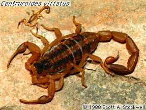

---
aliases:
  - Buthoidea
title: Buthoidea
---

# Buthoidea 

### Information on the Internet

-   The [Scorpion     Emporium](http://wrbu.si.edu/www/stockwell/emporium/emporium.html)

## Phylogeny 

-   « Ancestral Groups  
    -   [Scorpion](../Scorpion.md)
    -  [Scorpionida](../../Scorpionida.md) 
    -  [Arachnida](../../../Arachnida.md) 
    -  [Arthropoda](../../../../../Arthropoda.md) 
    -  [Bilateria](../../../../../../Bilateria.md) 
    -  [Animals](../../../../../../../Animals.md) 
    -  [Eukarya](../../../../../../../../Eukarya.md) 
    -   [Tree of Life](../../../../../../../../Tree_of_Life.md)

-   ◊ Sibling Groups of  Scorpiones
    -   Buthoidea
    -   [Chactoidea](Chactoidea.md)
    -   [Scorpionoidea](Scorpionoidea.md)
    -   [Vaejovoidea](Vaejovoidea.md)

-   » Sub-Groups
    -   [Buthidae](Buthoidea/Buthidae.md)
    -   [Chaerilus](Chaerilus)
	-   *[Buthidae](Buthoidea/Buthidae.md "go to ToL page")*
	-   *[Chaerilidae](Chaerilus)*

## Title Illustrations

Centruroides vittatus (Buthidae).\
Photograph copyright © Scott A. Stockwell.

----------

copyright ::   © 1988 Scott A. Stockwell

## Confidential Links & Embeds: 

### #is_/same_as :: [[/_Standards/bio/bio~Domain/Eukarya/Animal/Bilateria/Arthropoda/Chelicerata/Arachnida/Scorpionida/Scorpion/Buthoidea|Buthoidea]] 

### #is_/same_as :: [[/_public/bio/bio~Domain/Eukarya/Animal/Bilateria/Arthropoda/Chelicerata/Arachnida/Scorpionida/Scorpion/Buthoidea.public|Buthoidea.public]] 

### #is_/same_as :: [[/_internal/bio/bio~Domain/Eukarya/Animal/Bilateria/Arthropoda/Chelicerata/Arachnida/Scorpionida/Scorpion/Buthoidea.internal|Buthoidea.internal]] 

### #is_/same_as :: [[/_protect/bio/bio~Domain/Eukarya/Animal/Bilateria/Arthropoda/Chelicerata/Arachnida/Scorpionida/Scorpion/Buthoidea.protect|Buthoidea.protect]] 

### #is_/same_as :: [[/_private/bio/bio~Domain/Eukarya/Animal/Bilateria/Arthropoda/Chelicerata/Arachnida/Scorpionida/Scorpion/Buthoidea.private|Buthoidea.private]] 

### #is_/same_as :: [[/_personal/bio/bio~Domain/Eukarya/Animal/Bilateria/Arthropoda/Chelicerata/Arachnida/Scorpionida/Scorpion/Buthoidea.personal|Buthoidea.personal]] 

### #is_/same_as :: [[/_secret/bio/bio~Domain/Eukarya/Animal/Bilateria/Arthropoda/Chelicerata/Arachnida/Scorpionida/Scorpion/Buthoidea.secret|Buthoidea.secret]] 

