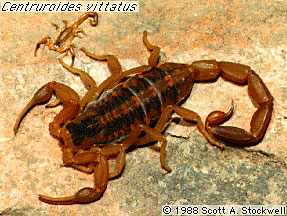

---
aliases:
  - Buthidae
title: Buthidae
---

## Phylogeny 

-   « Ancestral Groups  
    -   [Buthoidea](../Buthoidea.md)
    -   [Scorpion](../../Scorpion.md)
    -  [Scorpionida](../../../Scorpionida.md) 
    -  [Arachnida](../../../../Arachnida.md) 
    -  [Arthropoda](../../../../../../Arthropoda.md) 
    -  [Bilateria](../../../../../../../Bilateria.md) 
    -  [Animals](../../../../../../../../Animals.md) 
    -  [Eukarya](../../../../../../../../../Eukarya.md) 
    -   [Tree of Life](../../../../../../../../../Tree_of_Life.md)

-   ◊ Sibling Groups of  Buthoidea
    -   Buthidae
    -   [Chaerilus](Chaerilus)

-   » Sub-Groups 
	-   *Akentrobuthus*
	-   *Alayotityus*
	-   *Ananteris*
	-   *Androctonus*
	-   *Anomalobuthus*
	-   *Apistobuthus*
	-   *Babycurus*
	-   *Birulatus*
	-   *Buthacus*
	-   *Butheolus*
	-   *Butheoloides*
	-   *Buthiscus*
	-   *Buthus*
	-   *Centruroides*
	-   *Charmus*
	-   *Cicielus*
	-   *Compsobuthus*
	-   *Darchenia*
	-   *Grosphus*
	-   *Hemibuthus*
	-   *Hoplocystis*
	-   *Hottentotta*
	-   *Isometrus*
	-   *Isometroides*
	-   *Karasbergia*
	-   *Kraepelinia*
	-   *Leiurus*
	-   *Liobuthus*
	-   *Lissothus*
	-   *Lychas*
	-   *Lychasoides*
	-   *Mesobuthus*
	-   *Mesotityus*
	-   *Microbuthus*
	-   *Microtityus*
	-   *Odontobuthus*
	-   *Odonturus*
	-   *Orthochirus*
	-   *Parabuthus*
	-   *Pocockius*
	-   *Pseudolychas*
	-   *Psammobuthus*
	-   *Rhopalurus*
	-   *Tityobuthus*
	-   *Tityopsis*
	-   *Tityus*
	-   *Uroplectes*
	-   *Vachoniolus*
	-   *Vachonus*
	-   *Zabius*

# Buthidae 

### Information on the Internet

-   The [Scorpion     Emporium](http://wrbu.si.edu/www/stockwell/emporium/emporium.html)

## Title Illustrations

----------
Centruroides vittatus. Photograph copyright © Scott A. Stockwell.
)
Copyright ::   © 1988 Scott A. Stockwell

## Confidential Links & Embeds: 

### #is_/same_as :: [Buthidae](/_Standards/bio/bio~Domain/Eukarya/Animal/Bilateria/Arthropoda/Chelicerata/Arachnida/Scorpionida/Scorpion/Buthoidea/Buthidae.md) 

### #is_/same_as :: [Buthidae.public](/_public/bio/bio~Domain/Eukarya/Animal/Bilateria/Arthropoda/Chelicerata/Arachnida/Scorpionida/Scorpion/Buthoidea/Buthidae.public.md) 

### #is_/same_as :: [Buthidae.internal](/_internal/bio/bio~Domain/Eukarya/Animal/Bilateria/Arthropoda/Chelicerata/Arachnida/Scorpionida/Scorpion/Buthoidea/Buthidae.internal.md) 

### #is_/same_as :: [Buthidae.protect](/_protect/bio/bio~Domain/Eukarya/Animal/Bilateria/Arthropoda/Chelicerata/Arachnida/Scorpionida/Scorpion/Buthoidea/Buthidae.protect.md) 

### #is_/same_as :: [Buthidae.private](/_private/bio/bio~Domain/Eukarya/Animal/Bilateria/Arthropoda/Chelicerata/Arachnida/Scorpionida/Scorpion/Buthoidea/Buthidae.private.md) 

### #is_/same_as :: [Buthidae.personal](/_personal/bio/bio~Domain/Eukarya/Animal/Bilateria/Arthropoda/Chelicerata/Arachnida/Scorpionida/Scorpion/Buthoidea/Buthidae.personal.md) 

### #is_/same_as :: [Buthidae.secret](/_secret/bio/bio~Domain/Eukarya/Animal/Bilateria/Arthropoda/Chelicerata/Arachnida/Scorpionida/Scorpion/Buthoidea/Buthidae.secret.md)

