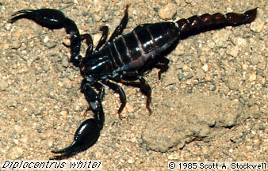

---
aliases:
  - Diplocentridae
title: Diplocentridae
---

# [[Diplocentridae]] 

 

## #has_/text_of_/abstract 

> **Diplocentridae** is a family of scorpions. 
> 
> The roughly 120 species are mostly native to the New World, 
> except for genus Nebo, which is distributed in the Middle East.
>
> A 2003 study suggests that this family is better treated as a subfamily of the Scorpionidae.
>
> Taxa include:
> - Subfamily Diplocentrinae Karsch, 1880
> - Bioculus Stahnke, 1968
> - Cazierius Francke, 1978
> - Didymocentrus Kraepelin, 1905
> - Diplocentrus Peters, 1861
> - Heteronebo Pocock, 1899
> - Kolotl Santibáñez-López, et al., 2014
> - Oiclus Simon, 1880
> - Tarsoporosus Francke, 1978
> - Subfamily Nebinae Kraepelin, 1905
> - Nebo Simon, 1878
>
> [Wikipedia](https://en.wikipedia.org/wiki/Diplocentridae) 

### Information on the Internet

-   The [Scorpion     Emporium](http://wrbu.si.edu/www/stockwell/emporium/emporium.html)

## Phylogeny 

-   « Ancestral Groups  
    -   [Scorpionoidea](../Scorpionoidea.md)
    -   [Scorpion](../../Scorpion.md)
    -  [Scorpionida](../../../Scorpionida.md) 
    -  [Arachnida](../../../../Arachnida.md) 
    -  [Arthropoda](../../../../../../Arthropoda.md) 
    -  [Bilateria](../../../../../../../Bilateria.md) 
    -  [Animals](../../../../../../../../Animals.md) 
    -  [Eukarya](../../../../../../../../../Eukarya.md) 
    -   [Tree of Life](../../../../../../../../../Tree_of_Life.md)

-   ◊ Sibling Groups of  Scorpionoidea
    -   [Scorpionidae](Scorpionidae.md)
    -   Diplocentridae
    -   [Ischnuridae](Ischnuridae.md)
    -   [Bothriuridae](Bothriuridae.md)

-   » Sub-Groups 

## Title Illustrations

----------
Diplocentrus whitei.
Photograph copyright © 1985, Scott A. Stockwell.)
Copyright ::   © 1985 Scott A. Stockwell

## Confidential Links & Embeds: 

### #is_/same_as :: [Diplocentridae](/_Standards/bio/bio~Domain/Eukarya/Animal/Bilateria/Arthropoda/Chelicerata/Arachnida/Scorpionida/Scorpion/Scorpionoidea/Diplocentridae.md) 

### #is_/same_as :: [Diplocentridae.public](/_public/bio/bio~Domain/Eukarya/Animal/Bilateria/Arthropoda/Chelicerata/Arachnida/Scorpionida/Scorpion/Scorpionoidea/Diplocentridae.public.md) 

### #is_/same_as :: [Diplocentridae.internal](/_internal/bio/bio~Domain/Eukarya/Animal/Bilateria/Arthropoda/Chelicerata/Arachnida/Scorpionida/Scorpion/Scorpionoidea/Diplocentridae.internal.md) 

### #is_/same_as :: [Diplocentridae.protect](/_protect/bio/bio~Domain/Eukarya/Animal/Bilateria/Arthropoda/Chelicerata/Arachnida/Scorpionida/Scorpion/Scorpionoidea/Diplocentridae.protect.md) 

### #is_/same_as :: [Diplocentridae.private](/_private/bio/bio~Domain/Eukarya/Animal/Bilateria/Arthropoda/Chelicerata/Arachnida/Scorpionida/Scorpion/Scorpionoidea/Diplocentridae.private.md) 

### #is_/same_as :: [Diplocentridae.personal](/_personal/bio/bio~Domain/Eukarya/Animal/Bilateria/Arthropoda/Chelicerata/Arachnida/Scorpionida/Scorpion/Scorpionoidea/Diplocentridae.personal.md) 

### #is_/same_as :: [Diplocentridae.secret](/_secret/bio/bio~Domain/Eukarya/Animal/Bilateria/Arthropoda/Chelicerata/Arachnida/Scorpionida/Scorpion/Scorpionoidea/Diplocentridae.secret.md)

