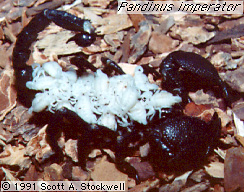

---
aliases:
  - Scorpionidae
title: Scorpionidae
has_id_wikidata: Q133410
---
# Scorpionidae 

 

## #has_/text_of_/abstract 

> **Scorpionidae** is a family of burrowing scorpions 
> or pale-legged scorpions in the superfamily Scorpionoidea. 
> 
> The family was established by Pierre André Latreille, 1802.
>
> [Wikipedia](https://en.wikipedia.org/wiki/Scorpionidae) 

### Information on the Internet

-   The [Scorpion     Emporium](http://wrbu.si.edu/www/stockwell/emporium/emporium.html)

## Phylogeny 

-   « Ancestral Groups  
    -   [Scorpionoidea](../Scorpionoidea.md)
    -   [Scorpion](../../Scorpion.md)
    -  [Scorpionida](../../../Scorpionida.md) 
    -  [Arachnida](../../../../Arachnida.md) 
    -  [Arthropoda](../../../../../../Arthropoda.md) 
    -  [Bilateria](../../../../../../../Bilateria.md) 
    -  [Animals](../../../../../../../../Animals.md) 
    -  [Eukarya](../../../../../../../../../Eukarya.md) 
    -   [Tree of Life](../../../../../../../../../Tree_of_Life.md)

-   ◊ Sibling Groups of  Scorpionoidea
    -   Scorpionidae
    -   [Diplocentridae](Diplocentridae.md)
    -   [Ischnuridae](Ischnuridae.md)
    -   [Bothriuridae](Bothriuridae.md)

-   » Sub-Groups 

## Title Illustrations

----------
Pandinus imperator.
Photograph copyright © 1991, Scott A. Stockwell.)
copyright ::   © 1991 Scott A. Stockwell

## Confidential Links & Embeds: 

### #is_/same_as :: [[/_Standards/bio/bio~Domain/Eukarya/Animal/Bilateria/Arthropoda/Chelicerata/Arachnida/Scorpionida/Scorpion/Scorpionoidea/Scorpionidae|Scorpionidae]] 

### #is_/same_as :: [[/_public/bio/bio~Domain/Eukarya/Animal/Bilateria/Arthropoda/Chelicerata/Arachnida/Scorpionida/Scorpion/Scorpionoidea/Scorpionidae.public|Scorpionidae.public]] 

### #is_/same_as :: [[/_internal/bio/bio~Domain/Eukarya/Animal/Bilateria/Arthropoda/Chelicerata/Arachnida/Scorpionida/Scorpion/Scorpionoidea/Scorpionidae.internal|Scorpionidae.internal]] 

### #is_/same_as :: [[/_protect/bio/bio~Domain/Eukarya/Animal/Bilateria/Arthropoda/Chelicerata/Arachnida/Scorpionida/Scorpion/Scorpionoidea/Scorpionidae.protect|Scorpionidae.protect]] 

### #is_/same_as :: [[/_private/bio/bio~Domain/Eukarya/Animal/Bilateria/Arthropoda/Chelicerata/Arachnida/Scorpionida/Scorpion/Scorpionoidea/Scorpionidae.private|Scorpionidae.private]] 

### #is_/same_as :: [[/_personal/bio/bio~Domain/Eukarya/Animal/Bilateria/Arthropoda/Chelicerata/Arachnida/Scorpionida/Scorpion/Scorpionoidea/Scorpionidae.personal|Scorpionidae.personal]] 

### #is_/same_as :: [[/_secret/bio/bio~Domain/Eukarya/Animal/Bilateria/Arthropoda/Chelicerata/Arachnida/Scorpionida/Scorpion/Scorpionoidea/Scorpionidae.secret|Scorpionidae.secret]] 

