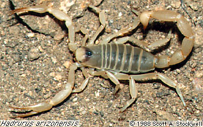

---
aliases:
- Iuridae
- ايريدى
- 毒尾蝎科
title: Iuridae
has_id_wikidata: Q140687
dv_has_:
  name_:
    an: Iuridae
    arz: ايريدى
    ast: Iuridae
    bg: Iuridae
    ca: Iuridae
    ceb: Iuridae
    de: Iuridae
    en: Iuridae
    eo: Iuridae
    es: Iuridae
    eu: Iuridae
    ext: Iuridae
    fi: Iuridae
    fr: Iuridae
    ga: Iuridae
    gl: Iuridae
    ia: Iuridae
    ie: Iuridae
    io: Iuridae
    it: Iuridae
    la: Iuridae
    mul: Iuridae
    nb: Iuridae
    nl: Iuridae
    oc: Iuridae
    pl: Iuridae
    pt: Iuridae
    pt-br: Iuridae
    ro: Iuridae
    ru: Iuridae
    sq: Iuridae
    tr: Iuridae
    uk: Iuridae
    vi: Iuridae
    vo: Iuridae
    war: Iuridae
    zh: 毒尾蝎科
    zh-cn: 毒尾蝎科
    zh-hans: 毒尾蝎科
    zh-tw: 毒尾蝎科
---
# [[Iuridae]] 

 

## #has_/text_of_/abstract 

> The **Iuridae** are a family of scorpions. 
> Six genera and at least 20 described species are placed in the Iuridae.
>
> [Wikipedia](https://en.wikipedia.org/wiki/Iuridae) 
> 
### Information on the Internet

-   The [Scorpion     Emporium](http://wrbu.si.edu/www/stockwell/emporium/emporium.html)

## Phylogeny 

-   « Ancestral Groups  
    -   [Vaejovoidea](../Vaejovoidea.md)
    -   [Scorpion](../../Scorpion.md)
    -  [Scorpionida](../../../Scorpionida.md) 
    -  [Arachnida](../../../../Arachnida.md) 
    -  [Arthropoda](../../../../../../Arthropoda.md) 
    -  [Bilateria](../../../../../../../Bilateria.md) 
    -  [Animals](../../../../../../../../Animals.md) 
    -  [Eukarya](../../../../../../../../../Eukarya.md) 
    -   [Tree of Life](../../../../../../../../../Tree_of_Life.md)

-   ◊ Sibling Groups of  Vaejovoidea
    -   [Vaejovidae](Vaejovidae.md)
    -   Iuridae
    -   [Superstitionidae](Superstitionidae.md)

-   » Sub-Groups 

## Title Illustrations

----------
Hadrurus arizonensis.
Copyright © 1988, Scott A. Stockwell.
 
copyright ::   © 1988 Scott A. Stockwell

## Confidential Links & Embeds: 

### #is_/same_as :: [[/_Standards/bio/bio~Domain/Eukarya/Animal/Bilateria/Arthropoda/Chelicerata/Arachnida/Scorpionida/Scorpion/Vaejovoidea/Iuridae|Iuridae]] 

### #is_/same_as :: [[/_public/bio/bio~Domain/Eukarya/Animal/Bilateria/Arthropoda/Chelicerata/Arachnida/Scorpionida/Scorpion/Vaejovoidea/Iuridae.public|Iuridae.public]] 

### #is_/same_as :: [[/_internal/bio/bio~Domain/Eukarya/Animal/Bilateria/Arthropoda/Chelicerata/Arachnida/Scorpionida/Scorpion/Vaejovoidea/Iuridae.internal|Iuridae.internal]] 

### #is_/same_as :: [[/_protect/bio/bio~Domain/Eukarya/Animal/Bilateria/Arthropoda/Chelicerata/Arachnida/Scorpionida/Scorpion/Vaejovoidea/Iuridae.protect|Iuridae.protect]] 

### #is_/same_as :: [[/_private/bio/bio~Domain/Eukarya/Animal/Bilateria/Arthropoda/Chelicerata/Arachnida/Scorpionida/Scorpion/Vaejovoidea/Iuridae.private|Iuridae.private]] 

### #is_/same_as :: [[/_personal/bio/bio~Domain/Eukarya/Animal/Bilateria/Arthropoda/Chelicerata/Arachnida/Scorpionida/Scorpion/Vaejovoidea/Iuridae.personal|Iuridae.personal]] 

### #is_/same_as :: [[/_secret/bio/bio~Domain/Eukarya/Animal/Bilateria/Arthropoda/Chelicerata/Arachnida/Scorpionida/Scorpion/Vaejovoidea/Iuridae.secret|Iuridae.secret]] 

