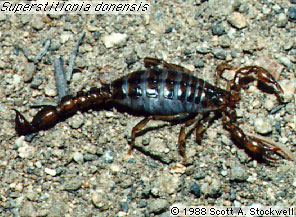

---
aliases:
  - Superstitionidae
title: Superstitionidae
has_id_wikidata: Q16948489
---
## Phylogeny 

-   « Ancestral Groups  
    -   [Vaejovoidea](../Vaejovoidea.md)
    -   [Scorpion](../../Scorpion.md)
    -  [Scorpionida](../../../Scorpionida.md) 
    -  [Arachnida](../../../../Arachnida.md) 
    -  [Arthropoda](../../../../../../Arthropoda.md) 
    -  [Bilateria](../../../../../../../Bilateria.md) 
    -  [Animals](../../../../../../../../Animals.md) 
    -  [Eukarya](../../../../../../../../../Eukarya.md) 
    -   [Tree of Life](../../../../../../../../../Tree_of_Life.md)

-   ◊ Sibling Groups of  Vaejovoidea
    -   [Vaejovidae](Vaejovidae.md)
    -   [Iuridae](Iuridae.md)
    -   Superstitionidae

-   » Sub-Groups 

# [[Superstitionidae]] 

## #has_/text_of_/abstract 

> Superstitionia donensis is a species of scorpion, the only species in the genus Superstitionia and the family Superstitioniidae.
>
> This species was discovered in Arizona in 1940 by H.L Stahnke and predominately is found in western New Mexico, Arizona, extreme southern Nevada, and southern California in the United States. It is also found in Baja California, Baja California Sur, and Sonora in Mexico.
>
> The genus name refers to the Superstition Mountains where the species was first discovered. S. donensis is normally found living in mountain terrain and under rocks or near plants in desert terrain.
>
> [Wikipedia](https://en.wikipedia.org/wiki/Superstitionia) 

### Information on the Internet

-   The [Scorpion     Emporium](http://wrbu.si.edu/www/stockwell/emporium/emporium.html)

## Title Illustrations

----------
Superstitionia donensis.
Photograph copyright © 1988, Scott A. Stockwell.)
copyright ::   © 1988 Scott A. Stockwell

## Confidential Links & Embeds: 

### #is_/same_as :: [[/_Standards/bio/bio~Domain/Eukarya/Animal/Bilateria/Arthropoda/Chelicerata/Arachnida/Scorpionida/Scorpion/Vaejovoidea/Superstitionidae|Superstitionidae]] 

### #is_/same_as :: [[/_public/bio/bio~Domain/Eukarya/Animal/Bilateria/Arthropoda/Chelicerata/Arachnida/Scorpionida/Scorpion/Vaejovoidea/Superstitionidae.public|Superstitionidae.public]] 

### #is_/same_as :: [[/_internal/bio/bio~Domain/Eukarya/Animal/Bilateria/Arthropoda/Chelicerata/Arachnida/Scorpionida/Scorpion/Vaejovoidea/Superstitionidae.internal|Superstitionidae.internal]] 

### #is_/same_as :: [[/_protect/bio/bio~Domain/Eukarya/Animal/Bilateria/Arthropoda/Chelicerata/Arachnida/Scorpionida/Scorpion/Vaejovoidea/Superstitionidae.protect|Superstitionidae.protect]] 

### #is_/same_as :: [[/_private/bio/bio~Domain/Eukarya/Animal/Bilateria/Arthropoda/Chelicerata/Arachnida/Scorpionida/Scorpion/Vaejovoidea/Superstitionidae.private|Superstitionidae.private]] 

### #is_/same_as :: [[/_personal/bio/bio~Domain/Eukarya/Animal/Bilateria/Arthropoda/Chelicerata/Arachnida/Scorpionida/Scorpion/Vaejovoidea/Superstitionidae.personal|Superstitionidae.personal]] 

### #is_/same_as :: [[/_secret/bio/bio~Domain/Eukarya/Animal/Bilateria/Arthropoda/Chelicerata/Arachnida/Scorpionida/Scorpion/Vaejovoidea/Superstitionidae.secret|Superstitionidae.secret]] 

