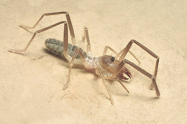

---
aliases:
  - Windscorpion
  - Windscorpions
title: Solifugae
has_id_wikidata: Q19126
described_by_source:
  - "[[_Standards/WikiData/WD~Brockhaus_and_Efron_Encyclopedic_Dictionary,602358]]"
  - "[[_Standards/WikiData/WD~Encyclopedic_Lexicon,4532135]]"
  - "[[_Standards/WikiData/WD~Granat_Encyclopedic_Dictionary,4532138]]"
  - "[[_Standards/WikiData/WD~Small_Brockhaus_and_Efron_Encyclopedic_Dictionary,19180675]]"
parent_taxon: "[[_Standards/WikiData/WD~Dromopoda,5308296]]"
instance_of: "[[_Standards/WikiData/WD~taxon,16521]]"
taxon_rank: "[[_Standards/WikiData/WD~order,36602]]"
ITIS_TSN: "690742"
image:
  - http://commons.wikimedia.org/wiki/Special:FilePath/Solifugae%20collage.png
  - http://commons.wikimedia.org/wiki/Special:FilePath/Sunspider.jpg
UMLS_CUI: C0323815
Commons_gallery: Solifugae
Commons_category: Solifugae
taxon_name: Solifugae
taxon_common_name:
  - Windscorpions
  - valseedderkopper
---

# [[Solifugae]] 

 

#is_/same_as :: [[../../../../../../../../WikiData/WD~Solifugae,19126|WD~Solifugae,19126]] 

## #has_/text_of_/abstract 

> **Solifugae** is an order of arachnids known variously as solifuges, 
> sun spiders, camel spiders, and wind scorpions. 
> 
> The order includes more than 1,000 described species in about 147 genera. 
> 
> Despite the common names, they are neither true spiders (order Araneae), 
> nor true scorpions (order Scorpiones). 
> 
> Most species of solifuges live in dry climates and feed opportunistically 
> on ground-dwelling arthropods and other small animals. 
> 
> The largest species grow to a length of 12–15 cm (5–6 in), including legs. 
> A number of urban legends exaggerate the size and speed of solifuges, 
> and their potential danger to humans, which is negligible.
>
> [Wikipedia](https://en.wikipedia.org/wiki/Solifugae) 

### Information on the Internet

-   [www.solpugid.com](http://www.solpugid.com/index.htm). A source of information on the arachnid order Solifugae. Maintained by Warren Savary.

## Phylogeny 

-   « Ancestral Groups  
    -  [Arachnida](../Arachnida.md))
    -  [Arthropoda](../../../Arthropoda.md))
    -  [Bilateria](../../../../Bilateria.md))
    -  [Animals](../../../../../Animals.md))
    -  [Eukarya](../../../../../../Eukarya.md))
    -   [Tree of Life](../../../../../../Tree_of_Life.md)

-   ◊ Sibling Groups of  Arachnida
    -   Solifugae
    -   [Spider](Spider.md)
    -   [Mite](Mite.md)
    -  [Scorpionida](Scorpionida.md))

-   » Sub-Groups
    -  [Ammotrechidae](Solifugae/Ammotrechidae.md))

	-   [Ammotrechidae](Solifugae/Ammotrechidae.md "go to ToL page"))*
	-   *Ceromidae*
	-   *Daesiidae*
	-   *Eremobatidae*
	-   *Galeodidae*
	-   *Gylippidae*
	-   *Hexisopodidae*
	-   *Karschiidae*
	-   *Melanoblossidae*
	-   *Mummuciidae*
	-   *Rhagodidae*
	-   *Solpugidae*

## Title Illustrations

--------------)
Scientific Name ::     Eremochelis bilobatus (Muma)
Specimen Condition   Live Specimen
Copyright ::            © 2003 Warren E. Savary

## Confidential Links & Embeds: 

### #is_/same_as :: [Solifugae](/_Standards/bio/bio~Domain/Eukarya/Animal/Bilateria/Arthropoda/Chelicerata/Arachnida/Solifugae.md) 

### #is_/same_as :: [Solifugae.public](/_public/bio/bio~Domain/Eukarya/Animal/Bilateria/Arthropoda/Chelicerata/Arachnida/Solifugae.public.md) 

### #is_/same_as :: [Solifugae.internal](/_internal/bio/bio~Domain/Eukarya/Animal/Bilateria/Arthropoda/Chelicerata/Arachnida/Solifugae.internal.md) 

### #is_/same_as :: [Solifugae.protect](/_protect/bio/bio~Domain/Eukarya/Animal/Bilateria/Arthropoda/Chelicerata/Arachnida/Solifugae.protect.md) 

### #is_/same_as :: [Solifugae.private](/_private/bio/bio~Domain/Eukarya/Animal/Bilateria/Arthropoda/Chelicerata/Arachnida/Solifugae.private.md) 

### #is_/same_as :: [Solifugae.personal](/_personal/bio/bio~Domain/Eukarya/Animal/Bilateria/Arthropoda/Chelicerata/Arachnida/Solifugae.personal.md) 

### #is_/same_as :: [Solifugae.secret](/_secret/bio/bio~Domain/Eukarya/Animal/Bilateria/Arthropoda/Chelicerata/Arachnida/Solifugae.secret.md)

