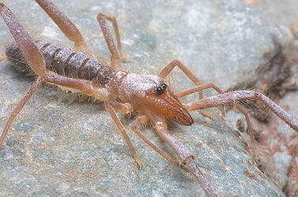

---
aliases:
- Ammotrechidae
- Zahalchíʼii dilwoʼí
- スナハシリヒヨケムシ科
- 沙风蝎科
- 砂風蝎科
- 암모트레카과
title: Ammotrechidae
has_id_wikidata: Q1952661
dv_has_:
  name_:
    an: Ammotrechidae
    ast: Ammotrechidae
    bg: Ammotrechidae
    ca: Ammotrechidae
    ceb: Ammotrechidae
    de: Ammotrechidae
    en: Ammotrechidae
    eo: Ammotrechidae
    es: Ammotrechidae
    eu: Ammotrechidae
    ext: Ammotrechidae
    fi: Ammotrechidae
    fr: Ammotrechidae
    ga: Ammotrechidae
    gl: Ammotrechidae
    ia: Ammotrechidae
    ie: Ammotrechidae
    io: Ammotrechidae
    it: Ammotrechidae
    ja: スナハシリヒヨケムシ科
    ko: 암모트레카과
    la: Ammotrechidae
    mul: Ammotrechidae
    nl: Ammotrechidae
    nv: Zahalchíʼii dilwoʼí
    oc: Ammotrechidae
    pl: Ammotrechidae
    pt: Ammotrechidae
    pt-br: Ammotrechidae
    ro: Ammotrechidae
    ru: Ammotrechidae
    sq: Ammotrechidae
    sv: Ammotrechidae
    tr: Ammotrechidae
    uk: Ammotrechidae
    vi: Ammotrechidae
    vo: Ammotrechidae
    war: Ammotrechidae
    zh: 沙风蝎科
    zh-cn: 沙风蝎科
    zh-hans: 沙风蝎科
    zh-tw: 砂風蝎科
---
# [[Ammotrechidae]] 

## #has_/text_of_/abstract 

> **Ammotrechidae** is a family of solifuges distributed in the Americas and the Caribbean Islands. It includes 26 described genera and 95 species. Members of this family can be distinguished from members of other families by the absence of claws on tarsi of leg I, tarsal segmentation 1-2-2-(2-4), pedipalps with pairs of lateroventral spines, and by males having an immovable flagellum on the mesal face of each chelicerum. The propeltidium of the Ammotrechidae is recurved.
>
> The common names used for Ammotrechidae are curve-faced solifugids and sand runners. They live in arid regions, such as dune and rocky habitats. They are carnivores which feed mainly on other invertebrates. Ammotrechidae have relatively high metabolic rates, which allow them to be voracious predators. They feed by masticating their prey and sucking out the liquids. They are preyed upon by other vertebrates. Species of Ammotrechidae are found to be cannibalistic. Males and females dig shallow burrows for protection and nesting.
>
> The species in North America are found in the South to Southwest and are rarely longer than 2 inches. Though they can be pests, they are considered beneficial because they feed on scorpions, spiders, and termites.
>
> [Wikipedia](https://en.wikipedia.org/wiki/Ammotrechidae) 

### Characteristics

Male ammotrechids have a fixed, non-rotatable membranous flagellum
attached to the mesal face of each chelicera. 
)\
\

 

### Geographic Distribution

Members of the family Ammotrechidae are known from North America,
Central America, South America, and the Caribbean Islands. 

 
)\

## Phylogeny 

-   « Ancestral Groups  
    -  [Solifugae](../Solifugae.md) 
    -  [Arachnida](../../Arachnida.md) 
    -  [Arthropoda](../../../../Arthropoda.md) 
    -  [Bilateria](../../../../../Bilateria.md) 
    -  [Animals](../../../../../../Animals.md) 
    -  [Eukarya](../../../../../../../Eukarya.md) 
    -   [Tree of Life](../../../../../../../Tree_of_Life.md)

-   ◊ Sibling Groups of  Solifugae
    -   Ammotrechidae

-   » Sub-Groups
    -  [Ammotrechinae](Ammotrechidae/Ammotrechinae.md) 
	-   [Ammotrechinae](Ammotrechidae/Ammotrechinae.md "go to ToL page"))*
	-   *Mortola mortola*
	-   *Nothopuga*
	-   *Oltacola*
	-   *Saronominae*
	-   *Chileotrecha atacamensis*
	-   *Eutrecha longirostris*
	-   *Xenotrecha huebneri*
	-   *Happlodontus proterus* †

## Title Illustrations
  ------------

  scientific_name ::     Ammotrechula pilosa Muma
  specimen_condition ::  Live Specimen
  Sex ::                Male
  Life Cycle Stage ::     Adult
  copyright ::            © 2003 Warren E. Savary

## Confidential Links & Embeds: 

### #is_/same_as :: [[/_Standards/bio/bio~Domain/Eukarya/Animal/Bilateria/Arthropoda/Chelicerata/Arachnida/Solifugae/Ammotrechidae|Ammotrechidae]] 

### #is_/same_as :: [[/_public/bio/bio~Domain/Eukarya/Animal/Bilateria/Arthropoda/Chelicerata/Arachnida/Solifugae/Ammotrechidae.public|Ammotrechidae.public]] 

### #is_/same_as :: [[/_internal/bio/bio~Domain/Eukarya/Animal/Bilateria/Arthropoda/Chelicerata/Arachnida/Solifugae/Ammotrechidae.internal|Ammotrechidae.internal]] 

### #is_/same_as :: [[/_protect/bio/bio~Domain/Eukarya/Animal/Bilateria/Arthropoda/Chelicerata/Arachnida/Solifugae/Ammotrechidae.protect|Ammotrechidae.protect]] 

### #is_/same_as :: [[/_private/bio/bio~Domain/Eukarya/Animal/Bilateria/Arthropoda/Chelicerata/Arachnida/Solifugae/Ammotrechidae.private|Ammotrechidae.private]] 

### #is_/same_as :: [[/_personal/bio/bio~Domain/Eukarya/Animal/Bilateria/Arthropoda/Chelicerata/Arachnida/Solifugae/Ammotrechidae.personal|Ammotrechidae.personal]] 

### #is_/same_as :: [[/_secret/bio/bio~Domain/Eukarya/Animal/Bilateria/Arthropoda/Chelicerata/Arachnida/Solifugae/Ammotrechidae.secret|Ammotrechidae.secret]] 

