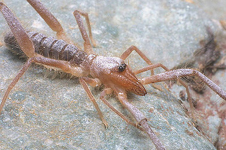

---
aliases:
  - Ammotrechinae
title: Ammotrechinae
---

# [[Ammotrechinae]] 

 

## Phylogeny 

-   « Ancestral Groups  
    -  [Ammotrechidae](../Ammotrechidae.md) 
    -  [Solifugae](../../Solifugae.md) 
    -  [Arachnida](../../../Arachnida.md) 
    -  [Arthropoda](../../../../../Arthropoda.md) 
    -  [Bilateria](../../../../../../Bilateria.md) 
    -  [Animals](../../../../../../../Animals.md) 
    -  [Eukarya](../../../../../../../../Eukarya.md) 
    -   [Tree of Life](../../../../../../../../Tree_of_Life.md)

-   ◊ Sibling Groups of  Ammotrechidae
    -   Ammotrechinae

-   » Sub-Groups 
	-   *Ammotrecha*
	-   *Ammotrechella*
	-   *Ammotrechesta*
	-   *Ammotrechinus*
	-   *Ammotrechona*
	-   *Ammotrechula*
	-   *Antillotrecha*
	-   *Campostrecha*
	-   *Dasycleobis*
	-   *Neocleobis*
	-   *Pseudocleobis*

## Title Illustrations

------------

Scientific Name ::     Ammotrechula pilosa Muma
Specimen Condition   Live Specimen
Sex ::                Male
Life Cycle Stage ::     Adult
Copyright ::            © 2003 Warren E. Savary

## Confidential Links & Embeds: 

### #is_/same_as :: [Ammotrechinae](/_Standards/bio/bio~Domain/Eukarya/Animal/Bilateria/Arthropoda/Chelicerata/Arachnida/Solifugae/Ammotrechidae/Ammotrechinae.md) 

### #is_/same_as :: [Ammotrechinae.public](/_public/bio/bio~Domain/Eukarya/Animal/Bilateria/Arthropoda/Chelicerata/Arachnida/Solifugae/Ammotrechidae/Ammotrechinae.public.md) 

### #is_/same_as :: [Ammotrechinae.internal](/_internal/bio/bio~Domain/Eukarya/Animal/Bilateria/Arthropoda/Chelicerata/Arachnida/Solifugae/Ammotrechidae/Ammotrechinae.internal.md) 

### #is_/same_as :: [Ammotrechinae.protect](/_protect/bio/bio~Domain/Eukarya/Animal/Bilateria/Arthropoda/Chelicerata/Arachnida/Solifugae/Ammotrechidae/Ammotrechinae.protect.md) 

### #is_/same_as :: [Ammotrechinae.private](/_private/bio/bio~Domain/Eukarya/Animal/Bilateria/Arthropoda/Chelicerata/Arachnida/Solifugae/Ammotrechidae/Ammotrechinae.private.md) 

### #is_/same_as :: [Ammotrechinae.personal](/_personal/bio/bio~Domain/Eukarya/Animal/Bilateria/Arthropoda/Chelicerata/Arachnida/Solifugae/Ammotrechidae/Ammotrechinae.personal.md) 

### #is_/same_as :: [Ammotrechinae.secret](/_secret/bio/bio~Domain/Eukarya/Animal/Bilateria/Arthropoda/Chelicerata/Arachnida/Solifugae/Ammotrechidae/Ammotrechinae.secret.md)

