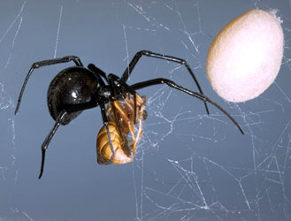
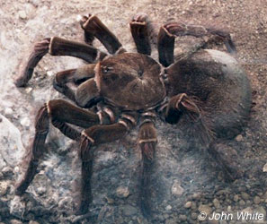

---
aliases:
- Spider
- Aranea
- Araneae
- Spinne
Baidu_Tieba_name: 蜘蛛
Commons_category: Araneae
Commons_gallery: Araneae
described_at_URL: "https://neal.fun/earth-reviews/spiders"
described_by_source:
- '[[_Standards/WikiData/WD~Brockhaus_and_Efron_Encyclopedic_Dictionary,602358]]'
- '[[_Standards/WikiData/WD~Encyclopædia_Britannica_11th_edition,867541]]'
- '[[_Standards/WikiData/WD~Gujin_Tushu_Jicheng,1768721]]'
- '[[_Standards/WikiData/WD~Explanatory_Dictionary_of_the_Living_Great_Russian_Language,1970746]]'
- '[[_Standards/WikiData/WD~Q2041543,2041543]]'
- '[[_Standards/WikiData/WD~Small_Brockhaus_and_Efron_Encyclopedic_Dictionary,19180675]]'
- '[[_Standards/WikiData/WD~Meyers_Konversations_Lexikon,_4th_edition_(1885_1890),19219752]]'
- '[[_Standards/WikiData/WD~The_Domestic_Encyclopædia;_Or,_A_Dictionary_Of_Facts,_And_Useful_Knowledge,56441911]]'
different_from: '[[_Standards/WikiData/WD~Spiders,1950984]]'
EPPO_Code: 1ARANO
has_effect:
- '[[_Standards/WikiData/WD~arachnophobia,220783]]'
- '[[_Standards/WikiData/WD~spider_bite,2549274]]'
has_id_wikidata: Q1357
image: "http://commons.wikimedia.org/wiki/Special:FilePath/Clynotis%20severus%2C%20AF%202.jpg"
instance_of: '[[_Standards/WikiData/WD~taxon,16521]]'
ITIS_TSN: 82732
Krugosvet_article: nauka_i_tehnika/biologiya/PAUKI.html
maintained_by_WikiProject: '[[_Standards/WikiData/WD~WikiProject_Invasion_Biology,56241615]]'
MeSH_tree_code: B01.050.500.131.166.803
montage_image: "http://commons.wikimedia.org/wiki/Special:FilePath/Spiders%20Diversity.jpg"
NBN_System_Key: NHMSYS0000841308
OmegaWiki_Defined_Meaning: 3588
parent_taxon: '[[_Standards/WikiData/WD~Tetrapulmonata,3821682]]'
permanent_duplicated_item: '[[_Standards/WikiData/WD~Q22828342,22828342]]'
small_logo_or_icon: "http://commons.wikimedia.org/wiki/Special:FilePath/Font%20Awesome%205%20solid%20spider.svg"
start_time: -319000000-01-01
studied_by: '[[_Standards/WikiData/WD~araneology,2859535]]'
taxon_common_name:
- Ananse
- Паяци
- Ayiyi
- Αράχνες
- Arañas
- hämähäkit
- Aranéides
- עכבישאים
- मकडी
- Սարդեր
- Ragni
- クモ目
- 거미목
- ပင့်ကူ
- Spinnen
- Pająki
- Aranhas
- Păianjen
- Пауки
- pajki
- Spindlar
- แมงมุม
- Örümcekler
- Spiders
- Spinnen
- edderkopper
- pavouci
- "damhán alla"
- Naʼashjéʼii
taxon_name: Araneae
taxon_rank: '[[_Standards/WikiData/WD~order,36602]]'
taxon_synonym: '[[_Standards/WikiData/WD~Araneida,30587689]]'
this_taxon_is_source_of: '[[_Standards/WikiData/WD~spider_silk,2740926]]'
title: Spider
UMLS_CUI: C0037913
---

# [[Spider]] 

#is_/same_as :: [[../../../../../WikiData/WD~Spider,1357|WD~Spider,1357]] 

 ) 

## #has_/text_of_/abstract 

> Spiders (order **Araneae**) are air-breathing arthropods that have eight limbs, 
> chelicerae with fangs generally able to inject venom, and spinnerets that extrude silk. 
> 
> They are the largest order of arachnids 
> and rank seventh in total species diversity among all orders of organisms. 
> 
> Spiders are found worldwide on every continent except Antarctica, 
> and have become established in nearly every land habitat. 
> 
> As of June 2025, 53,034 spider species in 136 families have been recorded by taxonomists. 
> However, there has been debate among scientists about how families should be classified, 
> with over 20 different classifications proposed since 1900.
>
> Anatomically, spiders (as with all arachnids) differ from other arthropods 
> in that the usual body segments are fused into two tagmata, 
> - the cephalothorax or prosoma, and 
> - the opisthosoma, or abdomen, and 
> - joined by a small, cylindrical pedicel. 
> However, as there is currently neither paleontological nor embryological evidence 
> that spiders ever had a separate thorax-like division, 
> there exists an argument against the validity of the term cephalothorax, 
> which means fused cephalon (head) and the thorax. 
> Similarly, arguments can be formed against the use of the term "abdomen", 
> as the opisthosoma of all spiders contains a heart and respiratory organs, 
> organs atypical of an abdomen.
>
> Unlike insects, spiders do not have antennae. 
> In all except the most primitive group, the Mesothelae, 
> spiders have the most centralized nervous systems of all arthropods, 
> as all their ganglia are fused into one mass in the cephalothorax. 
> 
> Unlike most arthropods, spiders have no extensor muscles in their limbs 
> and instead extend them by hydraulic pressure.
>
> Their abdomens bear appendages, 
> modified into spinnerets that extrude silk from up to six types of glands. 
> 
> Spider webs vary widely in size, shape and the amount of sticky thread used. 
> It now appears that the spiral orb web may be one of the earliest forms, 
> and spiders that produce tangled cobwebs are more abundant and diverse than orb-weaver spiders. 
> 
> Spider-like arachnids with silk-producing spigots (Uraraneida) appeared in the Devonian period, 
> about 386 million years ago, but these animals apparently lacked spinnerets. 
> 
> True spiders have been found in Carboniferous rocks from 318 to 299 million years ago 
> and are very similar to the most primitive surviving suborder, the Mesothelae. 
> The main groups of modern spiders, Mygalomorphae and Araneomorphae, 
> first appeared in the Triassic period, more than 200 million years ago.
>
> The species Bagheera kiplingi was described as herbivorous in 2008, 
> but all other known species are predators, mostly preying on insects and other spiders, 
> although a few large species also take birds and lizards. 
> 
> An estimated 25 million tons of spiders kill 400–800 million tons of prey every year. 
> 
> Spiders use numerous strategies to capture prey: trapping it in sticky webs, 
> lassoing it with sticky bolas, mimicking the prey to avoid detection, or running it down. 
> 
> Most detect prey mainly by sensing vibrations, but the active hunters have acute vision 
> and hunters of the genus Portia show signs of intelligence in their choice of tactics 
> and ability to develop new ones. 
> 
> Spiders' guts are too narrow to take solids, 
> so they liquefy their food by flooding it with digestive enzymes. 
> They also grind food with the bases of their pedipalps, 
> as arachnids do not have the mandibles that crustaceans and insects have.
>
> To avoid being eaten by the females, which are typically much larger, 
> male spiders identify themselves as potential mates by a variety of complex courtship rituals. 
> 
> Males of most species survive a few matings, limited mainly by their short life spans. 
> Females weave silk egg cases, each of which may contain hundreds of eggs. 
> Females of many species care for their young, 
> for example by carrying them around or by sharing food with them. 
> 
> A minority of species are social, building communal webs 
> that may house anywhere from a few to 50,000 individuals. 
> 
> Social behavior ranges from precarious toleration, as in the widow spiders, 
> to cooperative hunting and food-sharing. 
> 
> Although most spiders live for at most two years, 
> tarantulas and other mygalomorph spiders can live up to 25 years in captivity.
>
> While the venom of a few species is dangerous to humans, 
> scientists are now researching the use of spider venom in medicine and as non-polluting pesticides. 
> 
> Spider silk provides a combination of lightness, strength and elasticity 
> superior to synthetic materials, and spider silk genes have been inserted into mammals and plants 
> to see if these can be used as silk factories. 
> 
> As a result of their wide range of behaviors, 
> spiders have become common symbols in art and mythology, 
> symbolizing various combinations of patience, cruelty and creative powers. 
> An irrational fear of spiders is called arachnophobia.
>
> [Wikipedia](https://en.wikipedia.org/wiki/Spider) 

### Information on the Internet
-   [Assembling the Tree of Life: Phylogeny of     Spiders](http://research.amnh.org/atol/files/)
-   [The World Spider     Catalog](http://research.amnh.org/entomology/spiders/catalog81-87/INTRO1.html).
    Norman I. Platnick, American Museum of Natural History.
-   [Monographic Research in Araneoid Spider     Systematics](http://www.gwu.edu/%7Eclade/spiders/peet.htm). NSF Peet
    Project. Gustavo Hormiga, George Washington University & Gonzalo
    Giribet, Harvard University
-   [Colorado Spider Survey](http://www.dmns.org/spiders/default.aspx).
    Denver Museum of Nature & Science.
-   [Araneological     Database](http://www.inra.fr/Internet/Produits/ARAIGNEES/base-araen.html).
    Institut National de la Recherche Agronomique, Avignon, France.
-   [Araneae, Spiders of North-West     Europe](http://www.xs4all.nl/%7Eednieuw/Spiders/spidhome.htm). Ed
    Nieuwenhuys.
-   [Spiders of     Australia](http://www.xs4all.nl/%7Eednieuw/australian/Spidaus.html).
    Ed Nieuwenhuys, Ronald Loggen.
-   [The Life of the     Spider](http://digital.library.upenn.edu/webbin/gutbook/lookup?num=1887)
    by J. Henri Fabre, translated by Alexander Teixeira de Mattos.
    Project Gutenberg.

## Phylogeny 

-   « Ancestral Groups  
    -  [Arachnida](../Arachnida.md))
    -  [Arthropoda](../../../Arthropoda.md))
    -  [Bilateria](../../../../Bilateria.md))
    -  [Animals](../../../../../Animals.md))
    -  [Eukarya](../../../../../../Eukarya.md))
    -   [Tree of Life](../../../../../../Tree_of_Life.md)

-   ◊ Sibling Groups of  Arachnida
    -  [Solifugae](Solifugae.md))
    -   Spider
    -   [Mite](Mite.md)
    -  [Scorpionida](Scorpionida.md))

-   » Sub-Groups
    -  [Mygalomorphae](Spider/Mygalomorphae.md))
    -  [Araneomorphae](Spider/Araneomorphae.md))

## Title Illustrations

------------------------------------------------------------------------------

Scientific Name ::     Latrodectus mactans
Comments             Black widow spider with egg sack.
Creator              Photograph by George W. Robinson
Specimen Condition   Live Specimen
Source Collection    [CalPhotos](http://calphotos.berkeley.edu/)
Copyright ::            © 1999 [California Academy of Sciences](http://www.calacademy.org/) 

-------------------)
Scientific Name ::     Theraphosa blondi
Comments             Goliath birdeating tarantula
Specimen Condition   Live Specimen
Source Collection    [CalPhotos](http://calphotos.berkeley.edu/)
Copyright ::            © 2000 [John White](mailto:reptiles@erols.com)

## Confidential Links & Embeds: 

### #is_/same_as ::[Spider](Spider.md)) 

### #is_/same_as :: [Spider.public](/_public/bio/bio~Domain/Eukarya/Animal/Bilateria/Arthropoda/Chelicerata/Arachnida/Spider.public.md) 

### #is_/same_as :: [Spider.internal](/_internal/bio/bio~Domain/Eukarya/Animal/Bilateria/Arthropoda/Chelicerata/Arachnida/Spider.internal.md) 

### #is_/same_as :: [Spider.protect](/_protect/bio/bio~Domain/Eukarya/Animal/Bilateria/Arthropoda/Chelicerata/Arachnida/Spider.protect.md) 

### #is_/same_as :: [Spider.private](/_private/bio/bio~Domain/Eukarya/Animal/Bilateria/Arthropoda/Chelicerata/Arachnida/Spider.private.md) 

### #is_/same_as :: [Spider.personal](/_personal/bio/bio~Domain/Eukarya/Animal/Bilateria/Arthropoda/Chelicerata/Arachnida/Spider.personal.md) 

### #is_/same_as :: [Spider.secret](/_secret/bio/bio~Domain/Eukarya/Animal/Bilateria/Arthropoda/Chelicerata/Arachnida/Spider.secret.md)

