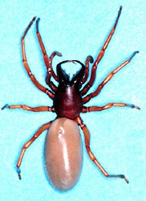
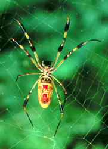
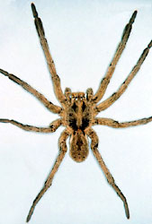

---
title: Araneomorphae
---

# [[Araneomorphae]] 
)
 
 

## #has_/text_of_/abstract 

> The **Araneomorphae** (also called the Labidognatha or "true spiders") are an infraorder of spiders. 
> They are distinguishable by chelicerae (fangs) that point diagonally forward 
> and cross in a pinching action, in contrast to the Mygalomorphae (tarantulas and their close kin), 
> where they point straight down. 
> Araneomorphs comprise the vast majority (about 93%) of living spiders.
>
> [Wikipedia](https://en.wikipedia.org/wiki/Araneomorphae) 

## Phylogeny 

-   « Ancestral Groups  
    -   [Spider](../Spider.md)
    -  [Arachnida](../../Arachnida.md))
    -  [Arthropoda](../../../../Arthropoda.md))
    -  [Bilateria](../../../../../Bilateria.md))
    -  [Animals](../../../../../../Animals.md))
    -  [Eukarya](../../../../../../../Eukarya.md))
    -   [Tree of Life](../../../../../../../Tree_of_Life.md)

-   ◊ Sibling Groups of  Spider
    -  [Mygalomorphae](Mygalomorphae.md))
    -   Araneomorphae

-   » Sub-Groups
    -  [Haplogynae](Araneomorphae/Haplogynae.md))
    -  [Hypochilidae](Araneomorphae/Hypochilidae.md))
    -  [Entelegynae](Araneomorphae/Entelegynae.md))

## Title Illustrations
)
-   Woodlouse hunter, Dysdera crocata (Haplogynae, Dysderidae).\
Photograph copyright © Jim Kalisch, [Department of Entomology,     University of Nebraska-Lincoln](http://entomology.unl.edu/).)
-   Golden-silk spider, Nephila clavipes (Entelegynae, Orbicularia,
Araneidae).\
Photograph courtesy [InsectImages.org](http://www.insectimages.org/)
(image 0001045), copyright © Ray Simons, Centers for Disease Control
and Prevention.)
-   Wolf spider male, Lycosa (Hogna) helluo (Entelegynae, Lycosoidea,
Lycosidae).\
Photograph copyright © Jim Kalisch, [Department of Entomology,     University of Nebraska-Lincoln](http://entomology.unl.edu/).

## Confidential Links & Embeds: 

### #is_/same_as ::[Araneomorphae](Araneomorphae.md)) 

### #is_/same_as :: [Araneomorphae.public](/_public/bio/bio~Domain/Eukarya/Animal/Bilateria/Arthropoda/Chelicerata/Arachnida/Spider/Araneomorphae.public.md) 

### #is_/same_as :: [Araneomorphae.internal](/_internal/bio/bio~Domain/Eukarya/Animal/Bilateria/Arthropoda/Chelicerata/Arachnida/Spider/Araneomorphae.internal.md) 

### #is_/same_as :: [Araneomorphae.protect](/_protect/bio/bio~Domain/Eukarya/Animal/Bilateria/Arthropoda/Chelicerata/Arachnida/Spider/Araneomorphae.protect.md) 

### #is_/same_as :: [Araneomorphae.private](/_private/bio/bio~Domain/Eukarya/Animal/Bilateria/Arthropoda/Chelicerata/Arachnida/Spider/Araneomorphae.private.md) 

### #is_/same_as :: [Araneomorphae.personal](/_personal/bio/bio~Domain/Eukarya/Animal/Bilateria/Arthropoda/Chelicerata/Arachnida/Spider/Araneomorphae.personal.md) 

### #is_/same_as :: [Araneomorphae.secret](/_secret/bio/bio~Domain/Eukarya/Animal/Bilateria/Arthropoda/Chelicerata/Arachnida/Spider/Araneomorphae.secret.md)

