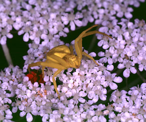
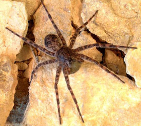

---
aliases:
  - Entelegynae
title: Entelegynae
---

# [[Entelegynae]] 

 
 

## #has_/text_of_/abstract 

> The **Entelegynae** or entelegynes are a subgroup of araneomorph spiders, 
> the largest of the two main groups into which the araneomorphs were traditionally divided. 
> 
> Females have a genital plate (epigynum) and a "flow through" fertilization system; 
> males have complex palpal bulbs. 
> 
> Molecular phylogenetic studies have supported the monophyly of Entelegynae 
> (whereas the other traditional subgroup, the Haplogynae, has been shown __not__ to be monophyletic).
>
> The clade contains both cribellate and ecribellate spiders.
>
> [Wikipedia](https://en.wikipedia.org/wiki/Entelegynae) 

## Phylogeny 

-   « Ancestral Groups  
    -  [Araneomorphae](../Araneomorphae.md) 
    -   [Spider](../../Spider.md)
    -  [Arachnida](../../../Arachnida.md) 
    -  [Arthropoda](../../../../../Arthropoda.md) 
    -  [Bilateria](../../../../../../Bilateria.md) 
    -  [Animals](../../../../../../../Animals.md) 
    -  [Eukarya](../../../../../../../../Eukarya.md) 
    -   [Tree of Life](../../../../../../../../Tree_of_Life.md) 

-   ◊ Sibling Groups of  Araneomorphae
    -  [Haplogynae](Haplogynae.md) 
    -  [Hypochilidae](Hypochilidae.md) 
    -   Entelegynae

-   » Sub-Groups
    -  [Amaurobiidae](Entelegynae/Amaurobiidae.md) 
    -  [Eresoidea](Entelegynae/Eresoidea.md) 
    -   [other entelegynes](other_entelegynes)
    -  [Palpimanoidea](Entelegynae/Palpimanoidea.md) 
    -  [Dictynoidea](Entelegynae/Dictynoidea.md) 
    -  [Orbiculariae](Entelegynae/Orbiculariae.md) 
    -  [Dionycha](Entelegynae/Dictynoidea/Dionycha.md) 
    -   [other amaurobioids](other_amaurobioids)
    -  [Lycosoidea](Entelegynae/Lycosoidea.md) 

## Title Illustrations

-------------------------------------------------------------------------

scientific_name ::     Misumena vatia
location ::           Bodega Bay (Marin County, California, US)
Comments             Yellow crab spider (goldenrod spider) on wild carrot, Daucus carota.
specimen_condition ::  Live Specimen
Source Collection    [CalPhotos](http://calphotos.berkeley.edu/)
copyright ::            © 2000 [Joseph Dougherty](http://www.ecology.org/) 

----------------------------------------------------------------------- 
 
scientific_name ::     Dolomedes tenebrosus
Comments             Fishing spider with egg case.
specimen_condition ::  Live Specimen
Sex ::                Female
Life Cycle Stage ::     adult, egg sac
copyright ::            © [Jim Kalisch](http://entomology.unl.edu/) 

## Confidential Links & Embeds: 

### #is_/same_as :: [[/_Standards/bio/bio~Domain/Eukarya/Animal/Bilateria/Arthropoda/Chelicerata/Arachnida/Spider/Araneomorphae/Entelegynae|Entelegynae]] 

### #is_/same_as :: [[/_public/bio/bio~Domain/Eukarya/Animal/Bilateria/Arthropoda/Chelicerata/Arachnida/Spider/Araneomorphae/Entelegynae.public|Entelegynae.public]] 

### #is_/same_as :: [[/_internal/bio/bio~Domain/Eukarya/Animal/Bilateria/Arthropoda/Chelicerata/Arachnida/Spider/Araneomorphae/Entelegynae.internal|Entelegynae.internal]] 

### #is_/same_as :: [[/_protect/bio/bio~Domain/Eukarya/Animal/Bilateria/Arthropoda/Chelicerata/Arachnida/Spider/Araneomorphae/Entelegynae.protect|Entelegynae.protect]] 

### #is_/same_as :: [[/_private/bio/bio~Domain/Eukarya/Animal/Bilateria/Arthropoda/Chelicerata/Arachnida/Spider/Araneomorphae/Entelegynae.private|Entelegynae.private]] 

### #is_/same_as :: [[/_personal/bio/bio~Domain/Eukarya/Animal/Bilateria/Arthropoda/Chelicerata/Arachnida/Spider/Araneomorphae/Entelegynae.personal|Entelegynae.personal]] 

### #is_/same_as :: [[/_secret/bio/bio~Domain/Eukarya/Animal/Bilateria/Arthropoda/Chelicerata/Arachnida/Spider/Araneomorphae/Entelegynae.secret|Entelegynae.secret]] 

