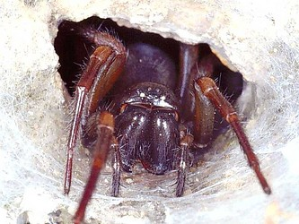

---
aliases:
- Amaurobiidae
- Amauròbid
- Cedivkovité
- cedivkovití
- Chahałheeł naʼashjéʼii
- Eretnekpókfélék
- Finsterspinnen
- Mörkrumsspindlar
- nachtkaardespinnen
- pimentohämähäkit
- vinduedderkopper
- пауки-амауробииды
- אמאורוביים
- الأموربيدات
- عنکبوتهای شب
- 暗蛛科
title: Amaurobiidae
has_id_wikidata: Q5854
dv_has_:
  name_:
    an: Amaurobiidae
    ar: الأموربيدات
    ast: Amaurobiidae
    bg: Amaurobiidae
    ca: Amauròbid
    ceb: Amaurobiidae
    cs: cedivkovití
    de: Finsterspinnen
    en: Amaurobiidae
    eo: Amaurobiidae
    es: Amaurobiidae
    eu: Amaurobiidae
    ext: Amaurobiidae
    fa: عنکبوتهای شب
    fi: pimentohämähäkit
    fr: Amaurobiidae
    ga: Amaurobiidae
    gl: Amaurobiidae
    he: אמאורוביים
    hr: Amaurobiidae
    hu: Eretnekpókfélék
    ia: Amaurobiidae
    ie: Amaurobiidae
    io: Amaurobiidae
    it: Amaurobiidae
    la: Amaurobiidae
    mul: Amaurobiidae
    nb: vinduedderkopper
    nl: nachtkaardespinnen
    nv: Chahałheeł naʼashjéʼii
    oc: Amaurobiidae
    pl: Amaurobiidae
    pt: Amaurobiidae
    pt_br: Amaurobiidae
    ro: Amaurobiidae
    ru: пауки-амауробииды
    sk: Cedivkovité
    sq: Amaurobiidae
    sv: Mörkrumsspindlar
    tr: Amaurobiidae
    uk: Amaurobiidae
    vi: Amaurobiidae
    vo: Amaurobiidae
    war: Amaurobiidae
    zh: 暗蛛科
    zh_cn: 暗蛛科
    zh_hans: 暗蛛科
    zh_tw: 暗蛛科
---
# [[Amaurobiidae]] 
 

# [[Amaurobiidae]] 

## #has_/text_of_/abstract 

> **Amaurobiidae** is a family of three-clawed cribellate or ecribellate spiders found in crevices and hollows or under stones where they build retreats, and are often collected in pitfall traps. Unlidded burrows are sometimes quite obvious in crusty, loamy soil. They are difficult to distinguish from related spiders in other families, especially Agelenidae and Desidae. Their intra- and interfamilial relationships have been contentious.
>
> In Australia, they are small to medium-sized entelegyne spiders with minimal sheet webs. They are fairly common in Tasmania and nearby mainland Australia in cooler rainforest, some in caves. They are widespread but uncommon along the eastern coastline. They generally have eight similar eyes in two conservatively curved rows. They often have a calamistrum on metatarsus IV associated with a cribellum. Australian amaurobiids may be distinguished from the Desidae by the absence of a pretarsal fracture and the presence of a retrocoxal hymen on coxa I.
>
> [Wikipedia](https://en.wikipedia.org/wiki/Amaurobiidae) 
> 

## Phylogeny 

-   « Ancestral Groups  
    -  [Entelegynae](../Entelegynae.md) 
    -  [Araneomorphae](../../Araneomorphae.md) 
    -   [Spider](../../../Spider.md)
    -  [Arachnida](../../../../Arachnida.md) 
    -  [Arthropoda](../../../../../../Arthropoda.md) 
    -  [Bilateria](../../../../../../../Bilateria.md) 
    -  [Animals](../../../../../../../../Animals.md) 
    -  [Eukarya](../../../../../../../../../Eukarya.md) 
    -   [Tree of Life](../../../../../../../../../Tree_of_Life.md)

-   ◊ Sibling Groups of  Entelegynae
    -   Amaurobiidae
    -  [Eresoidea](Eresoidea.md) 
    -   [other entelegynes](other_entelegynes)
    -  [Palpimanoidea](Palpimanoidea.md) 
    -  [Dictynoidea](Dictynoidea.md) 
    -  [Orbiculariae](Orbiculariae.md) 
    -  [Dionycha](Dictynoidea/Dionycha.md) 
    -   [other amaurobioids](other_amaurobioids)
    -  [Lycosoidea](Lycosoidea.md) 

-   » Sub-Groups 
	-   *Altellopsis*
	-   *Amaurobius*
	-   *Ambanus*
	-   *Anisacate*
	-   *Arctobius*
	-   *Asiacoelotes*
	-   *Auhunga*
	-   *Auximella*
	-   *Bakala*
	-   *Bifidocoelotes*
	-   *Callevopsis*
	-   *Callobius*
	-   *Cavernocymbium*
	-   *Chresiona*
	-   *Ciniflella*
	-   *Coelotes*
	-   *Coras*
	-   *Coronilla*
	-   *Cybaeopsis*
	-   *Dardurus*
	-   *Draconarius*
	-   *Emmenomma*
	-   *Eurocoelotes*
	-   *Femoracoelotes*
	-   *Hicanodon*
	-   *Himalcoelotes*
	-   *Jamara*
	-   *Leptocoelotes*
	-   *Livius*
	-   *Longicoelotes*
	-   *Macrobunus*
	-   *Malala*
	-   *Maloides*
	-   *Manjala*
	-   *Midgee*
	-   *Muritaia*
	-   *Naevius*
	-   *Neoporteria*
	-   *Neowadotes*
	-   *Neuquenia*
	-   *Obatala*
	-   *Otira*
	-   *Pakeha*
	-   *Paracoelotes*
	-   *Paravoca*
	-   *Parazanomys*
	-   *Pimus*
	-   *Platocoelotes*
	-   *Poaka*
	-   *Pseudauximus*
	-   *Retiro*
	-   *Rhoicinaria*
	-   *Robusticoelotes*
	-   *Rubrius*
	-   *Spiricoelotes*
	-   *Storenosoma*
	-   *Taira*
	-   *Tamgrinia*
	-   *Tegecoelotes*
	-   *Tonsilla*
	-   *Tugana*
	-   *Tymbira*
	-   *Urepus*
	-   *Urocoras*
	-   *Virgilus*
	-   *Wabarra*
	-   *Wadotes*
	-   *Waitetola*
	-   *Yacolla*
	-   *Yupanquia*
	-   *Zanomys*

## Title Illustrations

---------------------------------------------------------------------------- 
 
scientific_name ::     Arachnida:Spider:Amaurobiidae: Amaurobius ferox
location ::           "Corno alle Scale" Park, Bologna Province, Emilia Romagna, Italy
specimen_condition ::  Live Specimen
Image Use ::    [Attribution-NonCommercial 2.0 Creative Commons License](http://creativecommons.org/licenses/by-nc/2.0/).
copyright ::            © 2005 [Cesare Brizio](http://xoomer.virgilio.it/cebrizio/) 

## Confidential Links & Embeds: 

### #is_/same_as :: [[/_Standards/bio/bio~Domain/Eukarya/Animal/Bilateria/Arthropoda/Chelicerata/Arachnida/Spider/Araneomorphae/Entelegynae/Amaurobiidae|Amaurobiidae]] 

### #is_/same_as :: [[/_public/bio/bio~Domain/Eukarya/Animal/Bilateria/Arthropoda/Chelicerata/Arachnida/Spider/Araneomorphae/Entelegynae/Amaurobiidae.public|Amaurobiidae.public]] 

### #is_/same_as :: [[/_internal/bio/bio~Domain/Eukarya/Animal/Bilateria/Arthropoda/Chelicerata/Arachnida/Spider/Araneomorphae/Entelegynae/Amaurobiidae.internal|Amaurobiidae.internal]] 

### #is_/same_as :: [[/_protect/bio/bio~Domain/Eukarya/Animal/Bilateria/Arthropoda/Chelicerata/Arachnida/Spider/Araneomorphae/Entelegynae/Amaurobiidae.protect|Amaurobiidae.protect]] 

### #is_/same_as :: [[/_private/bio/bio~Domain/Eukarya/Animal/Bilateria/Arthropoda/Chelicerata/Arachnida/Spider/Araneomorphae/Entelegynae/Amaurobiidae.private|Amaurobiidae.private]] 

### #is_/same_as :: [[/_personal/bio/bio~Domain/Eukarya/Animal/Bilateria/Arthropoda/Chelicerata/Arachnida/Spider/Araneomorphae/Entelegynae/Amaurobiidae.personal|Amaurobiidae.personal]] 

### #is_/same_as :: [[/_secret/bio/bio~Domain/Eukarya/Animal/Bilateria/Arthropoda/Chelicerata/Arachnida/Spider/Araneomorphae/Entelegynae/Amaurobiidae.secret|Amaurobiidae.secret]] 

