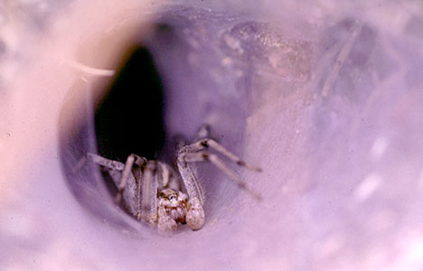

---
aliases:
  - Amaurobioids
title: other amaurobioids
---

# other amaurobioids 

## Phylogeny 

-   « Ancestral Groups  
    -  [Entelegynae](../Entelegynae.md) 
    -  [Araneomorphae](../../Araneomorphae.md) 
    -   [Spider](../../../Spider.md)
    -  [Arachnida](../../../../Arachnida.md) 
    -  [Arthropoda](../../../../../../Arthropoda.md) 
    -  [Bilateria](../../../../../../../Bilateria.md) 
    -  [Animals](../../../../../../../../Animals.md) 
    -  [Eukarya](../../../../../../../../../Eukarya.md) 
    -   [Tree of Life](../../../../../../../../../Tree_of_Life.md)

-   ◊ Sibling Groups of  Entelegynae
    -  [Amaurobiidae](Amaurobiidae.md) 
    -  [Eresoidea](Eresoidea.md) 
    -   [other entelegynes](other_entelegynes)
    -  [Palpimanoidea](Palpimanoidea.md) 
    -  [Dictynoidea](Dictynoidea.md) 
    -  [Orbiculariae](Orbiculariae.md) 
    -  [Dionycha](Dictynoidea/Dionycha.md) 
    -   other amaurobioids
    -  [Lycosoidea](Lycosoidea.md) 

-   » Sub-Groups 
	-   *Agelenidae* [(funnel weavers)]
	-   *Amphinectidae*
	-   *Titanoecidae* 

## Title Illustrations

-------------------------------------------------------------------------

scientific_name ::     Agelenopsis aperta
location ::           Mt. Diablo (Contra Costa County, California, US)
Comments             Funnel web spider (Western grass spider)
specimen_condition ::  Live Specimen
Sex ::                Female
Source Collection    [CalPhotos](http://calphotos.berkeley.edu/)
copyright ::            © 2000 [Joseph Dougherty](http://www.ecology.org/) 

## Confidential Links & Embeds: 

### #is_/same_as :: [[/_Standards/bio/bio~Domain/Eukarya/Animal/Bilateria/Arthropoda/Chelicerata/Arachnida/Spider/Araneomorphae/Entelegynae/Amaurobioids|Amaurobioids]] 

### #is_/same_as :: [[/_public/bio/bio~Domain/Eukarya/Animal/Bilateria/Arthropoda/Chelicerata/Arachnida/Spider/Araneomorphae/Entelegynae/Amaurobioids.public|Amaurobioids.public]] 

### #is_/same_as :: [[/_internal/bio/bio~Domain/Eukarya/Animal/Bilateria/Arthropoda/Chelicerata/Arachnida/Spider/Araneomorphae/Entelegynae/Amaurobioids.internal|Amaurobioids.internal]] 

### #is_/same_as :: [[/_protect/bio/bio~Domain/Eukarya/Animal/Bilateria/Arthropoda/Chelicerata/Arachnida/Spider/Araneomorphae/Entelegynae/Amaurobioids.protect|Amaurobioids.protect]] 

### #is_/same_as :: [[/_private/bio/bio~Domain/Eukarya/Animal/Bilateria/Arthropoda/Chelicerata/Arachnida/Spider/Araneomorphae/Entelegynae/Amaurobioids.private|Amaurobioids.private]] 

### #is_/same_as :: [[/_personal/bio/bio~Domain/Eukarya/Animal/Bilateria/Arthropoda/Chelicerata/Arachnida/Spider/Araneomorphae/Entelegynae/Amaurobioids.personal|Amaurobioids.personal]] 

### #is_/same_as :: [[/_secret/bio/bio~Domain/Eukarya/Animal/Bilateria/Arthropoda/Chelicerata/Arachnida/Spider/Araneomorphae/Entelegynae/Amaurobioids.secret|Amaurobioids.secret]] 

