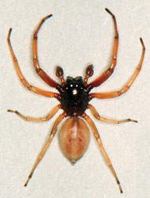
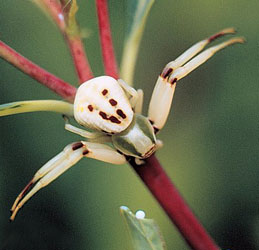
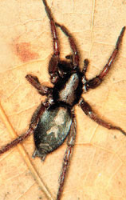

---
aliases:
  - Dionycha
title: Dionycha
---

# Dionycha 
) )   

## #has_/text_of_/abstract 

> The **Dionycha** are a clade of spiders (Araneomorphae:Entelegynae), 
> characterized by the possession of two tarsal claws 
> with tufts of hairs (setae) beside them, which produce strong adhesion, 
> enabling some species to climb glass. 
> 
> The circumscription of the group has varied widely; 
> a 2021 analysis resulted in about 20 families, 
> including Salticidae (jumping spiders), Gnaphosidae (ground spiders), and Clubionidae.
>
> The Dionycha are considered to be a subgroup of the larger RTA clade. 
> Most species hunt their prey instead of building webs.
>
> There are no cribellate members in the Dionycha.
>
> Today it is thought that the reduction of the third claw 
> present in ancestral spiders evolved several times independently, 
> so this alone is not a criterion that defines the clade.
>
> [Wikipedia](https://en.wikipedia.org/wiki/Dionycha) 

### Information on the Internet

[Biodiversity of Australasian Ground Spiders](http://research.amnh.org/entomology/spiders/). NSF Peet Project, American Museum of Natural History.

## Phylogeny 

-   « Ancestral Groups  
    -  [Entelegynae](../../Entelegynae.md) 
    -  [Araneomorphae](../../../Araneomorphae.md) 
    -   [Spider](../../../../Spider.md)
    -  [Arachnida](../../../../../Arachnida.md) 
    -  [Arthropoda](../../../../../../../Arthropoda.md) 
    -  [Bilateria](../../../../../../../../Bilateria.md) 
    -  [Animals](../../../../../../../../../Animals.md) 
    -  [Eukarya](../../../../../../../../../../Eukarya.md) 
    -   [Tree of Life](../../../../../../../../../../Tree_of_Life.md)

-   ◊ Sibling Groups of  Entelegynae
    -  [Amaurobiidae](../Amaurobiidae.md) 
    -  [Eresoidea](../Eresoidea.md) 
    -   [other entelegynes](other_entelegynes)
    -  [Palpimanoidea](../Palpimanoidea.md) 
    -  [Dictynoidea](../Dictynoidea.md) 
    -  [Orbiculariae](../Orbiculariae.md) 
    -   Dionycha
    -   [other amaurobioids](other_amaurobioids)
    -  [Lycosoidea](../Lycosoidea.md) 

-   » Sub-Groups
    -   [Jumping_Spider](Dionycha/Jumping_Spider.md)
    -   [Crab_Spider](Dionycha/Crab_Spider.md)
    -  [Clubionidae](Dionycha/Clubionidae.md) 

## Title Illustrations

Photographs copyright © Jim Kalisch, [Department of Entomology,     University of Nebraska-Lincoln](http://entomology.unl.edu/).

-   Ground spider, Trachelas tranquillus (Corrinidae). )

-   Crab spider, Misumenoides formosipes (Thomisidae). )

-   Parson spider, Herpyllus ecclesiasticus (Gnaphosidae). )

## Confidential Links & Embeds: 

### #is_/same_as :: [[/_Standards/bio/bio~Domain/Eukarya/Animal/Bilateria/Arthropoda/Chelicerata/Arachnida/Spider/Araneomorphae/Entelegynae/Dictynoidea/Dionycha|Dionycha]] 

### #is_/same_as :: [[/_public/bio/bio~Domain/Eukarya/Animal/Bilateria/Arthropoda/Chelicerata/Arachnida/Spider/Araneomorphae/Entelegynae/Dictynoidea/Dionycha.public|Dionycha.public]] 

### #is_/same_as :: [[/_internal/bio/bio~Domain/Eukarya/Animal/Bilateria/Arthropoda/Chelicerata/Arachnida/Spider/Araneomorphae/Entelegynae/Dictynoidea/Dionycha.internal|Dionycha.internal]] 

### #is_/same_as :: [[/_protect/bio/bio~Domain/Eukarya/Animal/Bilateria/Arthropoda/Chelicerata/Arachnida/Spider/Araneomorphae/Entelegynae/Dictynoidea/Dionycha.protect|Dionycha.protect]] 

### #is_/same_as :: [[/_private/bio/bio~Domain/Eukarya/Animal/Bilateria/Arthropoda/Chelicerata/Arachnida/Spider/Araneomorphae/Entelegynae/Dictynoidea/Dionycha.private|Dionycha.private]] 

### #is_/same_as :: [[/_personal/bio/bio~Domain/Eukarya/Animal/Bilateria/Arthropoda/Chelicerata/Arachnida/Spider/Araneomorphae/Entelegynae/Dictynoidea/Dionycha.personal|Dionycha.personal]] 

### #is_/same_as :: [[/_secret/bio/bio~Domain/Eukarya/Animal/Bilateria/Arthropoda/Chelicerata/Arachnida/Spider/Araneomorphae/Entelegynae/Dictynoidea/Dionycha.secret|Dionycha.secret]] 

