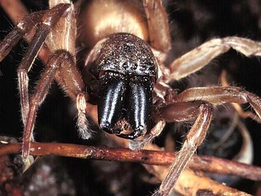

---
aliases:
- Clubionidae
- Clubiònid
- Klubionedoj
- Maišavoriai
- Naʼashjéʼii azisí
- pussihämähäkit
- Păianjen sac
- Sackspinnen
- sekkeedderkopper
- struikzakspinnen
- säckspindlar
- zápředníkovití
- Κλουβιονίδες
- Клубіяніды
- عنکبوتهای کیسهباف
- كلوبيونيداى
- لماجيات
- フクログモ科
- 袋蛛科
title: Clubionidae
has_id_wikidata: Q8634
dv_has_:
  name_:
    an: Clubionidae
    ar: لماجيات
    arz: كلوبيونيداى
    ast: Clubionidae
    be: Клубіяніды
    bg: Clubionidae
    ca: Clubiònid
    ceb: Clubionidae
    cs: zápředníkovití
    de: Sackspinnen
    el: Κλουβιονίδες
    en: Clubionidae
    eo: Klubionedoj
    es: Clubionidae
    eu: Clubionidae
    ext: Clubionidae
    fa: عنکبوتهای کیسهباف
    fi: pussihämähäkit
    fr: Clubionidae
    ga: Clubionidae
    gl: Clubionidae
    ia: Clubionidae
    ie: Clubionidae
    io: Clubionidae
    it: Clubionidae
    ja: フクログモ科
    la: Clubionidae
    lt: Maišavoriai
    mul: Clubionidae
    nb: sekkeedderkopper
    nl: struikzakspinnen
    nn: Clubionidae
    nv: Naʼashjéʼii azisí
    oc: Clubionidae
    pl: Clubionidae
    pt: Clubionidae
    pt_br: Clubionidae
    ro: Păianjen sac
    ru: Clubionidae
    sq: Clubionidae
    sv: säckspindlar
    tr: Clubionidae
    uk: Clubionidae
    vi: Clubionidae
    vo: Clubionidae
    war: Clubionidae
    zh: 袋蛛科
    zh_cn: 袋蛛科
    zh_hans: 袋蛛科
    zh_tw: 袋蛛科
---
# [[Clubionidae]] 

 

## #has_/text_of_/abstract 

> The sac spiders of the family **Clubionidae** are nocturnal, sac-building hunting spiders with a near-worldwide distribution. Their sacs, silken retreats in which they hide during the day, may be made in a variety of places, including between folded leaves or grass blades, under bark and below rocks or other ground litter.
>
> Although formerly a much larger catch-all taxon, in its current definition the family contains less than 700 described species across 18 genera, of which Clubiona is by far most species-rich, with 528 accepted species as of November 2024.
>
> [Wikipedia](https://en.wikipedia.org/wiki/Sac%20spider) 

## Phylogeny 

-   « Ancestral Groups  
    -  [Dionycha](../Dionycha.md) 
    -  [Entelegynae](../../../Entelegynae.md) 
    -  [Araneomorphae](../../../../Araneomorphae.md) 
    -   [Spider](../../../../../Spider.md)
    -  [Arachnida](../../../../../../Arachnida.md) 
    -  [Arthropoda](../../../../../../../../Arthropoda.md) 
    -  [Bilateria](../../../../../../../../../Bilateria.md) 
    -  [Animals](../../../../../../../../../../Animals.md) 
    -  [Eukarya](../../../../../../../../../../../Eukarya.md) 
    -   [Tree of Life](../../../../../../../../../../../Tree_of_Life.md)

-   ◊ Sibling Groups of  Dionycha
    -   [Jumping_Spider](Jumping_Spider.md)
    -   [Crab_Spider](Crab_Spider.md)
    -   Clubionidae

-   » Sub-Groups 

	-   *Alloclubionoides*
	-   *Carteroniella*
	-   *Carteronius*
	-   *Clubiona*
	-   *Clubionina*
	-   *Dorymetaecus*
	-   *Elaver*
	-   *Malamatidia*
	-   *Matidia*
	-   *Nusatidia*
	-   *Pristidia*
	-   *Pteroneta*
	-   *Scopalio*
	-   *Simalio*
	-   *Tixcocoba*

Containing group:[Dionycha](../Dionycha.md) 

## Title Illustrations

----------------------------------------------------------------------------

scientific_name ::     Arachnida:Spider:Clubionidae: Chiracanthium sp (face)
location ::           Midland Meanders, Kwazulu-Natal, South Africa
specimen_condition ::  Live Specimen
Body Part            face
Image Use ::    [Attribution-NonCommercial 2.0 Creative Commons License](http://creativecommons.org/licenses/by-nc/2.0/).
copyright ::            © 2005 [Cesare Brizio](http://xoomer.virgilio.it/cebrizio/) 

## Confidential Links & Embeds: 

### #is_/same_as :: [[/_Standards/bio/bio~Domain/Eukarya/Animal/Bilateria/Arthropoda/Chelicerata/Arachnida/Spider/Araneomorphae/Entelegynae/Dictynoidea/Dionycha/Clubionidae|Clubionidae]] 

### #is_/same_as :: [[/_public/bio/bio~Domain/Eukarya/Animal/Bilateria/Arthropoda/Chelicerata/Arachnida/Spider/Araneomorphae/Entelegynae/Dictynoidea/Dionycha/Clubionidae.public|Clubionidae.public]] 

### #is_/same_as :: [[/_internal/bio/bio~Domain/Eukarya/Animal/Bilateria/Arthropoda/Chelicerata/Arachnida/Spider/Araneomorphae/Entelegynae/Dictynoidea/Dionycha/Clubionidae.internal|Clubionidae.internal]] 

### #is_/same_as :: [[/_protect/bio/bio~Domain/Eukarya/Animal/Bilateria/Arthropoda/Chelicerata/Arachnida/Spider/Araneomorphae/Entelegynae/Dictynoidea/Dionycha/Clubionidae.protect|Clubionidae.protect]] 

### #is_/same_as :: [[/_private/bio/bio~Domain/Eukarya/Animal/Bilateria/Arthropoda/Chelicerata/Arachnida/Spider/Araneomorphae/Entelegynae/Dictynoidea/Dionycha/Clubionidae.private|Clubionidae.private]] 

### #is_/same_as :: [[/_personal/bio/bio~Domain/Eukarya/Animal/Bilateria/Arthropoda/Chelicerata/Arachnida/Spider/Araneomorphae/Entelegynae/Dictynoidea/Dionycha/Clubionidae.personal|Clubionidae.personal]] 

### #is_/same_as :: [[/_secret/bio/bio~Domain/Eukarya/Animal/Bilateria/Arthropoda/Chelicerata/Arachnida/Spider/Araneomorphae/Entelegynae/Dictynoidea/Dionycha/Clubionidae.secret|Clubionidae.secret]] 

