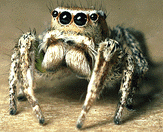
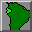
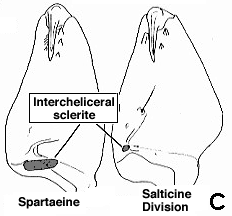

---
aliases:
- Salticidae
- "Jumping Spider"
title: Salticidae
---

## Phylogeny 

-   « Ancestral Groups  
    -  [Dionycha](../Dionycha.md))
    -  [Entelegynae](../../../Entelegynae.md))
    -  [Araneomorphae](../../../../Araneomorphae.md))
    -   [Spider](../../../../../Spider.md)
    -  [Arachnida](../../../../../../Arachnida.md))
    -  [Arthropoda](../../../../../../../../Arthropoda.md))
    -  [Bilateria](../../../../../../../../../Bilateria.md))
    -  [Animals](../../../../../../../../../../Animals.md))
    -  [Eukarya](../../../../../../../../../../../Eukarya.md))
    -   [Tree of Life](../../../../../../../../../../../Tree_of_Life.md)

-   ◊ Sibling Groups of  Dionycha
    -   Salticidae
    -   [Crab_Spider](Crab_Spider.md)
    -  [Clubionidae](Clubionidae.md))

-   » Sub-Groups
    -   [Lyssomaninae](Jumping_Spider/Lyssomaninae.md)
    -   [Spartaeinae](Jumping_Spider/Spartaeinae.md)
    -   [Amycinae](Jumping_Spider/Amycinae.md)
    -   [Thiodininae](Jumping_Spider/Thiodininae.md)
    -   [Hisponinae](Jumping_Spider/Hisponinae.md)
    -   [Synemosyninae](Jumping_Spider/Synemosyninae.md)
    -   [Hyetussinae](Jumping_Spider/Hyetussinae.md)
    -   [Sitticinae](Jumping_Spider/Sitticinae.md)
    -   [Plexippinae](Jumping_Spider/Plexippinae.md)
    -   [Pelleninae](Jumping_Spider/Pelleninae.md)
    -   [Heliophaninae](Jumping_Spider/Heliophaninae.md)
    -   [Salticus](Salticus)
    -   [Miscellaneous salticids with a fixed         embolus](Miscellaneous_salticids_with_a_fixed_embolus)
    -   [Dendryphantinae](Jumping_Spider/Dendryphantinae.md)
    -   [Euophryinae](Jumping_Spider/Euophryinae.md)
    -   [Synagelinae](Jumping_Spider/Synagelinae.md)
    -   [Ballinae](Jumping_Spider/Ballinae.md)
    -   [Miscellaneous salticids with a free         embolus](Miscellaneous_salticids_with_a_free_embolus)

# [[Jumping_Spider]]

Jumping Spiders 

## #has_/text_of_/abstract 

> Jumping spiders are a group of spiders that constitute the family **Salticidae**. 
> 
> As of 2019, this family contained over 600 described genera and over 6,000 described species, 
> making it the largest family of spiders – comprising 13% of spider species. 
> 
> Jumping spiders have some of the best vision among arthropods — being capable of stereoptic color vision — and use sight in courtship, hunting, and navigation. Although they normally move unobtrusively and fairly slowly, most species are capable of very agile jumps, notably when hunting, but sometimes in response to sudden threats or crossing long gaps. Both their book lungs and tracheal system are well-developed, and they use both systems (bimodal breathing). Jumping spiders are generally recognized by their eye pattern. All jumping spiders have four pairs of eyes, with the anterior median pair (the two front middle eyes) being particularly large.
>
> [Wikipedia](https://en.wikipedia.org/wiki/Jumping%20spider) 

### Information on the Internet

-   [Proszynski\'s Catalogue of Salticidae](http://salticidae.org/salticid/main.htm).\
    This catalogue is a complete taxonomic catalogue of salticids as of early 1995. It also includes an extensive [references](http://salticidae.org/salticid/catalog/1-Ref-A.htm) section.

## Introduction

[Wayne Maddison]() 

Jumping spiders (Salticidae) are easily distinguished from other spiders
by their four big eyes on the face and four smaller eyes on top of the
head. Around the world there are probably more than 5000 species of
jumping spiders.

Jumping spiders are charming spiders that look up and watch you. Their
excellent
[vision](http://www.tolweb.org/accessory/Jumping_Spider_Vision?acc_id=1946)
allows them to hunt much as do cats, spotting prey from long distances,
creeping up then pouncing using their jumping ability. Although a
jumping spider can jump more than fifty times its body length, none of
its legs has enlarged muscles. The power for jumping probably comes from
a quick contraction of muscles in the front part of the body increasing
the blood pressure, which causes the legs to extend rapidly much as in
the toy frogs that hop when you squeeze a bulb.

Their vision also allows communications by visual means, such as the
elaborate [courtship dances](http://www.tolweb.org/accessory/Movies_of_Jumping_Spider_Courtship?acc_id=64)
that males perform.

Salticids are perhaps as old and diverse as mammals, though not many
humans know their world. Many salticids are
[colorful](http://www.tolweb.org/accessory/Colorful_Jumping_Spiders?acc_id=62),
they take on a variety of [body forms](http://www.tolweb.org/accessory/Jumping_Spider_Diversity?acc_id=61),
and some have
[disguises](http://www.tolweb.org/accessory/Salticids_in_Disguise?acc_id=63),
looking like ants and other organisms. The bright colors and elaborate
forms of some jumping spider species are involved in courtship.

If you\'d like to learn more about jumping spiders, you can follow the
phylogenetic tree above to explore the diversity of species. You might
also want to wander through a
[gallery](http://www.tolweb.org/accessory/Jumping_Spider_Image_Gallery?acc_id=59)
of jumping spider images and movies, explore their
[anatomy](http://www.tolweb.org/accessory/Jumping_Spider_Anatomy?acc_id=65),
or focus on the [jumping spiders of America north of Mexico](http://www.tolweb.org/accessory/Jumping_spiders_of_America_North_of_Mexico?acc_id=66).

### Characteristics

The monophyly of the family Salticidae is best supported by the peculiar
eye structure yielding excellent vision and corresponding vision-based
behavior. In particular, the AME are enlarged and tube shaped, with the
retina strip-shaped and tiered (Scheuring, 1914; Land, 1969, Blest and
Sigmund, 1984). Each of these features may be cited as a synapomorphy
uniting the salticids. The fully-developed system of eye muscles
described by Scheuring (1914) appears unique to salticids, though eye
muscles are inadequately studied among salticids and spiders as a whole.
Study of the eye muscles of thomisids and clubionids could be
particularly important in establishing a sister group to salticids. The
complex branching of the intestinal diverticula over the brain of
salticids (Millot, 1931) may also delimit the family, though there have
not been studies of the diverticula of lyssomanines, whose narrower
ocular area may not accommodate complex diverticula.

### Salticid faunas of geographical areas

By navigating along the tree above, you can wander through jumping
spider diversity throughout the world (although, at present, the
coverage is highly biased towards New World salticids). Guides or
overviews to the salticid faunas of the following restricted
geographical areas are available:

-   [America North of     Mexico](http://www.tolweb.org/accessory/Jumping_spiders_of_America_North_of_Mexico?acc_id=66)
    ](http://www.tolweb.org/accessory/Jumping_spiders_of_America_North_of_Mexico?acc_id=66)
-   [Ecuador](http://www.tolweb.org/accessory/Jumping_Spiders_of_Ecuador?acc_id=67),
    South America ](http://www.tolweb.org/accessory/Jumping_Spiders_of_Ecuador?acc_id=67)

### Discussion of Phylogenetic Relationships

The phylogeny of salticids is poorly resolved. What is shown above is
provisional and incomplete, based on the work of Maddison (1988, 1996).

Of the branches shown here, the best supported clade is the **Salticine
Division**. Some synapomorphies for the Salticine Division are:

1.  Short, anteriorly placed fovea (Wanless, 1984);
2.  Small posterior median eyes (Wanless, 1984);
3.  Cell bodies of anterior lateral eye photoreceptors displaced to side
    (Blest, 1983);
4.  AME retinal strip sharply curved (Blest and Sigmund, 1984);
5.  Six arms of pigmented glia surround secondary eye photoreceptors, as
    opposed to 4 or less in Lyssomanes and the spartaeines (Eakin and
    Brandenburger, 1971; Blest and Sigmund, 1984).

Maddison (1988, 1996) added the following additional synapomorphies:

1.  Absence (or great reduction) of tarsal claw on female palpus;
2.  Gnathocoxal gland openings displaced medially (A);
3.  Posterior tarsal claws with far fewer teeth than anterior;
4.  Accumulation of slit sense organs and associated seta on a mound on
    the medial edge of the basal segment of the chelicerae (B);
5.  Intercheliceral sclerite small (C).

The **unidentates** form a group recognized by Simon that may retain
validity, if fissidents are included as a variant. The dendryphantines,
euophryines and several smaller subfamilies make up the
**\"free-embolus\" group**, which have a movable embolus separated from
the tegulum by an inflatable hematodocha, and an embolus that curls
counterclockwise from origin to tip in the left palpus ventral view.

### Express routes

The salticid section of the Tree of Life is most completely developed in
the following areas:

-   [Habronattus](tree?group=Habronattus&contgroup=Pelleninae):
    A remarkable genus whose males are elaborately colored and
    ornamented. You will find videos of their courtship behavior.
-   [Pelegrina](tree?group=Pelegrina&contgroup=Dendryphantinae):
    Some of the illustrations and diagnoses from the monograph of
    Pelegrina (Maddison, 1996) are shown here.

## Title Illustrations

This is an apparently undescribed species of Habronattus, near H. hirsutus, from California.

---------------------------------------------------------------------------

Copyright ::   © 1994-1995 [Wayne Maddison](http://salticidae.org/wpm/home.html) 

## Confidential Links & Embeds: 

### #is_/same_as ::[Jumping_Spider](Jumping_Spider.md)) 

### #is_/same_as :: [Jumping_Spider.public](/_public/bio/bio~Domain/Eukarya/Animal/Bilateria/Arthropoda/Chelicerata/Arachnida/Spider/Araneomorphae/Entelegynae/Dictynoidea/Dionycha/Jumping_Spider.public.md) 

### #is_/same_as :: [Jumping_Spider.internal](/_internal/bio/bio~Domain/Eukarya/Animal/Bilateria/Arthropoda/Chelicerata/Arachnida/Spider/Araneomorphae/Entelegynae/Dictynoidea/Dionycha/Jumping_Spider.internal.md) 

### #is_/same_as :: [Jumping_Spider.protect](/_protect/bio/bio~Domain/Eukarya/Animal/Bilateria/Arthropoda/Chelicerata/Arachnida/Spider/Araneomorphae/Entelegynae/Dictynoidea/Dionycha/Jumping_Spider.protect.md) 

### #is_/same_as :: [Jumping_Spider.private](/_private/bio/bio~Domain/Eukarya/Animal/Bilateria/Arthropoda/Chelicerata/Arachnida/Spider/Araneomorphae/Entelegynae/Dictynoidea/Dionycha/Jumping_Spider.private.md) 

### #is_/same_as :: [Jumping_Spider.personal](/_personal/bio/bio~Domain/Eukarya/Animal/Bilateria/Arthropoda/Chelicerata/Arachnida/Spider/Araneomorphae/Entelegynae/Dictynoidea/Dionycha/Jumping_Spider.personal.md) 

### #is_/same_as :: [Jumping_Spider.secret](/_secret/bio/bio~Domain/Eukarya/Animal/Bilateria/Arthropoda/Chelicerata/Arachnida/Spider/Araneomorphae/Entelegynae/Dictynoidea/Dionycha/Jumping_Spider.secret.md)

