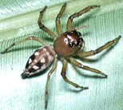

---
aliases:
- Amycinae
- Amycini
- اميسينى
title: Amycinae
has_id_wikidata: Q101445
dv_has_:
  name_:
    an: Amycini
    arz: اميسينى
    ast: Amycini
    bg: Amycini
    ca: Amycini
    ceb: Amycini
    de: Amycini
    en: Amycini
    eo: Amycini
    es: Amycini
    eu: Amycini
    ext: Amycini
    fi: Amycini
    fr: Amycini
    ga: Amycini
    gl: Amycini
    ia: Amycini
    ie: Amycini
    io: Amycini
    it: Amycini
    la: Amycini
    mul: Amycini
    nl: Amycini
    oc: Amycini
    pl: Amycini
    pt: Amycini
    pt-br: Amycini
    ro: Amycini
    ru: Amycini
    sq: Amycini
    uk: Amycini
    vi: Amycini
    vo: Amycini
    war: Amycini
---
# [[Amycinae]] 

## #has_/text_of_/abstract 

> Amycini is a tribe of jumping spiders. It has been treated as the subfamily **Amycinae**.
>
> [Wikipedia](https://en.wikipedia.org/wiki/Amycini) 

## Phylogeny 

-   « Ancestral Groups  
    -   [Jumping_Spider](../Jumping_Spider.md)
    -  [Dionycha](../../Dionycha.md) 
    -  [Entelegynae](../../../../Entelegynae.md) 
    -  [Araneomorphae](../../../../../Araneomorphae.md) 
    -   [Spider](../../../../../../Spider.md)
    -  [Arachnida](../../../../../../../Arachnida.md) 
    -  [Arthropoda](../../../../../../../../../Arthropoda.md) 
    -  [Bilateria](../../../../../../../../../../Bilateria.md) 
    -  [Animals](../../../../../../../../../../../Animals.md) 
    -  [Eukarya](../../../../../../../../../../../../Eukarya.md) 
    -   [Tree of Life](../../../../../../../../../../../../Tree_of_Life.md)

-   ◊ Sibling Groups of  Salticidae
    -   [Lyssomaninae](Lyssomaninae.md)
    -   [Spartaeinae](Spartaeinae.md)
    -   Amycinae
    -   [Thiodininae](Thiodininae.md)
    -   [Hisponinae](Hisponinae.md)
    -   [Synemosyninae](Synemosyninae.md)
    -   [Hyetussinae](Hyetussinae.md)
    -   [Sitticinae](Sitticinae.md)
    -   [Plexippinae](Plexippinae.md)
    -   [Pelleninae](Pelleninae.md)
    -   [Heliophaninae](Heliophaninae.md)
    -   [Salticus](Salticus)
    -   [Miscellaneous salticids with a fixed         embolus](Miscellaneous_salticids_with_a_fixed_embolus)
    -   [Dendryphantinae](Dendryphantinae.md)
    -   [Euophryinae](Euophryinae.md)
    -   [Synagelinae](Synagelinae.md)
    -   [Ballinae](Ballinae.md)
    -   [Miscellaneous salticids with a free         embolus](Miscellaneous_salticids_with_a_free_embolus)

-   » Sub-Groups
    -   [Amycus](Amycus)
    -   [Acragas](Acragas)
    -   [Encolpius](Encolpius)
    -   [Hypaeus](Hypaeus)
    -   [Mago](Mago)
    -   [Noegus](Noegus)

	-   *[Amycus](Amycus)*
	-   *[Acragas](Acragas)*
	-   *[Encolpius](Encolpius)*
	-   *[Hypaeus](Hypaeus)*
	-   *[Mago](Mago)*
	-   *[Noegus](Noegus)*

## Introduction

An entirely neotropical group of pluridents. In many neotropical
rainforests these are perhaps the dominant group of salticids, both in
numbers of species and in individuals. Most are foliage dwellers, though
Encolpius is found on tree trunks and some Amycus are ground-dwellers.

## Title Illustrations

---------------------------------------------------------------------------

copyright ::   © 1994-1995 [Wayne Maddison](http://salticidae.org/wpm/home.html) 

## Confidential Links & Embeds: 

### #is_/same_as :: [[/_Standards/bio/bio~Domain/Eukarya/Animal/Bilateria/Arthropoda/Chelicerata/Arachnida/Spider/Araneomorphae/Entelegynae/Dictynoidea/Dionycha/Jumping_Spider/Amycinae|Amycinae]] 

### #is_/same_as :: [[/_public/bio/bio~Domain/Eukarya/Animal/Bilateria/Arthropoda/Chelicerata/Arachnida/Spider/Araneomorphae/Entelegynae/Dictynoidea/Dionycha/Jumping_Spider/Amycinae.public|Amycinae.public]] 

### #is_/same_as :: [[/_internal/bio/bio~Domain/Eukarya/Animal/Bilateria/Arthropoda/Chelicerata/Arachnida/Spider/Araneomorphae/Entelegynae/Dictynoidea/Dionycha/Jumping_Spider/Amycinae.internal|Amycinae.internal]] 

### #is_/same_as :: [[/_protect/bio/bio~Domain/Eukarya/Animal/Bilateria/Arthropoda/Chelicerata/Arachnida/Spider/Araneomorphae/Entelegynae/Dictynoidea/Dionycha/Jumping_Spider/Amycinae.protect|Amycinae.protect]] 

### #is_/same_as :: [[/_private/bio/bio~Domain/Eukarya/Animal/Bilateria/Arthropoda/Chelicerata/Arachnida/Spider/Araneomorphae/Entelegynae/Dictynoidea/Dionycha/Jumping_Spider/Amycinae.private|Amycinae.private]] 

### #is_/same_as :: [[/_personal/bio/bio~Domain/Eukarya/Animal/Bilateria/Arthropoda/Chelicerata/Arachnida/Spider/Araneomorphae/Entelegynae/Dictynoidea/Dionycha/Jumping_Spider/Amycinae.personal|Amycinae.personal]] 

### #is_/same_as :: [[/_secret/bio/bio~Domain/Eukarya/Animal/Bilateria/Arthropoda/Chelicerata/Arachnida/Spider/Araneomorphae/Entelegynae/Dictynoidea/Dionycha/Jumping_Spider/Amycinae.secret|Amycinae.secret]] 

