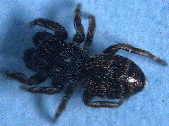
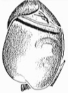
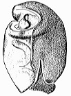
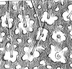

---
aliases:
  - Ballinae
title: Ballinae
---

# [[Ballinae]] 

Copyright ::   © 1994-1995 [Wayne Maddison](http://salticidae.org/wpm/home.html) 

## Phylogeny 

-   « Ancestral Groups  
    -   [Jumping_Spider](../Jumping_Spider.md)
    -  [Dionycha](../../Dionycha.md))
    -  [Entelegynae](../../../../Entelegynae.md))
    -  [Araneomorphae](../../../../../Araneomorphae.md))
    -   [Spider](../../../../../../Spider.md)
    -  [Arachnida](../../../../../../../Arachnida.md))
    -  [Arthropoda](../../../../../../../../../Arthropoda.md))
    -  [Bilateria](../../../../../../../../../../Bilateria.md))
    -  [Animals](../../../../../../../../../../../Animals.md))
    -  [Eukarya](../../../../../../../../../../../../Eukarya.md))
    -   [Tree of Life](../../../../../../../../../../../../Tree_of_Life.md)

-   ◊ Sibling Groups of  Salticidae
    -   [Lyssomaninae](Lyssomaninae.md)
    -   [Spartaeinae](Spartaeinae.md)
    -   [Amycinae](Amycinae.md)
    -   [Thiodininae](Thiodininae.md)
    -   [Hisponinae](Hisponinae.md)
    -   [Synemosyninae](Synemosyninae.md)
    -   [Hyetussinae](Hyetussinae.md)
    -   [Sitticinae](Sitticinae.md)
    -   [Plexippinae](Plexippinae.md)
    -   [Pelleninae](Pelleninae.md)
    -   [Heliophaninae](Heliophaninae.md)
    -   [Salticus](Salticus)
    -   [Miscellaneous salticids with a fixed         embolus](Miscellaneous_salticids_with_a_fixed_embolus)
    -   [Dendryphantinae](Dendryphantinae.md)
    -   [Euophryinae](Euophryinae.md)
    -   [Synagelinae](Synagelinae.md)
    -   Ballinae
    -   [Miscellaneous salticids with a free         embolus](Miscellaneous_salticids_with_a_free_embolus)

-   » Sub-Groups
    -   [Ballus](Ballus)
    -   [Admestina](Admestina)

	-   *[Ballus](Ballus)*
	-   *Colaxes*
	-   *Padilla*
	-   *Pachyballus*
	-   *Marengo*
	-   *[Admestina](Admestina)*

## Introduction

[Wayne Maddison]() 

A tentative grouping of salticids with a specially spiralled embolus. At
least some are beetle-like or pseudoscorpion-like and bark dwellers.

### Characteristics

Maddison (1988) proposed as synapomorphies for this group two characters
of the male palpi: (1) a well-coiled embolus lying flat on the tegulum,
and (2) a tegulum which is divided by a pale longitudinal furrow:

 

As well, at least some members share an unusual carapace tegument
showing a reticulate pattern:

This pattern, however, is also seen in Cheliferoides and Descanso, which
I have interpreted to be
[synagelines](tree?group=Synagelinae&contgroup=Salticidae).
The distinction between synagelines and ballines is clouded by other
characters as well.

## Confidential Links & Embeds: 

### #is_/same_as :: [Ballinae](/_Standards/bio/bio~Domain/Eukarya/Animal/Bilateria/Arthropoda/Chelicerata/Arachnida/Spider/Araneomorphae/Entelegynae/Dictynoidea/Dionycha/Jumping_Spider/Ballinae.md) 

### #is_/same_as :: [Ballinae.public](/_public/bio/bio~Domain/Eukarya/Animal/Bilateria/Arthropoda/Chelicerata/Arachnida/Spider/Araneomorphae/Entelegynae/Dictynoidea/Dionycha/Jumping_Spider/Ballinae.public.md) 

### #is_/same_as :: [Ballinae.internal](/_internal/bio/bio~Domain/Eukarya/Animal/Bilateria/Arthropoda/Chelicerata/Arachnida/Spider/Araneomorphae/Entelegynae/Dictynoidea/Dionycha/Jumping_Spider/Ballinae.internal.md) 

### #is_/same_as :: [Ballinae.protect](/_protect/bio/bio~Domain/Eukarya/Animal/Bilateria/Arthropoda/Chelicerata/Arachnida/Spider/Araneomorphae/Entelegynae/Dictynoidea/Dionycha/Jumping_Spider/Ballinae.protect.md) 

### #is_/same_as :: [Ballinae.private](/_private/bio/bio~Domain/Eukarya/Animal/Bilateria/Arthropoda/Chelicerata/Arachnida/Spider/Araneomorphae/Entelegynae/Dictynoidea/Dionycha/Jumping_Spider/Ballinae.private.md) 

### #is_/same_as :: [Ballinae.personal](/_personal/bio/bio~Domain/Eukarya/Animal/Bilateria/Arthropoda/Chelicerata/Arachnida/Spider/Araneomorphae/Entelegynae/Dictynoidea/Dionycha/Jumping_Spider/Ballinae.personal.md) 

### #is_/same_as :: [Ballinae.secret](/_secret/bio/bio~Domain/Eukarya/Animal/Bilateria/Arthropoda/Chelicerata/Arachnida/Spider/Araneomorphae/Entelegynae/Dictynoidea/Dionycha/Jumping_Spider/Ballinae.secret.md)

