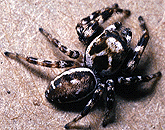
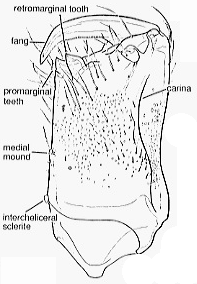
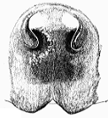

---
aliases:
  - Dendryphantinae
title: Dendryphantinae
---

# Dendryphantinae 

## Phylogeny 

-   « Ancestral Groups  
    -   [Jumping_Spider](../Jumping_Spider.md)
    -  [Dionycha](../../Dionycha.md) 
    -  [Entelegynae](../../../../Entelegynae.md) 
    -  [Araneomorphae](../../../../../Araneomorphae.md) 
    -   [Spider](../../../../../../Spider.md)
    -  [Arachnida](../../../../../../../Arachnida.md) 
    -  [Arthropoda](../../../../../../../../../Arthropoda.md) 
    -  [Bilateria](../../../../../../../../../../Bilateria.md) 
    -  [Animals](../../../../../../../../../../../Animals.md) 
    -  [Eukarya](../../../../../../../../../../../../Eukarya.md) 
    -   [Tree of Life](../../../../../../../../../../../../Tree_of_Life.md)

-   ◊ Sibling Groups of  Salticidae
    -   [Lyssomaninae](Lyssomaninae.md)
    -   [Spartaeinae](Spartaeinae.md)
    -   [Amycinae](Amycinae.md)
    -   [Thiodininae](Thiodininae.md)
    -   [Hisponinae](Hisponinae.md)
    -   [Synemosyninae](Synemosyninae.md)
    -   [Hyetussinae](Hyetussinae.md)
    -   [Sitticinae](Sitticinae.md)
    -   [Plexippinae](Plexippinae.md)
    -   [Pelleninae](Pelleninae.md)
    -   [Heliophaninae](Heliophaninae.md)
    -   [Salticus](Salticus)
    -   [Miscellaneous salticids with a fixed embolus](Miscellaneous_salticids_with_a_fixed_embolus)
    -   Dendryphantinae
    -   [Euophryinae](Euophryinae.md)
    -   [Synagelinae](Synagelinae.md)
    -   [Ballinae](Ballinae.md)
    -   [Miscellaneous salticids with a free embolus](Miscellaneous_salticids_with_a_free_embolus)

-   » Sub-Groups
    -   [Agassa cyanea](Agassa_cyanea)
    -   [Anicius dolius](Anicius_dolius)
    -   [Ashtabula](Ashtabula)
    -   [Bagheera](Bagheera)
    -   [Beata](Beata)
    -   [Bellota](Bellota)
    -   [Bryantella](Bryantella)
    -   [Chirothecia](Chirothecia)
    -   [Dendryphantes](Dendryphantes)
    -   [Eris](Eris)
    -   [Gastromicans](Gastromicans)
    -   [Ghelna](Ghelna)
    -   [Hentzia](Hentzia)
    -   [Lurio](Lurio)
    -   [Mabellina prescotti](Mabellina_prescotti)
    -   [Messua](Messua)
    -   [Metaphidippus](Metaphidippus)
    -   [Nagaina](Nagaina)
    -   [Paradamoetas](Paradamoetas)
    -   [Parnaenus](Parnaenus)
    -   [Pelegrina](Pelegrina)
    -   [Phanias](Phanias)
    -   [Phidippus](Phidippus)
    -   [Poultonella](Poultonella)
    -   [Ramboia](Ramboia)
    -   [Rhene](Rhene)
    -   [Rhetenor](Rhetenor)
    -   [Rudra](Rudra)
    -   [Sassacus](Sassacus)
    -   [Terralonus](Terralonus)
    -   [Tulpius](Tulpius)
    -   [Tutelina](Tutelina)
    -   [Zygoballus](Zygoballus)
    -   [Unidentified Dendryphantinae](Unidentified_Dendryphantinae)

	-   *Admirala*
	-   *[Agassa](Agassa_cyanea)*
	-   *Anamosa*
	-   *[Anicius](Anicius_dolius)*
	-   *[Ashtabula](Ashtabula)*
	-   *Avitus*
	-   *[Bagheera](Bagheera)*
	-   *[Beata](Beata)*
	-   *[Bellota](Bellota)*
	-   *[Bryantella](Bryantella)*
	-   *Cerionesta*
	-   *[Chirothecia](Chirothecia)*
	-   *[Dendryphantes](Dendryphantes)*
	-   *Donaldius*
	-   *[Eris](Eris)*
	-   *[Gastromicans](Gastromicans)*
	-   *[Ghelna](Ghelna)*
	-   *[Hentzia](Hentzia)*
	-   *Homalattus*
	-   *[Lurio](Lurio)*
	-   *[Mabellina](Mabellina_prescotti)*
	-   *[Messua](Messua)*
	-   *[Metaphidippus](Metaphidippus)*
	-   *[Nagaina](Nagaina)*
	-   *Osericta*
	-   *[Paradamoetas](Paradamoetas)*
	-   *[Parnaenus](Parnaenus)*
	-   *[Pelegrina](Pelegrina)*
	-   *[Phanias](Phanias)*
	-   *[Phidippus](Phidippus)*
	-   *[Poultonella](Poultonella)*
	-   *[Ramboia](Ramboia)*
	-   *[Rhene](Rhene)*
	-   *[Rhetenor](Rhetenor)*
	-   *[Rudra](Rudra)*
	-   *[Sassacus](Sassacus)*
	-   *Sebastira*
	-   *Selimus*
	-   *Semora*
	-   *Tacuna*
	-   *[Terralonus](Terralonus)*
	-   *Thammaca*
	-   *[Tulpius](Tulpius)*
	-   *[Tutelina](Tutelina)*
	-   *Uluella*
	-   *[Zygoballus](Zygoballus)*
	-   *[Unidentified     Dendryphantinae](Unidentified_Dendryphantinae)*

## Introduction

[Wayne Maddison]() 

The dendryphantines are among the commonnest and most diverse jumping
spiders of the New World (considerably less diverse in the Old World).
Included are genera such as Phidippus, Metaphidippus, Eris,
Dendryphantes, Tutelina, and Hentzia. Generally the females show paired
spots on the abdomen, and the males often have enlarged chelicerae.

### Characteristics

Maddison (1988, 1996) proposed three characters derived within the
family as synapomorphies of the subfamily:

1.  Carina on the ventrolateral edge of the basal segment of the male
    chelicerae:

    

    (from Maddison, 1996)

2.  Coil of embolus folded back so as to be hidden behind the basal part
    of the embolus, so that the coiling is usually only visible from the
    back of the embolus:

    

3.  Epigynal openings S-shaped, with entry toward the lateral in the
    anterior half and toward the medial in the posterior half:

    

    (from Maddison, 1996)

### References

Maddison, W.P. 1988. A revision of jumping spider species groups
formerly placed in the genus Metaphidippus, with a discussion of
salticid phylogeny (Spider). Ph.D. thesis, Harvard University,
Cambridge.

Maddison, W.P. 1996. Pelegrina and other jumping spiders formerly placed
in the genus Metaphidippus (Spider: Salticidae). Bulletin of the Museum
of Comparative Zoology. l54(4): 215-368.

## Title Illustrations

)

  ---------------------------------------------------------------------------
  Copyright ::   © 1994-1995 [Wayne Maddison](http://salticidae.org/wpm/home.html) 
 
  ---------------------------------------------------------------------------

## Confidential Links & Embeds: 

### #is_/same_as :: [[/_Standards/bio/bio~Domain/Eukarya/Animal/Bilateria/Arthropoda/Chelicerata/Arachnida/Spider/Araneomorphae/Entelegynae/Dictynoidea/Dionycha/Jumping_Spider/Dendryphantinae|Dendryphantinae]] 

### #is_/same_as :: [[/_public/bio/bio~Domain/Eukarya/Animal/Bilateria/Arthropoda/Chelicerata/Arachnida/Spider/Araneomorphae/Entelegynae/Dictynoidea/Dionycha/Jumping_Spider/Dendryphantinae.public|Dendryphantinae.public]] 

### #is_/same_as :: [[/_internal/bio/bio~Domain/Eukarya/Animal/Bilateria/Arthropoda/Chelicerata/Arachnida/Spider/Araneomorphae/Entelegynae/Dictynoidea/Dionycha/Jumping_Spider/Dendryphantinae.internal|Dendryphantinae.internal]] 

### #is_/same_as :: [[/_protect/bio/bio~Domain/Eukarya/Animal/Bilateria/Arthropoda/Chelicerata/Arachnida/Spider/Araneomorphae/Entelegynae/Dictynoidea/Dionycha/Jumping_Spider/Dendryphantinae.protect|Dendryphantinae.protect]] 

### #is_/same_as :: [[/_private/bio/bio~Domain/Eukarya/Animal/Bilateria/Arthropoda/Chelicerata/Arachnida/Spider/Araneomorphae/Entelegynae/Dictynoidea/Dionycha/Jumping_Spider/Dendryphantinae.private|Dendryphantinae.private]] 

### #is_/same_as :: [[/_personal/bio/bio~Domain/Eukarya/Animal/Bilateria/Arthropoda/Chelicerata/Arachnida/Spider/Araneomorphae/Entelegynae/Dictynoidea/Dionycha/Jumping_Spider/Dendryphantinae.personal|Dendryphantinae.personal]] 

### #is_/same_as :: [[/_secret/bio/bio~Domain/Eukarya/Animal/Bilateria/Arthropoda/Chelicerata/Arachnida/Spider/Araneomorphae/Entelegynae/Dictynoidea/Dionycha/Jumping_Spider/Dendryphantinae.secret|Dendryphantinae.secret]] 

