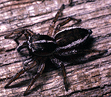

---
aliases:
  - Heliophaninae
  - Chrysillini
title: Heliophaninae
---

# [[Heliophaninae]]

## #has_/text_of_/abstract 

> Chrysillini is a tribe of jumping spider in the family Salticidae. 
> In Maddison's 2015 revision of the family, 
> the subfamily **Heliophaninae** was reclassified as a junior synonym of Chrysillini.
>
> [Wikipedia](https://en.wikipedia.org/wiki/Chrysillini) 

## Phylogeny 

-   « Ancestral Groups  
    -   [Jumping_Spider](../Jumping_Spider.md)
    -  [Dionycha](../../Dionycha.md) 
    -  [Entelegynae](../../../../Entelegynae.md) 
    -  [Araneomorphae](../../../../../Araneomorphae.md) 
    -   [Spider](../../../../../../Spider.md)
    -  [Arachnida](../../../../../../../Arachnida.md) 
    -  [Arthropoda](../../../../../../../../../Arthropoda.md) 
    -  [Bilateria](../../../../../../../../../../Bilateria.md) 
    -  [Animals](../../../../../../../../../../../Animals.md) 
    -  [Eukarya](../../../../../../../../../../../../Eukarya.md) 
    -   [Tree of Life](../../../../../../../../../../../../Tree_of_Life.md)

-   ◊ Sibling Groups of  Salticidae
    -   [Lyssomaninae](Lyssomaninae.md)
    -   [Spartaeinae](Spartaeinae.md)
    -   [Amycinae](Amycinae.md)
    -   [Thiodininae](Thiodininae.md)
    -   [Hisponinae](Hisponinae.md)
    -   [Synemosyninae](Synemosyninae.md)
    -   [Hyetussinae](Hyetussinae.md)
    -   [Sitticinae](Sitticinae.md)
    -   [Plexippinae](Plexippinae.md)
    -   [Pelleninae](Pelleninae.md)
    -   Heliophaninae
    -   [Salticus](Salticus)
    -   [Miscellaneous salticids with a fixed         embolus](Miscellaneous_salticids_with_a_fixed_embolus)
    -   [Dendryphantinae](Dendryphantinae.md)
    -   [Euophryinae](Euophryinae.md)
    -   [Synagelinae](Synagelinae.md)
    -   [Ballinae](Ballinae.md)
    -   [Miscellaneous salticids with a free         embolus](Miscellaneous_salticids_with_a_free_embolus)

-   » Sub-Groups
    -   [Heliophanus](Heliophanus)
    -   [Icius](Icius)
    -   [Pseudicius](Pseudicius)
    -   [Marchena minuta](Marchena_minuta)
    -   [Helvetia](Helvetia)
    -   [Yepoella](Yepoella)
    -   [Phintella](Phintella)

	-   *[Heliophanus](Heliophanus)*
	-   *[Icius](Icius)*
	-   *[Pseudicius](Pseudicius)*
	-   *Festucula*
	-   *[Marchena](Marchena_minuta)*
	-   *[Helvetia](Helvetia)*
	-   *[Yepoella](Yepoella)*
	-   *[Phintella](Phintella)*

Composition of Heliophaninae after Maddison (1987, unpublished)

Containing group: [Jumping_Spider](../Jumping_Spider.md)

## Introduction

[Wayne Maddison]() 

A primarily Old World subfamily with a distinctive leg-carapace
stridulatory mechanism. The New World has only Marchena minuta and the
neotropical bark-dwellers Helvetia and Yepoella. There are hints that
social aggregations may be common throughout the group (Maddison, 1987).

### Characteristics

The heliophaninae is delimited by two characters (Maddison, 1987):

1.  a stridulatory apparatus consisting of seta-bearing tubercles on the
    first leg femur and rugose carapace-sides
2.  a bump on the tegulum

### References

Maddison, W. P. 1987. Marchena and other jumping spiders with an
apparent leg-carapace stridulatory mechanism (Spider: Salticidae:
Heliophaninae and Thiodininae). Bulletin of the British Arachnological
Society 7: 101-106.

## Title Illustrations

 

  ---------------------------------------------------------------------------
  Copyright ::   © 1994-1995 [Wayne Maddison](http://salticidae.org/wpm/home.html) 
 
  ---------------------------------------------------------------------------

## Confidential Links & Embeds: 

### #is_/same_as :: [[/_Standards/bio/bio~Domain/Eukarya/Animal/Bilateria/Arthropoda/Chelicerata/Arachnida/Spider/Araneomorphae/Entelegynae/Dictynoidea/Dionycha/Jumping_Spider/Heliophaninae|Heliophaninae]] 

### #is_/same_as :: [[/_public/bio/bio~Domain/Eukarya/Animal/Bilateria/Arthropoda/Chelicerata/Arachnida/Spider/Araneomorphae/Entelegynae/Dictynoidea/Dionycha/Jumping_Spider/Heliophaninae.public|Heliophaninae.public]] 

### #is_/same_as :: [[/_internal/bio/bio~Domain/Eukarya/Animal/Bilateria/Arthropoda/Chelicerata/Arachnida/Spider/Araneomorphae/Entelegynae/Dictynoidea/Dionycha/Jumping_Spider/Heliophaninae.internal|Heliophaninae.internal]] 

### #is_/same_as :: [[/_protect/bio/bio~Domain/Eukarya/Animal/Bilateria/Arthropoda/Chelicerata/Arachnida/Spider/Araneomorphae/Entelegynae/Dictynoidea/Dionycha/Jumping_Spider/Heliophaninae.protect|Heliophaninae.protect]] 

### #is_/same_as :: [[/_private/bio/bio~Domain/Eukarya/Animal/Bilateria/Arthropoda/Chelicerata/Arachnida/Spider/Araneomorphae/Entelegynae/Dictynoidea/Dionycha/Jumping_Spider/Heliophaninae.private|Heliophaninae.private]] 

### #is_/same_as :: [[/_personal/bio/bio~Domain/Eukarya/Animal/Bilateria/Arthropoda/Chelicerata/Arachnida/Spider/Araneomorphae/Entelegynae/Dictynoidea/Dionycha/Jumping_Spider/Heliophaninae.personal|Heliophaninae.personal]] 

### #is_/same_as :: [[/_secret/bio/bio~Domain/Eukarya/Animal/Bilateria/Arthropoda/Chelicerata/Arachnida/Spider/Araneomorphae/Entelegynae/Dictynoidea/Dionycha/Jumping_Spider/Heliophaninae.secret|Heliophaninae.secret]] 

