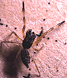
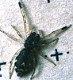
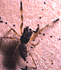

---
aliases:
  - Hyetussa
title: Hyetussa
---

## Phylogeny 

-   « Ancestral Groups  
    -   [Hyetussinae](../Hyetussinae.md)
    -   [Jumping_Spider](../../Jumping_Spider.md)
    -  [Dionycha](../../../Dionycha.md) 
    -  [Entelegynae](../../../../../Entelegynae.md) 
    -  [Araneomorphae](../../../../../../Araneomorphae.md) 
    -   [Spider](../../../../../../../Spider.md)
    -  [Arachnida](../../../../../../../../Arachnida.md) 
    -  [Arthropoda](../../../../../../../../../../Arthropoda.md) 
    -  [Bilateria](../../../../../../../../../../../Bilateria.md) 
    -  [Animals](../../../../../../../../../../../../Animals.md) 
    -  [Eukarya](../../../../../../../../../../../../../Eukarya.md) 
    -   [Tree of Life](../../../../../../../../../../../../../Tree_of_Life.md)

-   ◊ Sibling Groups of  Hyetussinae
    -   [Bredana](Bredana)
    -   [Cyllodania](Cyllodania)
    -   Hyetussa
    -   [Scopocira](Scopocira.md)
    -   [Titanattus](Titanattus.md)
    -   [Unidentified         Hyetussinae](Unidentified_Hyetussinae)

-   » Sub-Groups 

# Hyetussa 

-   *Hyetussa aguilari*
-   *Hyetussa andalgalaensis*
-   *Hyetussa cribrata*
-   *Hyetussa mesopotamica*
-   *Hyetussa secta*
-   *Hyetussa simoni*

Containing group: [Hyetussinae](../Hyetussinae.md)

### Information on the Internet

Proszynski\'s Catalogue entry for
[Hyetussa](http://salticidae.org/salticid/catalog/Hyetussa.htm)

## Title Illustrations

The above photos are of spiders tentatively identified as Hyetussa. They
occur commonly on the trunks of standing trees in the tropical
rainforest of the Cuyabeno Reserve, Ecuador.


  ---------------------------------------------------------------------------
  copyright ::   © 1994-1995 [Wayne Maddison](http://salticidae.org/wpm/home.html) 
 
  ---------------------------------------------------------------------------


  ---------------------------------------------------------------------------
  copyright ::   © 1994-1995 [Wayne Maddison](http://salticidae.org/wpm/home.html) 
 
  ---------------------------------------------------------------------------

## Confidential Links & Embeds: 

### #is_/same_as :: [[/_Standards/bio/bio~Domain/Eukarya/Animal/Bilateria/Arthropoda/Chelicerata/Arachnida/Spider/Araneomorphae/Entelegynae/Dictynoidea/Dionycha/Jumping_Spider/Hyetussinae/Hyetussa|Hyetussa]] 

### #is_/same_as :: [[/_public/bio/bio~Domain/Eukarya/Animal/Bilateria/Arthropoda/Chelicerata/Arachnida/Spider/Araneomorphae/Entelegynae/Dictynoidea/Dionycha/Jumping_Spider/Hyetussinae/Hyetussa.public|Hyetussa.public]] 

### #is_/same_as :: [[/_internal/bio/bio~Domain/Eukarya/Animal/Bilateria/Arthropoda/Chelicerata/Arachnida/Spider/Araneomorphae/Entelegynae/Dictynoidea/Dionycha/Jumping_Spider/Hyetussinae/Hyetussa.internal|Hyetussa.internal]] 

### #is_/same_as :: [[/_protect/bio/bio~Domain/Eukarya/Animal/Bilateria/Arthropoda/Chelicerata/Arachnida/Spider/Araneomorphae/Entelegynae/Dictynoidea/Dionycha/Jumping_Spider/Hyetussinae/Hyetussa.protect|Hyetussa.protect]] 

### #is_/same_as :: [[/_private/bio/bio~Domain/Eukarya/Animal/Bilateria/Arthropoda/Chelicerata/Arachnida/Spider/Araneomorphae/Entelegynae/Dictynoidea/Dionycha/Jumping_Spider/Hyetussinae/Hyetussa.private|Hyetussa.private]] 

### #is_/same_as :: [[/_personal/bio/bio~Domain/Eukarya/Animal/Bilateria/Arthropoda/Chelicerata/Arachnida/Spider/Araneomorphae/Entelegynae/Dictynoidea/Dionycha/Jumping_Spider/Hyetussinae/Hyetussa.personal|Hyetussa.personal]] 

### #is_/same_as :: [[/_secret/bio/bio~Domain/Eukarya/Animal/Bilateria/Arthropoda/Chelicerata/Arachnida/Spider/Araneomorphae/Entelegynae/Dictynoidea/Dionycha/Jumping_Spider/Hyetussinae/Hyetussa.secret|Hyetussa.secret]] 

