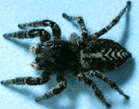

---
aliases:
  - Pelleninae
title: Pelleninae
---

# [[Pelleninae]] 

Copyright ::   © 1994-1995 [Wayne Maddison](http://salticidae.org/wpm/home.html) 

## Phylogeny 

-   « Ancestral Groups  
    -   [Jumping_Spider](../Jumping_Spider.md)
    -  [Dionycha](../../Dionycha.md) 
    -  [Entelegynae](../../../../Entelegynae.md) 
    -  [Araneomorphae](../../../../../Araneomorphae.md) 
    -   [Spider](../../../../../../Spider.md)
    -  [Arachnida](../../../../../../../Arachnida.md) 
    -  [Arthropoda](../../../../../../../../../Arthropoda.md) 
    -  [Bilateria](../../../../../../../../../../Bilateria.md) 
    -  [Animals](../../../../../../../../../../../Animals.md) 
    -  [Eukarya](../../../../../../../../../../../../Eukarya.md) 
    -   [Tree of Life](../../../../../../../../../../../../Tree_of_Life.md)

-   ◊ Sibling Groups of  Salticidae
    -   [Lyssomaninae](Lyssomaninae.md)
    -   [Spartaeinae](Spartaeinae.md)
    -   [Amycinae](Amycinae.md)
    -   [Thiodininae](Thiodininae.md)
    -   [Hisponinae](Hisponinae.md)
    -   [Synemosyninae](Synemosyninae.md)
    -   [Hyetussinae](Hyetussinae.md)
    -   [Sitticinae](Sitticinae.md)
    -   [Plexippinae](Plexippinae.md)
    -   Pelleninae
    -   [Heliophaninae](Heliophaninae.md)
    -   [Salticus](Salticus)
    -   [Miscellaneous salticids with a fixed         embolus](Miscellaneous_salticids_with_a_fixed_embolus)
    -   [Dendryphantinae](Dendryphantinae.md)
    -   [Euophryinae](Euophryinae.md)
    -   [Synagelinae](Synagelinae.md)
    -   [Ballinae](Ballinae.md)
    -   [Miscellaneous salticids with a free         embolus](Miscellaneous_salticids_with_a_free_embolus)

-   » Sub-Groups
    -   [Habronattus](Habronattus)
    -   [Pellenes](Pellenes)

	-   *[Habronattus](Habronattus)*
	-   *Neaetha*
	-   *[Pellenes](Pellenes)*

Containing group: [Jumping_Spider](../Jumping_Spider.md)

## Introduction

[Wayne Maddison](http://www.tolweb.org/)

A subfamily of primarily ground-dwelling salticids with a holarctic
genus Pellenes, an Old World genus Neaetha, and a New World genus
Habronattus. Habronattus in particular is remarkable for the elaborate
and diverse ornaments and behaviors used in courtship by males.

## Confidential Links & Embeds: 

### #is_/same_as :: [[/_Standards/bio/bio~Domain/Eukarya/Animal/Bilateria/Arthropoda/Chelicerata/Arachnida/Spider/Araneomorphae/Entelegynae/Dictynoidea/Dionycha/Jumping_Spider/Pelleninae|Pelleninae]] 

### #is_/same_as :: [[/_public/bio/bio~Domain/Eukarya/Animal/Bilateria/Arthropoda/Chelicerata/Arachnida/Spider/Araneomorphae/Entelegynae/Dictynoidea/Dionycha/Jumping_Spider/Pelleninae.public|Pelleninae.public]] 

### #is_/same_as :: [[/_internal/bio/bio~Domain/Eukarya/Animal/Bilateria/Arthropoda/Chelicerata/Arachnida/Spider/Araneomorphae/Entelegynae/Dictynoidea/Dionycha/Jumping_Spider/Pelleninae.internal|Pelleninae.internal]] 

### #is_/same_as :: [[/_protect/bio/bio~Domain/Eukarya/Animal/Bilateria/Arthropoda/Chelicerata/Arachnida/Spider/Araneomorphae/Entelegynae/Dictynoidea/Dionycha/Jumping_Spider/Pelleninae.protect|Pelleninae.protect]] 

### #is_/same_as :: [[/_private/bio/bio~Domain/Eukarya/Animal/Bilateria/Arthropoda/Chelicerata/Arachnida/Spider/Araneomorphae/Entelegynae/Dictynoidea/Dionycha/Jumping_Spider/Pelleninae.private|Pelleninae.private]] 

### #is_/same_as :: [[/_personal/bio/bio~Domain/Eukarya/Animal/Bilateria/Arthropoda/Chelicerata/Arachnida/Spider/Araneomorphae/Entelegynae/Dictynoidea/Dionycha/Jumping_Spider/Pelleninae.personal|Pelleninae.personal]] 

### #is_/same_as :: [[/_secret/bio/bio~Domain/Eukarya/Animal/Bilateria/Arthropoda/Chelicerata/Arachnida/Spider/Araneomorphae/Entelegynae/Dictynoidea/Dionycha/Jumping_Spider/Pelleninae.secret|Pelleninae.secret]] 

