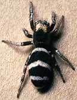

---
aliases:
  - Salticus
  - Salticinae
title: Salticus
---

## [[Salticinae]] 

Salticus 

 

## #has_/text_of_/abstract 

> **Salticinae** is a subfamily of jumping spiders (family Salticidae). 
> It includes over 90% of the known species of jumping spiders. 
> The subfamily is divided into two unranked clades: Amycoida and Salticoida.
>
> [Wikipedia](https://en.wikipedia.org/wiki/Salticinae) 

## Phylogeny 

-   « Ancestral Groups  
    -   [Jumping_Spider](../Jumping_Spider.md)
    -  [Dionycha](../../Dionycha.md) 
    -  [Entelegynae](../../../../Entelegynae.md) 
    -  [Araneomorphae](../../../../../Araneomorphae.md) 
    -   [Spider](../../../../../../Spider.md)
    -  [Arachnida](../../../../../../../Arachnida.md) 
    -  [Arthropoda](../../../../../../../../../Arthropoda.md) 
    -  [Bilateria](../../../../../../../../../../Bilateria.md) 
    -  [Animals](../../../../../../../../../../../Animals.md) 
    -  [Eukarya](../../../../../../../../../../../../Eukarya.md) 
    -   [Tree of Life](../../../../../../../../../../../../Tree_of_Life.md)

-   ◊ Sibling Groups of  Salticidae
    -   [Lyssomaninae](Lyssomaninae.md)
    -   [Spartaeinae](Spartaeinae.md)
    -   [Amycinae](Amycinae.md)
    -   [Thiodininae](Thiodininae.md)
    -   [Hisponinae](Hisponinae.md)
    -   [Synemosyninae](Synemosyninae.md)
    -   [Hyetussinae](Hyetussinae.md)
    -   [Sitticinae](Sitticinae.md)
    -   [Plexippinae](Plexippinae.md)
    -   [Pelleninae](Pelleninae.md)
    -   [Heliophaninae](Heliophaninae.md)
    -   Salticus
    -   [Miscellaneous salticids with a fixed         embolus](Miscellaneous_salticids_with_a_fixed_embolus)
    -   [Dendryphantinae](Dendryphantinae.md)
    -   [Euophryinae](Euophryinae.md)
    -   [Synagelinae](Synagelinae.md)
    -   [Ballinae](Ballinae.md)
    -   [Miscellaneous salticids with a free         embolus](Miscellaneous_salticids_with_a_free_embolus)

-   » Sub-Groups
    -   [Salticus palpalis](Salticus_palpalis)
    -   [Salticus peckhamae](Salticus_peckhamae)
    -   [Salticus scenicus](Salticus_scenicus)

	-   *Salticus albipalpis*
	-   *Salticus albobarbatus*
	-   *Salticus albovittatus*
	-   *Salticus alpinus*
	-   *Salticus ambiguus*
	-   *Salticus apressus*
	-   *Salticus arenarius*
	-   *Salticus atratus*
	-   *Salticus attenuatus*
	-   *Salticus aubryi*
	-   *Salticus austinensis*
	-   *Salticus berbruggeri*
	-   *Salticus biguttatus*
	-   *Salticus bonaeriensis*
	-   *Salticus brasiliensis*
	-   *Salticus canariensis*
	-   *Salticus candidus*
	-   *Salticus cephalicus*
	-   *Salticus cingulatus*
	-   *Salticus confusus*
	-   *Salticus conjunctus*
	-   *Salticus curvus*
	-   *Salticus dzhungaricus*
	-   *Salticus exilis*
	-   *Salticus festivus*
	-   *Salticus flavicruris*
	-   *Salticus flavipalpis*
	-   *Salticus fulvounilineatus*
	-   *Salticus fumosus*
	-   *Salticus furvus*
	-   *Salticus gomerensis*
	-   *Salticus gracilis*
	-   *Salticus guerini*
	-   *Salticus guichenoti*
	-   *Salticus jenynsi*
	-   *Salticus koreanus*
	-   *Salticus latidentatus*
	-   *Salticus lilliputanus*
	-   *Salticus limbatus*
	-   *Salticus major*
	-   *Salticus mandibularis*
	-   *Salticus marenzelleri*
	-   *Salticus meticulosus*
	-   *Salticus minax*
	-   *Salticus modicus*
	-   *Salticus mustillinus*
	-   *Salticus mutabilis*
	-   *Salticus myrmecinus*
	-   *Salticus myrmecoides*
	-   *Salticus nigrifrons*
	-   *Salticus notatus*
	-   *Salticus olivaceus*
	-   *Salticus oranensis*
	-   *Salticus oseryi*
	-   *[Salticus     palpalis](Salticus_palpalis)*
	-   *Salticus paludivagus*
	-   *[Salticus     peckhamae](Salticus_peckhamae)*
	-   *Salticus placidus*
	-   *Salticus potanini*
	-   *Salticus propinquus*
	-   *Salticus proruptus*
	-   *Salticus prosper*
	-   *Salticus proszynskii*
	-   *Salticus ravus*
	-   *Salticus rufifrons*
	-   *Salticus rufolineatus*
	-   *Salticus quagga*
	-   *[Salticus     scenicus](Salticus_scenicus)*
	-   *Salticus scitulus*
	-   *Salticus sedulus*
	-   *Salticus splendens*
	-   *Salticus tabinus*
	-   *Salticus tenebricus*
	-   *Salticus testaceolineatus*
	-   *Salticus tricinctus*
	-   *Salticus trunctatus*
	-   *Salticus unciger*
	-   *Salticus unicolor*
	-   *Salticus unispina*
	-   *Salticus v-notatus*
	-   *Salticus xantofrontalis*
	-   *Salticus zebraneus*

Containing group: [Jumping_Spider](../Jumping_Spider.md)

### Information on the Internet

Proszynski\'s Catalogue entry for [Salticus](http://salticidae.org/salticid/catalog/Salticus.htm)

## Introduction

[Wayne Maddison](http://www.tolweb.org/)

A traditional nomenclatural approach would dictate that the subfamily
Salticinae must exist, but to date no clear concept of it has been
proposed. Salticus, with its palpi waving as it walks, reminds one
behaviorally of Menemerus, Chrysilla and the heliophanines. There are
preliminary indications of a synapomorphy concerning glands in the
tegulum that would unite Salticus with some or all of these groups.

## Title Illustrations

------------------------------------------------------------------------------

Scientific Name ::     Salticus palpalis
Specimen Condition   Live Specimen
Sex ::                Female
Copyright ::            © 1994-1995 [Wayne Maddison](http://salticidae.org/wpm/home.html) 
------------------------------------------------------------------------------

## Confidential Links & Embeds: 

### #is_/same_as :: [[/_Standards/bio/bio~Domain/Eukarya/Animal/Bilateria/Arthropoda/Chelicerata/Arachnida/Spider/Araneomorphae/Entelegynae/Dictynoidea/Dionycha/Jumping_Spider/Salticinae|Salticinae]] 

### #is_/same_as :: [[/_public/bio/bio~Domain/Eukarya/Animal/Bilateria/Arthropoda/Chelicerata/Arachnida/Spider/Araneomorphae/Entelegynae/Dictynoidea/Dionycha/Jumping_Spider/Salticinae.public|Salticinae.public]] 

### #is_/same_as :: [[/_internal/bio/bio~Domain/Eukarya/Animal/Bilateria/Arthropoda/Chelicerata/Arachnida/Spider/Araneomorphae/Entelegynae/Dictynoidea/Dionycha/Jumping_Spider/Salticinae.internal|Salticinae.internal]] 

### #is_/same_as :: [[/_protect/bio/bio~Domain/Eukarya/Animal/Bilateria/Arthropoda/Chelicerata/Arachnida/Spider/Araneomorphae/Entelegynae/Dictynoidea/Dionycha/Jumping_Spider/Salticinae.protect|Salticinae.protect]] 

### #is_/same_as :: [[/_private/bio/bio~Domain/Eukarya/Animal/Bilateria/Arthropoda/Chelicerata/Arachnida/Spider/Araneomorphae/Entelegynae/Dictynoidea/Dionycha/Jumping_Spider/Salticinae.private|Salticinae.private]] 

### #is_/same_as :: [[/_personal/bio/bio~Domain/Eukarya/Animal/Bilateria/Arthropoda/Chelicerata/Arachnida/Spider/Araneomorphae/Entelegynae/Dictynoidea/Dionycha/Jumping_Spider/Salticinae.personal|Salticinae.personal]] 

### #is_/same_as :: [[/_secret/bio/bio~Domain/Eukarya/Animal/Bilateria/Arthropoda/Chelicerata/Arachnida/Spider/Araneomorphae/Entelegynae/Dictynoidea/Dionycha/Jumping_Spider/Salticinae.secret|Salticinae.secret]] 

