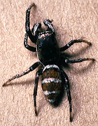
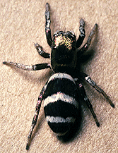

## Phylogeny 

-   « Ancestral Groups  
    -   [Salticus](Salticus)
    -   [Jumping_Spider](../../Jumping_Spider.md)
    -  [Dionycha](../../../Dionycha.md))
    -  [Entelegynae](../../../../../Entelegynae.md))
    -  [Araneomorphae](../../../../../../Araneomorphae.md))
    -   [Spider](../../../../../../../Spider.md)
    -  [Arachnida](../../../../../../../../Arachnida.md))
    -  [Arthropoda](../../../../../../../../../../Arthropoda.md))
    -  [Bilateria](../../../../../../../../../../../Bilateria.md))
    -  [Animals](../../../../../../../../../../../../Animals.md))
    -  [Eukarya](../../../../../../../../../../../../../Eukarya.md))
    -   [Tree of Life](../../../../../../../../../../../../../Tree_of_Life.md)

-   ◊ Sibling Groups of  Salticus
    -   Salticus palpalis
    -   [Salticus peckhamae](Salticus_peckhamae)
    -   [Salticus scenicus](Salticus_scenicus)

-   » Sub-Groups 

# [[Salticus palpalis]] 

 
 
Copyright ::   © 1994-1995 [Wayne Maddison](http://salticidae.org/wpm/home.html) 

## Confidential Links & Embeds: 

### #is_/same_as :: [palpalis](/_Standards/bio/bio~Domain/Eukarya/Animal/Bilateria/Arthropoda/Chelicerata/Arachnida/Spider/Araneomorphae/Entelegynae/Dictynoidea/Dionycha/Jumping_Spider/Salticinae/palpalis.md) 

### #is_/same_as :: [palpalis.public](/_public/bio/bio~Domain/Eukarya/Animal/Bilateria/Arthropoda/Chelicerata/Arachnida/Spider/Araneomorphae/Entelegynae/Dictynoidea/Dionycha/Jumping_Spider/Salticinae/palpalis.public.md) 

### #is_/same_as :: [palpalis.internal](/_internal/bio/bio~Domain/Eukarya/Animal/Bilateria/Arthropoda/Chelicerata/Arachnida/Spider/Araneomorphae/Entelegynae/Dictynoidea/Dionycha/Jumping_Spider/Salticinae/palpalis.internal.md) 

### #is_/same_as :: [palpalis.protect](/_protect/bio/bio~Domain/Eukarya/Animal/Bilateria/Arthropoda/Chelicerata/Arachnida/Spider/Araneomorphae/Entelegynae/Dictynoidea/Dionycha/Jumping_Spider/Salticinae/palpalis.protect.md) 

### #is_/same_as :: [palpalis.private](/_private/bio/bio~Domain/Eukarya/Animal/Bilateria/Arthropoda/Chelicerata/Arachnida/Spider/Araneomorphae/Entelegynae/Dictynoidea/Dionycha/Jumping_Spider/Salticinae/palpalis.private.md) 

### #is_/same_as :: [palpalis.personal](/_personal/bio/bio~Domain/Eukarya/Animal/Bilateria/Arthropoda/Chelicerata/Arachnida/Spider/Araneomorphae/Entelegynae/Dictynoidea/Dionycha/Jumping_Spider/Salticinae/palpalis.personal.md) 

### #is_/same_as :: [palpalis.secret](/_secret/bio/bio~Domain/Eukarya/Animal/Bilateria/Arthropoda/Chelicerata/Arachnida/Spider/Araneomorphae/Entelegynae/Dictynoidea/Dionycha/Jumping_Spider/Salticinae/palpalis.secret.md)

