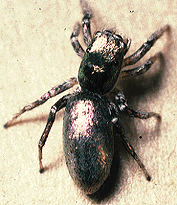

---
aliases:
  - peckhamae
title: Salticus peckhamae
---

## Phylogeny 

-   « Ancestral Groups  
    -   [Salticus](Salticus)
    -   [Jumping_Spider](../../Jumping_Spider.md)
    -  [Dionycha](../../../Dionycha.md) 
    -  [Entelegynae](../../../../../Entelegynae.md) 
    -  [Araneomorphae](../../../../../../Araneomorphae.md) 
    -   [Spider](../../../../../../../Spider.md)
    -  [Arachnida](../../../../../../../../Arachnida.md) 
    -  [Arthropoda](../../../../../../../../../../Arthropoda.md) 
    -  [Bilateria](../../../../../../../../../../../Bilateria.md) 
    -  [Animals](../../../../../../../../../../../../Animals.md) 
    -  [Eukarya](../../../../../../../../../../../../../Eukarya.md) 
    -   [Tree of Life](../../../../../../../../../../../../../Tree_of_Life.md)

-   ◊ Sibling Groups of  Salticus
    -   [Salticus palpalis](Salticus_palpalis)
    -   Salticus peckhamae
    -   [Salticus scenicus](Salticus_scenicus)

-   » Sub-Groups 

# *Salticus peckhamae* 

 
copyright ::   © 1994-1995 [Wayne Maddison](http://salticidae.org/wpm/home.html) 

## Confidential Links & Embeds: 

### #is_/same_as :: [[/_Standards/bio/bio~Domain/Eukarya/Animal/Bilateria/Arthropoda/Chelicerata/Arachnida/Spider/Araneomorphae/Entelegynae/Dictynoidea/Dionycha/Jumping_Spider/Salticinae/peckhamae|peckhamae]] 

### #is_/same_as :: [[/_public/bio/bio~Domain/Eukarya/Animal/Bilateria/Arthropoda/Chelicerata/Arachnida/Spider/Araneomorphae/Entelegynae/Dictynoidea/Dionycha/Jumping_Spider/Salticinae/peckhamae.public|peckhamae.public]] 

### #is_/same_as :: [[/_internal/bio/bio~Domain/Eukarya/Animal/Bilateria/Arthropoda/Chelicerata/Arachnida/Spider/Araneomorphae/Entelegynae/Dictynoidea/Dionycha/Jumping_Spider/Salticinae/peckhamae.internal|peckhamae.internal]] 

### #is_/same_as :: [[/_protect/bio/bio~Domain/Eukarya/Animal/Bilateria/Arthropoda/Chelicerata/Arachnida/Spider/Araneomorphae/Entelegynae/Dictynoidea/Dionycha/Jumping_Spider/Salticinae/peckhamae.protect|peckhamae.protect]] 

### #is_/same_as :: [[/_private/bio/bio~Domain/Eukarya/Animal/Bilateria/Arthropoda/Chelicerata/Arachnida/Spider/Araneomorphae/Entelegynae/Dictynoidea/Dionycha/Jumping_Spider/Salticinae/peckhamae.private|peckhamae.private]] 

### #is_/same_as :: [[/_personal/bio/bio~Domain/Eukarya/Animal/Bilateria/Arthropoda/Chelicerata/Arachnida/Spider/Araneomorphae/Entelegynae/Dictynoidea/Dionycha/Jumping_Spider/Salticinae/peckhamae.personal|peckhamae.personal]] 

### #is_/same_as :: [[/_secret/bio/bio~Domain/Eukarya/Animal/Bilateria/Arthropoda/Chelicerata/Arachnida/Spider/Araneomorphae/Entelegynae/Dictynoidea/Dionycha/Jumping_Spider/Salticinae/peckhamae.secret|peckhamae.secret]] 

