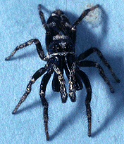
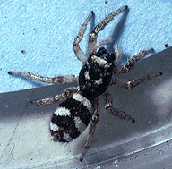

---
aliases:
  - scenicus
title: Salticus scenicus
---

# *Salticus scenicus* 

     

## Phylogeny 

-   « Ancestral Groups  
    -   [Salticus](Salticus)
    -   [Jumping_Spider](../../Jumping_Spider.md)
    -  [Dionycha](../../../Dionycha.md))
    -  [Entelegynae](../../../../../Entelegynae.md))
    -  [Araneomorphae](../../../../../../Araneomorphae.md))
    -   [Spider](../../../../../../../Spider.md)
    -  [Arachnida](../../../../../../../../Arachnida.md))
    -  [Arthropoda](../../../../../../../../../../Arthropoda.md))
    -  [Bilateria](../../../../../../../../../../../Bilateria.md))
    -  [Animals](../../../../../../../../../../../../Animals.md))
    -  [Eukarya](../../../../../../../../../../../../../Eukarya.md))
    -   [Tree of Life](../../../../../../../../../../../../../Tree_of_Life.md)

-   ◊ Sibling Groups of  Salticus
    -   [Salticus palpalis](Salticus_palpalis)
    -   [Salticus peckhamae](Salticus_peckhamae)
    -   Salticus scenicus

-   » Sub-Groups 

## Confidential Links & Embeds: 

### #is_/same_as :: [scenicus](/_Standards/bio/bio~Domain/Eukarya/Animal/Bilateria/Arthropoda/Chelicerata/Arachnida/Spider/Araneomorphae/Entelegynae/Dictynoidea/Dionycha/Jumping_Spider/Salticinae/scenicus.md) 

### #is_/same_as :: [scenicus.public](/_public/bio/bio~Domain/Eukarya/Animal/Bilateria/Arthropoda/Chelicerata/Arachnida/Spider/Araneomorphae/Entelegynae/Dictynoidea/Dionycha/Jumping_Spider/Salticinae/scenicus.public.md) 

### #is_/same_as :: [scenicus.internal](/_internal/bio/bio~Domain/Eukarya/Animal/Bilateria/Arthropoda/Chelicerata/Arachnida/Spider/Araneomorphae/Entelegynae/Dictynoidea/Dionycha/Jumping_Spider/Salticinae/scenicus.internal.md) 

### #is_/same_as :: [scenicus.protect](/_protect/bio/bio~Domain/Eukarya/Animal/Bilateria/Arthropoda/Chelicerata/Arachnida/Spider/Araneomorphae/Entelegynae/Dictynoidea/Dionycha/Jumping_Spider/Salticinae/scenicus.protect.md) 

### #is_/same_as :: [scenicus.private](/_private/bio/bio~Domain/Eukarya/Animal/Bilateria/Arthropoda/Chelicerata/Arachnida/Spider/Araneomorphae/Entelegynae/Dictynoidea/Dionycha/Jumping_Spider/Salticinae/scenicus.private.md) 

### #is_/same_as :: [scenicus.personal](/_personal/bio/bio~Domain/Eukarya/Animal/Bilateria/Arthropoda/Chelicerata/Arachnida/Spider/Araneomorphae/Entelegynae/Dictynoidea/Dionycha/Jumping_Spider/Salticinae/scenicus.personal.md) 

### #is_/same_as :: [scenicus.secret](/_secret/bio/bio~Domain/Eukarya/Animal/Bilateria/Arthropoda/Chelicerata/Arachnida/Spider/Araneomorphae/Entelegynae/Dictynoidea/Dionycha/Jumping_Spider/Salticinae/scenicus.secret.md)

