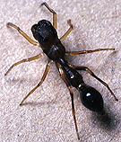

---
aliases:
- Synemosyninae
- سينيموسينينى
title: Synemosyninae
has_id_wikidata: Q101300
dv_has_:
  name_:
    an: Synemosyninae
    arz: سينيموسينينى
    ast: Synemosyninae
    bg: Synemosyninae
    ca: Synemosyninae
    ceb: Synemosyninae
    de: Synemosyninae
    en: Synemosyninae
    eo: Synemosyninae
    es: Synemosyninae
    eu: Synemosyninae
    ext: Synemosyninae
    fi: Synemosyninae
    fr: Synemosyninae
    ga: Synemosyninae
    gl: Synemosyninae
    ia: Synemosyninae
    ie: Synemosyninae
    io: Synemosyninae
    it: Synemosyninae
    la: Synemosyninae
    mul: Synemosyninae
    nl: Synemosyninae
    oc: Synemosyninae
    pl: Synemosyninae
    pt: Synemosyninae
    pt_br: Synemosyninae
    ro: Synemosyninae
    ru: Synemosyninae
    sq: Synemosyninae
    uk: Synemosyninae
    vi: Synemosyninae
    vo: Synemosyninae
    war: Synemosyninae
---
# [[Synemosyninae]] 

## #has_/text_of_/abstract 

> Simonellini is a tribe of spiders belonging to the Amycoida clade 
> of the subfamily Salticinae of the family Salticidae. 
> 
> The group has been treated at a variety of formal and informal ranks, 
> with different circumscriptions, including as the subfamilies **Synemosyninae** and Simonellinae. 
> 
> Its species mimic ants and beetles.
>
> [Wikipedia](https://en.wikipedia.org/wiki/Simonellini) 

## Phylogeny 

-   « Ancestral Groups  
    -   [Jumping_Spider](../Jumping_Spider.md)
    -  [Dionycha](../../Dionycha.md) 
    -  [Entelegynae](../../../../Entelegynae.md) 
    -  [Araneomorphae](../../../../../Araneomorphae.md) 
    -   [Spider](../../../../../../Spider.md)
    -  [Arachnida](../../../../../../../Arachnida.md) 
    -  [Arthropoda](../../../../../../../../../Arthropoda.md) 
    -  [Bilateria](../../../../../../../../../../Bilateria.md) 
    -  [Animals](../../../../../../../../../../../Animals.md) 
    -  [Eukarya](../../../../../../../../../../../../Eukarya.md) 
    -   [Tree of Life](../../../../../../../../../../../../Tree_of_Life.md)

-   ◊ Sibling Groups of  Salticidae
    -   [Lyssomaninae](Lyssomaninae.md)
    -   [Spartaeinae](Spartaeinae.md)
    -   [Amycinae](Amycinae.md)
    -   [Thiodininae](Thiodininae.md)
    -   [Hisponinae](Hisponinae.md)
    -   Synemosyninae
    -   [Hyetussinae](Hyetussinae.md)
    -   [Sitticinae](Sitticinae.md)
    -   [Plexippinae](Plexippinae.md)
    -   [Pelleninae](Pelleninae.md)
    -   [Heliophaninae](Heliophaninae.md)
    -   [Salticus](Salticus)
    -   [Miscellaneous salticids with a fixed         embolus](Miscellaneous_salticids_with_a_fixed_embolus)
    -   [Dendryphantinae](Dendryphantinae.md)
    -   [Euophryinae](Euophryinae.md)
    -   [Synagelinae](Synagelinae.md)
    -   [Ballinae](Ballinae.md)
    -   [Miscellaneous salticids with a free         embolus](Miscellaneous_salticids_with_a_free_embolus)

-   » Sub-Groups
    -   [Fluda](Fluda)
    -   [Myrmarachne](Myrmarachne)
    -   [Sarinda](Sarinda)
    -   [Simprulla](Simprulla)
    -   [Synemosyna](Synemosyna)

-   *Bocus*
-   *Corcovetella*
-   *[Fluda](Fluda)*
-   *Martella*
-   *[Myrmarachne](Myrmarachne)*
-   *[Sarinda](Sarinda)*
-   *[Simprulla](Simprulla)*
-   *[Synemosyna](Synemosyna)*
-   *Zuniga*

Containing group: [Jumping_Spider](../Jumping_Spider.md)

## Introduction

The synemosynines are strikingly ant-like salticids common in the
tropics. The first legs are waved like antennae and have the embolus
fixed to the tegulum (in comparison with the synagelines, which use the
second legs and have a free embolus). In many cases where the embolus is
long, it curls around the top of the cymbium (like the hyetussines).
Tentatively included are Myrmarachne and Bocus.

## Confidential Links & Embeds: 

### #is_/same_as :: [[/_Standards/bio/bio~Domain/Eukarya/Animal/Bilateria/Arthropoda/Chelicerata/Arachnida/Spider/Araneomorphae/Entelegynae/Dictynoidea/Dionycha/Jumping_Spider/Synemosyninae|Synemosyninae]] 

### #is_/same_as :: [[/_public/bio/bio~Domain/Eukarya/Animal/Bilateria/Arthropoda/Chelicerata/Arachnida/Spider/Araneomorphae/Entelegynae/Dictynoidea/Dionycha/Jumping_Spider/Synemosyninae.public|Synemosyninae.public]] 

### #is_/same_as :: [[/_internal/bio/bio~Domain/Eukarya/Animal/Bilateria/Arthropoda/Chelicerata/Arachnida/Spider/Araneomorphae/Entelegynae/Dictynoidea/Dionycha/Jumping_Spider/Synemosyninae.internal|Synemosyninae.internal]] 

### #is_/same_as :: [[/_protect/bio/bio~Domain/Eukarya/Animal/Bilateria/Arthropoda/Chelicerata/Arachnida/Spider/Araneomorphae/Entelegynae/Dictynoidea/Dionycha/Jumping_Spider/Synemosyninae.protect|Synemosyninae.protect]] 

### #is_/same_as :: [[/_private/bio/bio~Domain/Eukarya/Animal/Bilateria/Arthropoda/Chelicerata/Arachnida/Spider/Araneomorphae/Entelegynae/Dictynoidea/Dionycha/Jumping_Spider/Synemosyninae.private|Synemosyninae.private]] 

### #is_/same_as :: [[/_personal/bio/bio~Domain/Eukarya/Animal/Bilateria/Arthropoda/Chelicerata/Arachnida/Spider/Araneomorphae/Entelegynae/Dictynoidea/Dionycha/Jumping_Spider/Synemosyninae.personal|Synemosyninae.personal]] 

### #is_/same_as :: [[/_secret/bio/bio~Domain/Eukarya/Animal/Bilateria/Arthropoda/Chelicerata/Arachnida/Spider/Araneomorphae/Entelegynae/Dictynoidea/Dionycha/Jumping_Spider/Synemosyninae.secret|Synemosyninae.secret]] 

