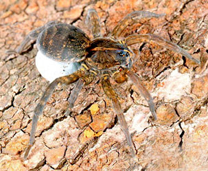
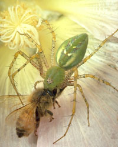

---
aliases:
  - Lycosoidea
title: Lycosoidea
---

## Phylogeny 

-   « Ancestral Groups  
    -  [Entelegynae](../Entelegynae.md) 
    -  [Araneomorphae](../../Araneomorphae.md) 
    -   [Spider](../../../Spider.md)
    -  [Arachnida](../../../../Arachnida.md) 
    -  [Arthropoda](../../../../../../Arthropoda.md) 
    -  [Bilateria](../../../../../../../Bilateria.md) 
    -  [Animals](../../../../../../../../Animals.md) 
    -  [Eukarya](../../../../../../../../../Eukarya.md) 
    -   [Tree of Life](../../../../../../../../../Tree_of_Life.md)

-   ◊ Sibling Groups of  Entelegynae
    -  [Amaurobiidae](Amaurobiidae.md) 
    -  [Eresoidea](Eresoidea.md) 
    -   [other entelegynes](other_entelegynes)
    -  [Palpimanoidea](Palpimanoidea.md) 
    -  [Dictynoidea](Dictynoidea.md) 
    -  [Orbiculariae](Orbiculariae.md) 
    -  [Dionycha](Dictynoidea/Dionycha.md) 
    -   [other amaurobioids](other_amaurobioids)
    -   Lycosoidea

-   » Sub-Groups
    -  [Lycosidae](Lycosoidea/Lycosidae.md) 
    -  [Oxyopidae](Lycosoidea/Oxyopidae.md) 

# Lycosoidea 
) 

Tree from Coddington and Levi (1991)

Containing group:[Entelegynae](../Entelegynae.md) 

### References

Bosselaers, J. 2002. A cladistic analysis of Zoropsidae (Spider), with
the description of a new genus. Belgian Journal of Zoology 132:141-154.

Coddington, J. A. and H. W. Levi. 1991. Systematics and evolution of
spiders (Spider). Annual Review of Ecology and Systematics 22:565-592.

Fang, K., C. C. Yang, B. W. Lue, S. H. Chen, and K. Y. Lue. 2000.
Phylogenetic corroboration of superfamily Lycosoidae spiders (Spider)
as inferred from partial mitochondrial 12S and 16S ribosomal DNA
sequences. Zoological Studies 39:107-113.

Sierwald, P. 1997. Phylogenetic analysis of pisaurine nursery web
spiders, with revisions of Tetragonophthalma and perenethis (Spider,
Lycosoidea, Pisauridae). Journal of Arachnology 25:361-407.

Townsend, V. R. and B. E. Felgenhauer. 2001. Phylogenetic significance
of the morphology of the cuticular scales of the lynx spiders (Spider :
Oxyopidae). Journal of Zoology 253:309-332.

## Title Illustrations

 

  -----------------------------------------------------------------------
  scientific_name ::     Lycosa (Hogna) helluo
  Comments             Wolf spider female with egg sac.
  specimen_condition ::  Live Specimen
  Sex ::                Female
  Life Cycle Stage ::     adult, egg sac
  copyright ::            © [Jim Kalisch](http://entomology.unl.edu/) 
 
  -----------------------------------------------------------------------
 

  ------------------------------------------------------------------------------
  scientific_name ::     Oxyopidae
  Comments             Lynx spider with captured bee.
  Creator              Photograph by Alden M. Johnson
  specimen_condition ::  Live Specimen
  Behavior             predation
  Source Collection    [CalPhotos](http://calphotos.berkeley.edu/)
  copyright ::            © 2001 [California Academy of Sciences](http://www.calacademy.org/) 
 
  ------------------------------------------------------------------------------

## Confidential Links & Embeds: 

### #is_/same_as :: [[/_Standards/bio/bio~Domain/Eukarya/Animal/Bilateria/Arthropoda/Chelicerata/Arachnida/Spider/Araneomorphae/Entelegynae/Lycosoidea|Lycosoidea]] 

### #is_/same_as :: [[/_public/bio/bio~Domain/Eukarya/Animal/Bilateria/Arthropoda/Chelicerata/Arachnida/Spider/Araneomorphae/Entelegynae/Lycosoidea.public|Lycosoidea.public]] 

### #is_/same_as :: [[/_internal/bio/bio~Domain/Eukarya/Animal/Bilateria/Arthropoda/Chelicerata/Arachnida/Spider/Araneomorphae/Entelegynae/Lycosoidea.internal|Lycosoidea.internal]] 

### #is_/same_as :: [[/_protect/bio/bio~Domain/Eukarya/Animal/Bilateria/Arthropoda/Chelicerata/Arachnida/Spider/Araneomorphae/Entelegynae/Lycosoidea.protect|Lycosoidea.protect]] 

### #is_/same_as :: [[/_private/bio/bio~Domain/Eukarya/Animal/Bilateria/Arthropoda/Chelicerata/Arachnida/Spider/Araneomorphae/Entelegynae/Lycosoidea.private|Lycosoidea.private]] 

### #is_/same_as :: [[/_personal/bio/bio~Domain/Eukarya/Animal/Bilateria/Arthropoda/Chelicerata/Arachnida/Spider/Araneomorphae/Entelegynae/Lycosoidea.personal|Lycosoidea.personal]] 

### #is_/same_as :: [[/_secret/bio/bio~Domain/Eukarya/Animal/Bilateria/Arthropoda/Chelicerata/Arachnida/Spider/Araneomorphae/Entelegynae/Lycosoidea.secret|Lycosoidea.secret]] 

