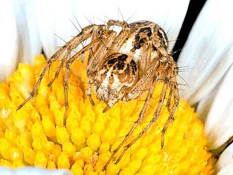

## Phylogeny 

-   « Ancestral Groups  
    -  [Lycosoidea](../Lycosoidea.md))
    -  [Entelegynae](../../Entelegynae.md))
    -  [Araneomorphae](../../../Araneomorphae.md))
    -   [Spider](../../../../Spider.md)
    -  [Arachnida](../../../../../Arachnida.md))
    -  [Arthropoda](../../../../../../../Arthropoda.md))
    -  [Bilateria](../../../../../../../../Bilateria.md))
    -  [Animals](../../../../../../../../../Animals.md))
    -  [Eukarya](../../../../../../../../../../Eukarya.md))
    -   [Tree of Life](../../../../../../../../../../Tree_of_Life.md)

-   ◊ Sibling Groups of  Lycosoidea
    -  [Lycosidae](Lycosidae.md))
    -   Oxyopidae

-   » Sub-Groups 

# Oxyopidae 
)

-   *Hamataliwa*
-   *Hostus*
-   *Megullia*
-   *Oxyopes*
-   *Peucetia*
-   *Pseudohostus*
-   *Schaenicoscelis*
-   *Tapinillus*
-   *Tapponia*

Containing group:[Lycosoidea](../Lycosoidea.md))

## Title Illustrations

)

  ----------------------------------------------------------------------------
  Scientific Name ::     Arachnida:Spider:Oxyopidae: Oxyopes heterophthalmus
  Location ::           Castel d'Aiano, Bologna Province, Emilia Romagna, Italy
  Specimen Condition   Live Specimen
  Image Use ::    [Attribution-NonCommercial 2.0 Creative Commons License](http://creativecommons.org/licenses/by-nc/2.0/).
  Copyright ::            © 2005 [Cesare Brizio](http://xoomer.virgilio.it/cebrizio/) 
  ----------------------------------------------------------------------------

## Confidential Links & Embeds: 

### #is_/same_as :: [Oxyopidae](/_Standards/bio/bio~Domain/Eukarya/Animal/Bilateria/Arthropoda/Chelicerata/Arachnida/Spider/Araneomorphae/Entelegynae/Lycosoidea/Oxyopidae.md) 

### #is_/same_as :: [Oxyopidae.public](/_public/bio/bio~Domain/Eukarya/Animal/Bilateria/Arthropoda/Chelicerata/Arachnida/Spider/Araneomorphae/Entelegynae/Lycosoidea/Oxyopidae.public.md) 

### #is_/same_as :: [Oxyopidae.internal](/_internal/bio/bio~Domain/Eukarya/Animal/Bilateria/Arthropoda/Chelicerata/Arachnida/Spider/Araneomorphae/Entelegynae/Lycosoidea/Oxyopidae.internal.md) 

### #is_/same_as :: [Oxyopidae.protect](/_protect/bio/bio~Domain/Eukarya/Animal/Bilateria/Arthropoda/Chelicerata/Arachnida/Spider/Araneomorphae/Entelegynae/Lycosoidea/Oxyopidae.protect.md) 

### #is_/same_as :: [Oxyopidae.private](/_private/bio/bio~Domain/Eukarya/Animal/Bilateria/Arthropoda/Chelicerata/Arachnida/Spider/Araneomorphae/Entelegynae/Lycosoidea/Oxyopidae.private.md) 

### #is_/same_as :: [Oxyopidae.personal](/_personal/bio/bio~Domain/Eukarya/Animal/Bilateria/Arthropoda/Chelicerata/Arachnida/Spider/Araneomorphae/Entelegynae/Lycosoidea/Oxyopidae.personal.md) 

### #is_/same_as :: [Oxyopidae.secret](/_secret/bio/bio~Domain/Eukarya/Animal/Bilateria/Arthropoda/Chelicerata/Arachnida/Spider/Araneomorphae/Entelegynae/Lycosoidea/Oxyopidae.secret.md)

