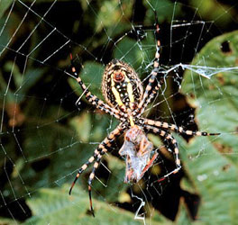

---
aliases:
  - Orbiculariae
title: Orbiculariae
---

## Phylogeny 

-   « Ancestral Groups  
    -  [Entelegynae](../Entelegynae.md) 
    -  [Araneomorphae](../../Araneomorphae.md) 
    -   [Spider](../../../Spider.md)
    -  [Arachnida](../../../../Arachnida.md) 
    -  [Arthropoda](../../../../../../Arthropoda.md) 
    -  [Bilateria](../../../../../../../Bilateria.md) 
    -  [Animals](../../../../../../../../Animals.md) 
    -  [Eukarya](../../../../../../../../../Eukarya.md) 
    -   [Tree of Life](../../../../../../../../../Tree_of_Life.md)

-   ◊ Sibling Groups of  Entelegynae
    -  [Amaurobiidae](Amaurobiidae.md) 
    -  [Eresoidea](Eresoidea.md) 
    -   [other entelegynes](other_entelegynes)
    -  [Palpimanoidea](Palpimanoidea.md) 
    -  [Dictynoidea](Dictynoidea.md) 
    -   Orbiculariae
    -  [Dionycha](Dictynoidea/Dionycha.md) 
    -   [other amaurobioids](other_amaurobioids)
    -  [Lycosoidea](Lycosoidea.md) 

-   » Sub-Groups
    -  [Anapidae](Orbiculariae/Anapidae.md) 
    -  [Mysmenidae](Orbiculariae/Mysmenidae.md) 
    -  [Deinopidae](Orbiculariae/Deinopidae.md) 
    -  [Uloboridae](Orbiculariae/Uloboridae.md) 
    -  [Araneidae](Orbiculariae/Araneidae.md) 
    -  [Theridiosomatidae](Orbiculariae/Theridiosomatidae.md) 
    -  [Symphytognathidae](Orbiculariae/Symphytognathidae.md) 
    -  [Linyphiidae](Orbiculariae/Linyphiidae.md) 
    -  [Pimoidae](Orbiculariae/Pimoidae.md) 
    -  [Synotaxidae](Orbiculariae/Synotaxidae.md) 
    -  [Cyatholipidae](Orbiculariae/Cyatholipidae.md) 
    -  [Nesticidae](Orbiculariae/Nesticidae.md) 
    -  [Theridiidae](Orbiculariae/Theridiidae.md) 

# Orbiculariae 

[Jonathan Coddington]()

)

Tree from Griswold et al. 1998 with modifications from Kuntner, 2005
(Nephilidae conservatively placed in  a basal trichotomy with Araneidae
and derived araneoids.\
\

Containing group:[Entelegynae](../Entelegynae.md) 

### Information on the Internet

-   [Araneoid Spider     Systematics](http://www.gwu.edu/%7Espiders/peet.htm)

### References

Agnarsson, I. 2004. Morphological phylogeny of cobweb spiders and their
relatives (Spider, Araneoidea, Theridiidae). Zoological Journal of the
Linnean Society 141:447-626.

Coddington, J.A. 2005. Phylogeny and Classification of Spiders. In D.
Ubick, P. Paquin, P. E. Cushing, and V. Roth (eds.) Spiders of North
America: an identification manual, American Arachnological Society. 377
pages. Chapter 2, pp. 18-24.

Coddington, J. A. and H. W. Levi. 1991. Systematics and evolution of
spiders (Spider). Annual Review of Ecology and Systematics 22:565-592.

Forster, R.R., N.I. Platnick & J. Coddington. 1990. A proposal and
review of the spider family Synotaxidae (Spider, Araneoidea), with
notes on theridiid interrelationships. Bulletin Of The American Museum
Of Natural History 1-116.

Griswold, C.E. 2001. A monograph of the living world genera and
Afrotropical species of cyatholipid spiders (Spider, Orbiculariae,
Araneoidea, Cyatholipidae). Mem. Calif. Acad. Sci. 26:1-251.

Griswold, C. E., J. A. Coddington, G. Hormiga, and N. Scharff. 1998.
Phylogeny of the orb-web building spiders (Spider, Orbiculariae:
Deinopoidea, Araneoidea). Zoological Journal of the Linnean Society
123:1-99.

Foelix, R.F. 1996. Biology of Spiders. Oxford Univ. Press, Oxford.
330pp.

Jocqué, R. & A.S. Dippenaar-Schoeman. 2006. Spider Families of the
World. Musée Royal de l\'Afrique Centrale, Tevuren. 336pp.

Hormiga, G., N. Scharff, and J. A. Coddington. 2000. The phylogenetic
basis of sexual size dimorphism in orb-weaving spiders (Spider,
Orbiculariae). Systematic Biology 49:435-462.

Kuntner, M., 2005. A revision of Herennia (Spider, Nephilidae,
Nephilinae), the Australasian 'coin spiders'. Invert. Syst. 19,
391--436.

Kuntner, M., 2006. Nephilidae.com: A web resource for nephilid spiders
(Spider, Araneoidea, Nephilidae), version 1.0.
[http://www.nephilidae.com/.](){http:="" www.nephilidae.com=""}

Opell, B.D. 1979. Revision of the genera and tropical American species
of the spider family Uloboridae. Bull. Mus. Comp. Zool. 148:443-549.

Platnick, N.I. 2006. The World Spider Catalog, Version 7.0.
[http://research.amnh.org/entomology/spiders/catalog/INTRO1.html.](){http:=""
research.amnh.org="" entomology="" spiders="" catalog="" index.html=""}

Scharff, N. and J. A. Coddington. 1997. A phylogenetic analysis of the
orb-weaving spider family Araneidae (Arachnida, Spider). Zoological
Journal of the Linnean Society 120:355-434.

Schütt, K. 2003. Phylogeny of Symphytognathidae s.l. (Spider,
Araneoidea). Zoologica Scripta 32(2):129-151.

Ubick, D., P. Paquin, P.E. Cushing & V.D. Roth. 2005. Spiders of North
America: an identification manual. American Arachnological Society,
377pp.

## Title Illustrations



  -------------------------------------
  Scientific Name ::     Argiope trifasciata
  Comments             Banded Argiope
  Specimen Condition   Live Specimen
  Copyright ::            © [Leon Higley, Department of Entomology, University of Nebraska-Lincoln](http://entomology.unl.edu/)
  -------------------------------------
)

  ---------------------------------------------------------------------------------
  Scientific Name ::     Araneus bicentenarius
  Location ::           USA
  Specimen Condition   Live Specimen
  Identified By        Jonathan Coddington
  Sex ::                Female
  Life Cycle Stage ::     adult
  Body Part            face
  View                 anterior view
  Size                 photo ca. 5mm across.
  Copyright ::            © [Jonathan Coddington](http://entomology.si.edu/StaffPages/coddington.html) 
 
  ---------------------------------------------------------------------------------
)

  ---------------------
  Scientific Name ::     Latrodectus curacaviensis
  Location ::           Bahia (Brazil)
  Comments             South American widow spider
  Specimen Condition   Live Specimen
  Source Collection    [CalPhotos](http://calphotos.berkeley.edu/)
  Copyright ::            © 1994 [Wolfgang Wuster](mailto:w.wuster@bangor.ac.uk)
  ---------------------

## Confidential Links & Embeds: 

### #is_/same_as :: [Orbiculariae](/_Standards/bio/bio~Domain/Eukarya/Animal/Bilateria/Arthropoda/Chelicerata/Arachnida/Spider/Araneomorphae/Entelegynae/Orbiculariae.md) 

### #is_/same_as :: [Orbiculariae.public](/_public/bio/bio~Domain/Eukarya/Animal/Bilateria/Arthropoda/Chelicerata/Arachnida/Spider/Araneomorphae/Entelegynae/Orbiculariae.public.md) 

### #is_/same_as :: [Orbiculariae.internal](/_internal/bio/bio~Domain/Eukarya/Animal/Bilateria/Arthropoda/Chelicerata/Arachnida/Spider/Araneomorphae/Entelegynae/Orbiculariae.internal.md) 

### #is_/same_as :: [Orbiculariae.protect](/_protect/bio/bio~Domain/Eukarya/Animal/Bilateria/Arthropoda/Chelicerata/Arachnida/Spider/Araneomorphae/Entelegynae/Orbiculariae.protect.md) 

### #is_/same_as :: [Orbiculariae.private](/_private/bio/bio~Domain/Eukarya/Animal/Bilateria/Arthropoda/Chelicerata/Arachnida/Spider/Araneomorphae/Entelegynae/Orbiculariae.private.md) 

### #is_/same_as :: [Orbiculariae.personal](/_personal/bio/bio~Domain/Eukarya/Animal/Bilateria/Arthropoda/Chelicerata/Arachnida/Spider/Araneomorphae/Entelegynae/Orbiculariae.personal.md) 

### #is_/same_as :: [Orbiculariae.secret](/_secret/bio/bio~Domain/Eukarya/Animal/Bilateria/Arthropoda/Chelicerata/Arachnida/Spider/Araneomorphae/Entelegynae/Orbiculariae.secret.md)

