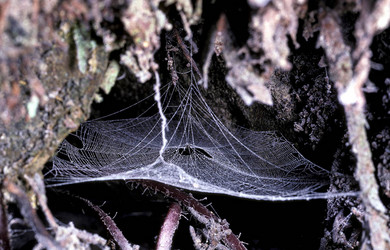

---
aliases:
  - Anapidae
title: Anapidae
---

## Phylogeny 

-   « Ancestral Groups  
    -  [Orbiculariae](../Orbiculariae.md) 
    -  [Entelegynae](../../Entelegynae.md) 
    -  [Araneomorphae](../../../Araneomorphae.md) 
    -   [Spider](../../../../Spider.md)
    -  [Arachnida](../../../../../Arachnida.md) 
    -  [Arthropoda](../../../../../../../Arthropoda.md) 
    -  [Bilateria](../../../../../../../../Bilateria.md) 
    -  [Animals](../../../../../../../../../Animals.md) 
    -  [Eukarya](../../../../../../../../../../Eukarya.md) 
    -   [Tree of Life](../../../../../../../../../../Tree_of_Life.md)

-   ◊ Sibling Groups of  Orbiculariae
    -   Anapidae
    -  [Mysmenidae](Mysmenidae.md) 
    -  [Deinopidae](Deinopidae.md) 
    -  [Uloboridae](Uloboridae.md) 
    -  [Araneidae](Araneidae.md) 
    -  [Theridiosomatidae](Theridiosomatidae.md) 
    -  [Symphytognathidae](Symphytognathidae.md) 
    -  [Linyphiidae](Linyphiidae.md) 
    -  [Pimoidae](Pimoidae.md) 
    -  [Synotaxidae](Synotaxidae.md) 
    -  [Cyatholipidae](Cyatholipidae.md) 
    -  [Nesticidae](Nesticidae.md) 
    -  [Theridiidae](Theridiidae.md) 

-   » Sub-Groups 

# Anapidae 

[Jonathan Coddington]()
 

Containing group:[Orbiculariae](../Orbiculariae.md) 

## Title Illustrations

 

  ---------------------------------------------------------------------------------
  scientific_name ::     Gertschanapis shantzi
  location ::           Santa Cruz Co., California
  specimen_condition ::  Live Specimen
  Identified By        Jonathan Coddington
  Behavior             Note out of plane, pendant sticky threads, and that not all radii reach the hub
  Sex ::                Female
  Life Cycle Stage ::     adult
  copyright ::            © [Jonathan Coddington](http://entomology.si.edu/StaffPages/coddington.html) 
 
  ---------------------------------------------------------------------------------

## Confidential Links & Embeds: 

### #is_/same_as :: [[/_Standards/bio/bio~Domain/Eukarya/Animal/Bilateria/Arthropoda/Chelicerata/Arachnida/Spider/Araneomorphae/Entelegynae/Orbiculariae/Anapidae|Anapidae]] 

### #is_/same_as :: [[/_public/bio/bio~Domain/Eukarya/Animal/Bilateria/Arthropoda/Chelicerata/Arachnida/Spider/Araneomorphae/Entelegynae/Orbiculariae/Anapidae.public|Anapidae.public]] 

### #is_/same_as :: [[/_internal/bio/bio~Domain/Eukarya/Animal/Bilateria/Arthropoda/Chelicerata/Arachnida/Spider/Araneomorphae/Entelegynae/Orbiculariae/Anapidae.internal|Anapidae.internal]] 

### #is_/same_as :: [[/_protect/bio/bio~Domain/Eukarya/Animal/Bilateria/Arthropoda/Chelicerata/Arachnida/Spider/Araneomorphae/Entelegynae/Orbiculariae/Anapidae.protect|Anapidae.protect]] 

### #is_/same_as :: [[/_private/bio/bio~Domain/Eukarya/Animal/Bilateria/Arthropoda/Chelicerata/Arachnida/Spider/Araneomorphae/Entelegynae/Orbiculariae/Anapidae.private|Anapidae.private]] 

### #is_/same_as :: [[/_personal/bio/bio~Domain/Eukarya/Animal/Bilateria/Arthropoda/Chelicerata/Arachnida/Spider/Araneomorphae/Entelegynae/Orbiculariae/Anapidae.personal|Anapidae.personal]] 

### #is_/same_as :: [[/_secret/bio/bio~Domain/Eukarya/Animal/Bilateria/Arthropoda/Chelicerata/Arachnida/Spider/Araneomorphae/Entelegynae/Orbiculariae/Anapidae.secret|Anapidae.secret]] 

