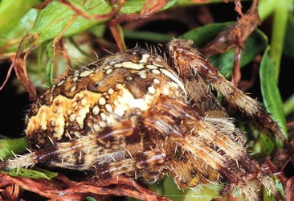
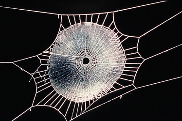

---
aliases:
  - Araneidae
title: Araneidae
---

## Phylogeny 

-   « Ancestral Groups  
    -  [Orbiculariae](../Orbiculariae.md) 
    -  [Entelegynae](../../Entelegynae.md) 
    -  [Araneomorphae](../../../Araneomorphae.md) 
    -   [Spider](../../../../Spider.md)
    -  [Arachnida](../../../../../Arachnida.md) 
    -  [Arthropoda](../../../../../../../Arthropoda.md) 
    -  [Bilateria](../../../../../../../../Bilateria.md) 
    -  [Animals](../../../../../../../../../Animals.md) 
    -  [Eukarya](../../../../../../../../../../Eukarya.md) 
    -   [Tree of Life](../../../../../../../../../../Tree_of_Life.md)

-   ◊ Sibling Groups of  Orbiculariae
    -  [Anapidae](Anapidae.md) 
    -  [Mysmenidae](Mysmenidae.md) 
    -  [Deinopidae](Deinopidae.md) 
    -  [Uloboridae](Uloboridae.md) 
    -   Araneidae
    -  [Theridiosomatidae](Theridiosomatidae.md) 
    -  [Symphytognathidae](Symphytognathidae.md) 
    -  [Linyphiidae](Linyphiidae.md) 
    -  [Pimoidae](Pimoidae.md) 
    -  [Synotaxidae](Synotaxidae.md) 
    -  [Cyatholipidae](Cyatholipidae.md) 
    -  [Nesticidae](Nesticidae.md) 
    -  [Theridiidae](Theridiidae.md) 

-   » Sub-Groups 

# Araneidae 

[Jonathan Coddington]()

) 

Containing group:[Orbiculariae](../Orbiculariae.md) 

## Title Illustrations



  -------------------------------------
  scientific_name ::     Argiope trifasciata
  Comments             Banded Argiope
  specimen_condition ::  Live Specimen
  copyright ::            © [Leon Higley, Department of Entomology, University of Nebraska-Lincoln](http://entomology.unl.edu/)
  -------------------------------------
 

  ----------------------------------------------------------------------------
  scientific_name ::     Arachnida:Spider:Araneidae: Araneus diadematus
  location ::           "Corno alle Scale" Park, Bologna Province, Emilia Romagna, Italy
  specimen_condition ::  Live Specimen
  Image Use ::    [Attribution-NonCommercial 2.0 Creative Commons License](http://creativecommons.org/licenses/by-nc/2.0/).
  copyright ::            © 2005 [Cesare Brizio](http://xoomer.virgilio.it/cebrizio/) 
 
  ----------------------------------------------------------------------------
 

  ---------------------------------------------------------------------------------
  scientific_name ::     Micrathena gracilis
  location ::           Virginia, USA
  specimen_condition ::  Live Specimen
  Identified By        Jonathan Coddington
  Sex ::                Female
  Life Cycle Stage ::     adult
  copyright ::            © [Jonathan Coddington](http://entomology.si.edu/StaffPages/coddington.html) 
 
  ---------------------------------------------------------------------------------

## Confidential Links & Embeds: 

### #is_/same_as :: [[/_Standards/bio/bio~Domain/Eukarya/Animal/Bilateria/Arthropoda/Chelicerata/Arachnida/Spider/Araneomorphae/Entelegynae/Orbiculariae/Araneidae|Araneidae]] 

### #is_/same_as :: [[/_public/bio/bio~Domain/Eukarya/Animal/Bilateria/Arthropoda/Chelicerata/Arachnida/Spider/Araneomorphae/Entelegynae/Orbiculariae/Araneidae.public|Araneidae.public]] 

### #is_/same_as :: [[/_internal/bio/bio~Domain/Eukarya/Animal/Bilateria/Arthropoda/Chelicerata/Arachnida/Spider/Araneomorphae/Entelegynae/Orbiculariae/Araneidae.internal|Araneidae.internal]] 

### #is_/same_as :: [[/_protect/bio/bio~Domain/Eukarya/Animal/Bilateria/Arthropoda/Chelicerata/Arachnida/Spider/Araneomorphae/Entelegynae/Orbiculariae/Araneidae.protect|Araneidae.protect]] 

### #is_/same_as :: [[/_private/bio/bio~Domain/Eukarya/Animal/Bilateria/Arthropoda/Chelicerata/Arachnida/Spider/Araneomorphae/Entelegynae/Orbiculariae/Araneidae.private|Araneidae.private]] 

### #is_/same_as :: [[/_personal/bio/bio~Domain/Eukarya/Animal/Bilateria/Arthropoda/Chelicerata/Arachnida/Spider/Araneomorphae/Entelegynae/Orbiculariae/Araneidae.personal|Araneidae.personal]] 

### #is_/same_as :: [[/_secret/bio/bio~Domain/Eukarya/Animal/Bilateria/Arthropoda/Chelicerata/Arachnida/Spider/Araneomorphae/Entelegynae/Orbiculariae/Araneidae.secret|Araneidae.secret]] 

