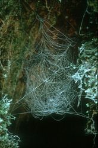
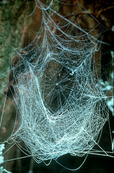
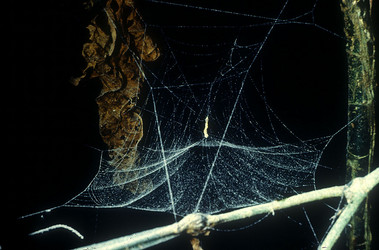

---
aliases:
  - Mysmenidae
title: Mysmenidae
---

## Phylogeny 

-   « Ancestral Groups  
    -  [Orbiculariae](../Orbiculariae.md))
    -  [Entelegynae](../../Entelegynae.md))
    -  [Araneomorphae](../../../Araneomorphae.md))
    -   [Spider](../../../../Spider.md)
    -  [Arachnida](../../../../../Arachnida.md))
    -  [Arthropoda](../../../../../../../Arthropoda.md))
    -  [Bilateria](../../../../../../../../Bilateria.md))
    -  [Animals](../../../../../../../../../Animals.md))
    -  [Eukarya](../../../../../../../../../../Eukarya.md))
    -   [Tree of Life](../../../../../../../../../../Tree_of_Life.md)

-   ◊ Sibling Groups of  Orbiculariae
    -  [Anapidae](Anapidae.md))
    -   Mysmenidae
    -  [Deinopidae](Deinopidae.md))
    -  [Uloboridae](Uloboridae.md))
    -  [Araneidae](Araneidae.md))
    -  [Theridiosomatidae](Theridiosomatidae.md))
    -  [Symphytognathidae](Symphytognathidae.md))
    -  [Linyphiidae](Linyphiidae.md))
    -  [Pimoidae](Pimoidae.md))
    -  [Synotaxidae](Synotaxidae.md))
    -  [Cyatholipidae](Cyatholipidae.md))
    -  [Nesticidae](Nesticidae.md))
    -  [Theridiidae](Theridiidae.md))

-   » Sub-Groups 

# Mysmenidae 

[Jonathan Coddington]()
))

Containing group:[Orbiculariae](../Orbiculariae.md))

## Title Illustrations

)

  ---------------------------------------------------------------------------------
  Scientific Name ::     Mysmena sp.
  Location ::           Costa Rica
  Specimen Condition   Live Specimen
  Identified By        Jonathan Coddington
  Behavior             Note completely 3D web with spherical symmetry and sticky spirals arranged on circumference
  Sex ::                Female
  Copyright ::            © [Jonathan Coddington](http://entomology.si.edu/StaffPages/coddington.html) 
  ---------------------------------------------------------------------------------
)

  ---------------------------------------------------------------------------------
  Scientific Name ::     Mysmena sp.
  Location ::           Costa Rica
  Specimen Condition   Live Specimen
  Identified By        Jonathan Coddington
  Behavior             The outer envelope of sticky spirals has been torn to reveal spherical symmetry of radii
  Sex ::                Female
  Copyright ::            © [Jonathan Coddington](http://entomology.si.edu/StaffPages/coddington.html) 
  ---------------------------------------------------------------------------------
)

  ---------------------------------------------------------------------------------
  Scientific Name ::     Maymena sp.
  Location ::           Costa Rica
  Specimen Condition   Live Specimen
  Identified By        Jonathan Coddington
  Behavior             Note pendant, out of plane sticky lines, that not all radii reach the hub, and eggsacs grouped at hu
  Sex ::                Female
  Copyright ::            © [Jonathan Coddington](http://entomology.si.edu/StaffPages/coddington.html) 
  ---------------------------------------------------------------------------------

## Confidential Links & Embeds: 

### #is_/same_as :: [Mysmenidae](/_Standards/bio/bio~Domain/Eukarya/Animal/Bilateria/Arthropoda/Chelicerata/Arachnida/Spider/Araneomorphae/Entelegynae/Orbiculariae/Mysmenidae.md) 

### #is_/same_as :: [Mysmenidae.public](/_public/bio/bio~Domain/Eukarya/Animal/Bilateria/Arthropoda/Chelicerata/Arachnida/Spider/Araneomorphae/Entelegynae/Orbiculariae/Mysmenidae.public.md) 

### #is_/same_as :: [Mysmenidae.internal](/_internal/bio/bio~Domain/Eukarya/Animal/Bilateria/Arthropoda/Chelicerata/Arachnida/Spider/Araneomorphae/Entelegynae/Orbiculariae/Mysmenidae.internal.md) 

### #is_/same_as :: [Mysmenidae.protect](/_protect/bio/bio~Domain/Eukarya/Animal/Bilateria/Arthropoda/Chelicerata/Arachnida/Spider/Araneomorphae/Entelegynae/Orbiculariae/Mysmenidae.protect.md) 

### #is_/same_as :: [Mysmenidae.private](/_private/bio/bio~Domain/Eukarya/Animal/Bilateria/Arthropoda/Chelicerata/Arachnida/Spider/Araneomorphae/Entelegynae/Orbiculariae/Mysmenidae.private.md) 

### #is_/same_as :: [Mysmenidae.personal](/_personal/bio/bio~Domain/Eukarya/Animal/Bilateria/Arthropoda/Chelicerata/Arachnida/Spider/Araneomorphae/Entelegynae/Orbiculariae/Mysmenidae.personal.md) 

### #is_/same_as :: [Mysmenidae.secret](/_secret/bio/bio~Domain/Eukarya/Animal/Bilateria/Arthropoda/Chelicerata/Arachnida/Spider/Araneomorphae/Entelegynae/Orbiculariae/Mysmenidae.secret.md)

