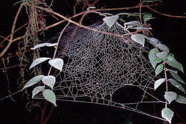
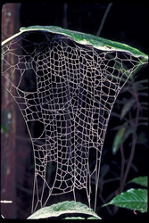

## Phylogeny 

-   « Ancestral Groups  
    -  [Orbiculariae](../Orbiculariae.md))
    -  [Entelegynae](../../Entelegynae.md))
    -  [Araneomorphae](../../../Araneomorphae.md))
    -   [Spider](../../../../Spider.md)
    -  [Arachnida](../../../../../Arachnida.md))
    -  [Arthropoda](../../../../../../../Arthropoda.md))
    -  [Bilateria](../../../../../../../../Bilateria.md))
    -  [Animals](../../../../../../../../../Animals.md))
    -  [Eukarya](../../../../../../../../../../Eukarya.md))
    -   [Tree of Life](../../../../../../../../../../Tree_of_Life.md)

-   ◊ Sibling Groups of  Orbiculariae
    -  [Anapidae](Anapidae.md))
    -  [Mysmenidae](Mysmenidae.md))
    -  [Deinopidae](Deinopidae.md))
    -  [Uloboridae](Uloboridae.md))
    -  [Araneidae](Araneidae.md))
    -  [Theridiosomatidae](Theridiosomatidae.md))
    -  [Symphytognathidae](Symphytognathidae.md))
    -  [Linyphiidae](Linyphiidae.md))
    -  [Pimoidae](Pimoidae.md))
    -   Synotaxidae
    -  [Cyatholipidae](Cyatholipidae.md))
    -  [Nesticidae](Nesticidae.md))
    -  [Theridiidae](Theridiidae.md))

-   » Sub-Groups 

# Synotaxidae 

[Jonathan Coddington]()
)

Containing group:[Orbiculariae](../Orbiculariae.md))

### References

Agnarsson, I. 2003. The phylogenetic placement and circumscription of
the genus Synotaxus (Spider: Synotaxidae), a new species from Guyana,
and notes on theridioid phylogeny. Invertebrate Systematics 17:719-734.

Agnarsson, I. 2004. Morphological phylogeny of cobweb spiders and their
relatives (Spider, Araneoidea, Theridiidae). Zoological Journal Of The
Linnean Society 141:447-626.

Eberhard, W.G. 1977. Rectangular orb-webs of Synotaxus (Spider:
Theridiidae). J. Nat. Hist. (G. B.) 11:501-507.

Eberhard, W., G. 1995. The web and building behavior of Synotaxus
ecuadorensis (Spider, Synotaxidae). J. Arachnology 23:25-30.

Forster, R.R., N.I. Platnick & J. Coddington. 1990. A proposal and
review of the spider family Synotaxidae (Spider, Araneoidea), with
notes on theridiid interrelationships. Bulletin Of The American Museum
Of Natural History 1-116.

Griswold, C.E., J.A. Coddington, G. Hormiga & N. Scharff. 1998.
Phylogeny of the orb-web building spiders (Spider, Orbiculariae:
Deinopoidea, Araneoidea). Zoological Journal of the Linnean Society. May
123:1-99.

Levi, H.W. 1965. The spider genus Synotaxus (Theridiidae). Trans. Amer.
Microscop. Soc. 84:177-184.

## Title Illustrations

)

  ---------------------------------------------------------------------------------
  Scientific Name ::     Chileotaxus sans
  Location ::           Chile
  Specimen Condition   Live Specimen
  Identified By        Ingi Agnarsson
  Sex ::                Female
  Life Cycle Stage ::     adult
  Size                 ca. 15 cm across
  Copyright ::            © [Jonathan Coddington](http://entomology.si.edu/StaffPages/coddington.html) 
  ---------------------------------------------------------------------------------
)

  ---------------------------------------------------------------------------------
  Scientific Name ::     Synotaxus monoceros
  Location ::           Guyana
  Specimen Condition   Live Specimen
  Identified By        Ingi Agnarsson
  Behavior             Synotaxus makes a modular web with varying numbers of vertical panels, one of the few examples of a
  Sex ::                Female
  Life Cycle Stage ::     adult
  Size                 ca. 20-30 cm. high
  Copyright ::            © [Jonathan Coddington](http://entomology.si.edu/StaffPages/coddington.html) 
  ---------------------------------------------------------------------------------

## Confidential Links & Embeds: 

### #is_/same_as :: [Synotaxidae](/_Standards/bio/bio~Domain/Eukarya/Animal/Bilateria/Arthropoda/Chelicerata/Arachnida/Spider/Araneomorphae/Entelegynae/Orbiculariae/Synotaxidae.md) 

### #is_/same_as :: [Synotaxidae.public](/_public/bio/bio~Domain/Eukarya/Animal/Bilateria/Arthropoda/Chelicerata/Arachnida/Spider/Araneomorphae/Entelegynae/Orbiculariae/Synotaxidae.public.md) 

### #is_/same_as :: [Synotaxidae.internal](/_internal/bio/bio~Domain/Eukarya/Animal/Bilateria/Arthropoda/Chelicerata/Arachnida/Spider/Araneomorphae/Entelegynae/Orbiculariae/Synotaxidae.internal.md) 

### #is_/same_as :: [Synotaxidae.protect](/_protect/bio/bio~Domain/Eukarya/Animal/Bilateria/Arthropoda/Chelicerata/Arachnida/Spider/Araneomorphae/Entelegynae/Orbiculariae/Synotaxidae.protect.md) 

### #is_/same_as :: [Synotaxidae.private](/_private/bio/bio~Domain/Eukarya/Animal/Bilateria/Arthropoda/Chelicerata/Arachnida/Spider/Araneomorphae/Entelegynae/Orbiculariae/Synotaxidae.private.md) 

### #is_/same_as :: [Synotaxidae.personal](/_personal/bio/bio~Domain/Eukarya/Animal/Bilateria/Arthropoda/Chelicerata/Arachnida/Spider/Araneomorphae/Entelegynae/Orbiculariae/Synotaxidae.personal.md) 

### #is_/same_as :: [Synotaxidae.secret](/_secret/bio/bio~Domain/Eukarya/Animal/Bilateria/Arthropoda/Chelicerata/Arachnida/Spider/Araneomorphae/Entelegynae/Orbiculariae/Synotaxidae.secret.md)

