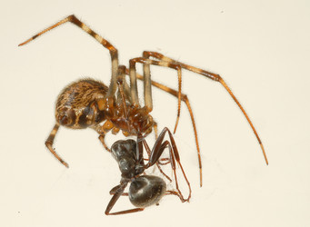
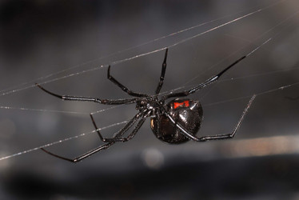
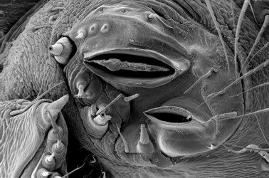

---
aliases:
  - Theridiidae
title: Theridiidae
---

## Phylogeny 

-   « Ancestral Groups  
    -  [Orbiculariae](../Orbiculariae.md) 
    -  [Entelegynae](../../Entelegynae.md) 
    -  [Araneomorphae](../../../Araneomorphae.md) 
    -   [Spider](../../../../Spider.md)
    -  [Arachnida](../../../../../Arachnida.md) 
    -  [Arthropoda](../../../../../../../Arthropoda.md) 
    -  [Bilateria](../../../../../../../../Bilateria.md) 
    -  [Animals](../../../../../../../../../Animals.md) 
    -  [Eukarya](../../../../../../../../../../Eukarya.md) 
    -   [Tree of Life](../../../../../../../../../../Tree_of_Life.md)

-   ◊ Sibling Groups of  Orbiculariae
    -  [Anapidae](Anapidae.md) 
    -  [Mysmenidae](Mysmenidae.md) 
    -  [Deinopidae](Deinopidae.md) 
    -  [Uloboridae](Uloboridae.md) 
    -  [Araneidae](Araneidae.md) 
    -  [Theridiosomatidae](Theridiosomatidae.md) 
    -  [Symphytognathidae](Symphytognathidae.md) 
    -  [Linyphiidae](Linyphiidae.md) 
    -  [Pimoidae](Pimoidae.md) 
    -  [Synotaxidae](Synotaxidae.md) 
    -  [Cyatholipidae](Cyatholipidae.md) 
    -  [Nesticidae](Nesticidae.md) 
    -   Theridiidae

-   » Sub-Groups
    -  [Latrodectus](Theridiidae/Latrodectus.md) 

# Theridiidae

## Cobweb spiders 

[Jeremy Miller]()

 

Tree simplified from Agnarsson (2006).

Containing group:[Orbiculariae](../Orbiculariae.md) 

### Information on the Internet

-   [Interactive Key to the World Genera of Cobweb Spiders     (Theridiidae)](http://www.gwu.edu/%7Eclade/spiders/content/interactiveKeys/Theridiidaekeyb.lcd)
    by Ingi Agnarsson. This comprehensive key to theridiid genera was
    developed using LUCID BUILDER and requires the LUCID PLAYER
    (available from
    [www.lucidcentral.com/lucid2/player/lucidplayer.htm](http://www.lucidcentral.com/lucid2/player/lucidplayer.htm)).
    LUCID PLAYER software is free but registration is required. Also, an
    internet connection is required to make use of the images.

## Introduction

Cobweb spiders (Theridiidae) are one of the most diverse spider
families, not only in terms of species numbers (\>2200 described and
many undescribed species), but also for the range of behavior, ecology,
and morphology represented within the group. Theridiids include the
widow spiders (genus *Latrodectus*), known for their potent venom and
sexual cannibalism (females of some species typically eat the males
during or shortly after mating). Sexual cannibalism is actually much
more common in *Tidarren* and *Echinotheridion*, two genera where
juvenile males amputate one of their two pedipalps (sperm transfer
organs). Like *Latrodectus*, *Tidarren* and *Echinotheridion* have
females much larger than males, a phenomenon known as sexual size
dimorphism. Theridiids also include the majority of social spider
species, which live in large colonies composed mostly of juvenile and
adult females that cooperate in hunting, web building, and brood care.
They include the largest group of kleptoparasitic spiders, which steel
prey from other species.

### Characteristics

Theridiid spiders have a comb of serrated setae on the fourth tarsus.
Similar combs can also be found in some related families (Nesticidae,
Synotaxidae). The combs are used to throw sticky silk over prey.
Theridiids may wrap their prey in silk before applying a poisonous bite
(wrap attack), or bite first. The wrap attack allows theridiids to delay
direct contact with prey until it is safely immobilized. The sticky silk
used in the wrap attack comes from large, specially modified silk
spigots that are uniquely elongate.
 

Left (top): Comb of serrated setae on fourth tarsus of a *Thwaitesia*
female. Right (bottom): Spinnerets of an adult *Latrodectus hesperus*
female. Note the elongate silk spigots. Images © [Jeremy Miller\ ](http://www.calacademy.org/research/entomology/personnel/jmiller/index.htm)

Most theridiids have a stridulatory (sound producing) organ where
elevated setal bases on the front of the abdomen rub against ridges on
the back of the carapace. These organs are often more strongly developed
in males. During courtship, males signal females with stridulatory
sounds and other vibrations; in some species, females signal back.

Theridiid webs are extremely variable but typically consist of a three
dimensional mesh with gumfoot lines. Gumfoot lines are under tension and
adorned with sticky droplets. Similar webs are made by nesticids. In
some theridiids, the mesh part of the web may be a broad sheet or nearly
spherical with gumfoot lines radiating out. Gumfoot lines and even
sticky silk are absent from some theridiid webs. Some theridiid webs are
reduced to a few lines. Hadrotarsines apparently do not build webs.

### Discussion of Phylogenetic Relationships

Despite major advances in the past few years, theridiid phylogeny is
still a work in progress. Recent studies have analyzed data from
morphology (Agnarsson, 2004), molecules (Arnedo et al., 2004), and both
in combination (Agnarsson, 2006). These studies largely agree on the
composition of subfamilies. The phylogenetic hypothesis illustrated
above is simplified from Agnarsson (2006), the only published study
combining molecular and morphological data.

### References

Agnarsson, I. 2004. Morphological phylogeny of cobweb spiders and their
relatives (Spider, Araneoidea, Theridiidae). Zool. J. Linnean Soc.
141:447-626.

Agnarsson, I. 2006. Phylogenetic placement of *Echinotheridion*
(Spider: Theridiidae) - do male sexual organ removal, emasculation, and
sexual cannibalism in *Echinotheridion* and *Tidarren* represent
evolutionary replicas? Invertebr. Syst. 20:415-429.

Arnedo, M. A., J. A. Coddington, I. Agnarsson, and R. G. Gillespie.
2004. From a comb to a tree: Phylogenetic relationships of the
comb-footed spiders (Spider, Theridiidae) inferred from nuclear and
mitochondrial genes. Mol. Phy. Evol. 31:225-245.

Dippenaar-Schoeman, A. S., and R. Jocqué. 1997. African Spiders. An
Identification Manual. Plant Protection Research Instute, Handbook No.
9, Pretoria.

Foelix, R. F. 1996. Biology of Spiders. Second Edition. Oxford
University Press, New York.

Forster, R. R., N. I. Platnick, and J. A. Coddington. 1990. A proposal
and review of the spider family Synotaxidae (Spider, Araneoidea), with
notes on theridiid interrelationships. Bull. American Mus. Nat. Hist.
193:1-116.

Jocqué, R., and A. S. Dippenaar-Schoeman. 2006. Spider Families of the
World. Royal Museum for Central Africa, Tervuren.

Knoflach, B. 2004. Diversity in the copulatory behaviour of comb-footed
spiders (Spider, Theridiidae). Denisia 12:161-256.

Levi, H. W. 2005. Theridiidae. Pages 235-243 in Spiders of North
America: An Identification Manual (D. Ubick, P. Paquin, C. E. Cushing,
and V. Roth, eds.). American Arachnological Society.

Levi, H. W., and L. R. Levi. 1962. The genera of the spider family
Theridiidae. Bull. Mus. Comp. Zool. 127:1-71.

Platnick, N.I. 2006. The World Spider Catalog, Version 7.0.
[http://research.amnh.org/entomology/spiders/catalog/INTRO1.html.](http://research.amnh.org/entomology/spiders/catalog/index.html)

## Title Illustrations

 

  -----------------------------
  Scientific Name ::                    Achaearanea tepidariorum

  Location ::                          Asbury Grove, Massachusetts, USA

  Acknowledgements                    This image is licensed under the
                                      [Attribution-NonCommercial-ShareAlike 2.0 Creative Commons                                       License](http://creativecommons.org/licenses/by-nc-sa/2.0/).\
                                      source: [flickr: Achaearanea tepidariorum - Common house spider                                       with prey](http://flickr.com/photos/trombamarina/169251899/)

  Specimen Condition                  Live Specimen

  Source Collection                   [Flickr](http://flickr.com/)

  Image Use ::                   [Attribution-NonCommercial-ShareAlike 2.0 Creative                                       Commons                                       License](http://creativecommons.org/licenses/by-nc-sa/2.0/).

  Copyright ::                           © 2006 [Glen Peterson](http://flickr.com/people/trombamarina/)
  -----------------------------
 

  -----------------------------
  Scientific Name ::                    Latrodectus hesperus

  Acknowledgements                    The copyright owner has released this image under the
                                      [Attribution-NonCommercial-NoDerivs 2.0 Creative Commons                                       license](http://creativecommons.org/licenses/by-nc-nd/2.0/).\
                                      source: [flickr: Waiting for                                       Dinner](http://flickr.com/photos/dvd5/164552677/)

  Specimen Condition                  Live Specimen

  Source Collection                   [Flickr](http://flickr.com/)

  Copyright ::                           © 2006 [Don Van Dyke](http://flickr.com/people/dvd5/)
  -----------------------------

## Confidential Links & Embeds: 

### #is_/same_as :: [[/_Standards/bio/bio~Domain/Eukarya/Animal/Bilateria/Arthropoda/Chelicerata/Arachnida/Spider/Araneomorphae/Entelegynae/Orbiculariae/Theridiidae|Theridiidae]] 

### #is_/same_as :: [[/_public/bio/bio~Domain/Eukarya/Animal/Bilateria/Arthropoda/Chelicerata/Arachnida/Spider/Araneomorphae/Entelegynae/Orbiculariae/Theridiidae.public|Theridiidae.public]] 

### #is_/same_as :: [[/_internal/bio/bio~Domain/Eukarya/Animal/Bilateria/Arthropoda/Chelicerata/Arachnida/Spider/Araneomorphae/Entelegynae/Orbiculariae/Theridiidae.internal|Theridiidae.internal]] 

### #is_/same_as :: [[/_protect/bio/bio~Domain/Eukarya/Animal/Bilateria/Arthropoda/Chelicerata/Arachnida/Spider/Araneomorphae/Entelegynae/Orbiculariae/Theridiidae.protect|Theridiidae.protect]] 

### #is_/same_as :: [[/_private/bio/bio~Domain/Eukarya/Animal/Bilateria/Arthropoda/Chelicerata/Arachnida/Spider/Araneomorphae/Entelegynae/Orbiculariae/Theridiidae.private|Theridiidae.private]] 

### #is_/same_as :: [[/_personal/bio/bio~Domain/Eukarya/Animal/Bilateria/Arthropoda/Chelicerata/Arachnida/Spider/Araneomorphae/Entelegynae/Orbiculariae/Theridiidae.personal|Theridiidae.personal]] 

### #is_/same_as :: [[/_secret/bio/bio~Domain/Eukarya/Animal/Bilateria/Arthropoda/Chelicerata/Arachnida/Spider/Araneomorphae/Entelegynae/Orbiculariae/Theridiidae.secret|Theridiidae.secret]] 

