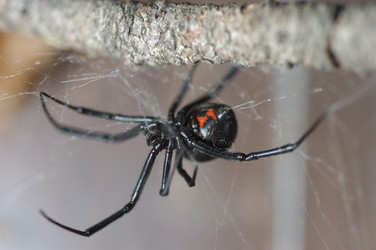

---
aliases:
  - Latrodectus
title: Latrodectus
---

## Phylogeny 

-   « Ancestral Groups  
    -  [Theridiidae](../Theridiidae.md) 
    -  [Orbiculariae](../../Orbiculariae.md) 
    -  [Entelegynae](../../../Entelegynae.md) 
    -  [Araneomorphae](../../../../Araneomorphae.md) 
    -   [Spider](../../../../../Spider.md)
    -  [Arachnida](../../../../../../Arachnida.md) 
    -  [Arthropoda](../../../../../../../../Arthropoda.md) 
    -  [Bilateria](../../../../../../../../../Bilateria.md) 
    -  [Animals](../../../../../../../../../../Animals.md) 
    -  [Eukarya](../../../../../../../../../../../Eukarya.md) 
    -   [Tree of Life](../../../../../../../../../../../Tree_of_Life.md)

-   ◊ Sibling Groups of  Theridiidae
    -   Latrodectus

-   » Sub-Groups
    -   [Latrodectus geometricus](Latrodectus_geometricus)
    -   [Latrodectus diaguita](Latrodectus_diaguita)
    -   [Latrodectus antheratus](Latrodectus_antheratus)
    -   [Latrodectus mirabilis](Latrodectus_mirabilis)
    -   [Latrodectus         renivulvatus](Latrodectus_renivulvatus)
    -   [Latrodectus         indistinctus](Latrodectus_indistinctus)
    -   [Latrodectus quartus](Latrodectus_quartus)

# *Latrodectus*

## Widow spiders 

[Jeremy Miller]()
 

Tree simplified from Garb et al. (2004), based on cytochrome oxidase I
sequence data.

Containing group:[Theridiidae](../Theridiidae.md) 

## Introduction

Widow spiders (genus *Latrodectus*) are widely feared but poorly known.
They are a medically important group with a worldwide distribution. Most
species favor xeric conditions. Some species adapt well to synanthropic
(human-altered) conditions and are readily dispersed by humans (Forster,
1984; 1985; Forster and Forster, 1999; Garb et al., 2004; Ono, 1995; Ori
et al., 1996). They have remarkably diverse sexual biology involving
cannibalism, kleptoparasitism, mate guarding, mating plugs,
post-copulatory sterility, and varying degrees of sexual size dimorphism
(e.g., Anava and Lubin, 1993; Andrade, 1996; 1998; Andrade and Banta,
2002; Breene and Sweet, 1985; Forster, 1992; 1995; Ross and Smith, 1979;
Segev et al., 2003; Snow et al., 2005; Snow and Andrade, 2005a; b).

There are currently 31 valid species of *Latrodectus*. Widow spiders are
most diverse in Argentina (seven species), the Middle East (seven
species), South Africa (six species), and North America (five species).
There are undescribed species and nomenclatural problems, so the
taxonomy of the group is unstable.\

### Characteristics

The male palp (intromittent organ) is distinctive with a long spiral
embolus. The epigynum (female genitalia) features an atrium (large
unified copulatory opening leading to a pair of independent copulatory
ducts) and dumbbell-shaped spermathecae (female sperm storage organs).
The famous red hourglass marking on the ventral part of the abdomen is
not present in all species.

### Medical Importance

Black widow venom is a neurotoxin that can cause latrodectism, a mild to
severe medical syndrome. The bite itself is usually not perceived but
local pain may occur several minutes after the bite. Typical symptoms of
latrodectism include swelling of the lymphatic nodes, profuse sweating,
rigidity of the abdominal muscles, facial contortions, and hypertension
(Maretic, 1971; 1975; 1983). Antivenin is available to counteract the
effects of *Latrodectus*. Cases of latrodectism are known from all
geographic regions where widow spiders occur. Across the globe
envenomations appear to be patchy. Actual or alleged envenomations in
the various geographic regions are attributed to the various local widow
species, which differ significantly in toxicity, aggressiveness, and
ecology (Finlayson, 1956; Maretic, 1971; 1978; 1983; 1987; McCrone,
1964; McCrone and Netzloff, 1965; Müller et al., 1989; Müller et al.,
1992; Shulov, 1940; Shulov and Weissman, 1959). Even without antivenin
treatment, the mortality rate is low (on the order of 5%, mostly in
small children; Schmidt, 1993).

One of the key factors influencing the epidemiology of latrodectism is
the ecology of local *Latrodectus* species. *Latrodectus* tends to be
urbanized in North America and Australia, while in Argentina and the
Mediterranean region, *Latrodectus* is more likely to be found in rural
or natural areas (Maretic, 1971; 1978). In regions where *Latrodectus*
is not urbanized, latrodectism is often associated with farm workers and
summer months, when farming is most intensive. In regions with urbanized
*Latrodectus* species, latrodectism affects a broader cross section of
the population, and bites may occur at almost any time of the year
(Maretic, 1978).

### Discussion of Phylogenetic Relationships

Garb et al. (2004) have produced the first phylogeny of *Latrodectus*
species using the mitochondrial gene cytochrome oxidase I. This analysis
produced a generally well supported tree. Species not included in the
Garb et al. study are listed below the tree on this page.

### References

Abalos, J. W. 1962. The egg-sac in the identification of species of
*Latrodectus* (black-widow spiders). Psyche 69:268-270.

Abalos, J. W. 1980. Las arañas del género *Latrodectus* en la Argentina.
Obra del Centenario del Museo de La Plata 6:29-51.

Abalos, J. W., and E. C. Báez. 1967. The spider genus *Latrodectus* in
Santiago del Estero, Argentina. Pages 59-74 in Animal Toxins Pergamon
Press, Oxford.

Anava, A., and Y. Lubin. 1993. Presence of gender cues in the web of a
widow spider, Latrodectus revivensis, and a description of courtship
behavior. Bull. Br. arachnol. Soc. 9:119-122.

Andrade, M. C. B. 1996. Sexual selection for male sacrifice in the
Australian redback spiders. Science 271:70-72.

Andrade, M. C. B. 1998. Female hunger can explain variation in
cannibalistic behavior despite male sacrifice in redback spiders. Behav.
Ecol. 9:33-42.

Andrade, M. C. B., and E. M. Banta. 2002. Value of male remating and
functional sterility in redback spiders. Animal Behav. 63:857-870.

Breene, R. G., and M. H. Sweet. 1985. Evidence of insemination of
multiple females by the male black widow spider, Latrodectus mactans
(Spider, Theridiidae). J. Arachnol. 13:331-335.

Finlayson, M. H. 1956. \"Knopie-Spider\" bite in Southern Africa. Med.
Proc. 2:634-638.

Forster, L. M. 1984. The Australian redback spider (*Latrodectus
hasselti*): its introduction and potential for establishment and
distribution in New Zealand. Pages 273-289 in Commerce and the Spread of
Harmful Pests and Disease Vectors (M. Laird, ed.) New York, Praeger
Press.

Forster, L. M. 1985. Is the redback spider here to stay? New Zealand J
Ag. 150:58-59.

Forster, L. M. 1992. The stereotyped behavior of sexual cannibalism in
*Latrodectus hasselti* Thorell (Spider: Theridiidae), the Australian
redback spider. Aust. J. Zool. 40:1-11.

Forster, L. M. 1995. The behavioral ecology of *Latrodectus hasselti*
(Thorell), the Australian redback spider (Spider: Theridiidae): A
review. Rec.Western Australian Mus., Sup 52:13-24.

Forster, R., and L. Forster. 1999. Spiders of New Zealand and their
World-Wide Kin. University of Otago Press, Hong Kong.

Garb, J. E., A. González, and R. G. Gillespie. 2004. The black widow
spider genus *Latrodectus* (Spider: Theridiidae): phylogeny and
invasion history. Mol. Phy. Evol. 31:1127-1142.

Knoflach, B., and A. van Harten. 2002. The genus *Latrodectus* (Spider:
Theridiidae) from mainland Yemen, the Socotra Archipelago and adjacent
countries. Fauna Arabia 19:321-361.

Levi, H. W. 1966. The three species of *Latrodectus* found in Israel. J.
Zool., London 150:427-432.

Levi, H. W. 1983. On the value of genitalic structures and coloration in
separating species of widow spiders (*Latrodectus* sp.) (Arachnida:
Spider: Theridiidae). Verh. Naturwiss. Ver. Hamburg 26:195-200.

Levy, G., and P. Amitai. 1983. Revision of the widow-spider genus
*Latrodectus* (Spider: Theridiidae) in Israel. Zool. J. Linnean Soc.
77:39-63.

Lotz, L. N. 1994. Revision of the genus *Latrodectus* (Spider:
Theridiidae) in Africa. Navorsinge van die Nasionale Museum Bloemfontein
10:1-60.

Maretic, Z. 1971. Latrodectism in Mediterranean countries, including
South Russia, Israel, and North Africa. Pages 299-309 *in* Venomous
Animals and their Venoms. Volume III. Venomous Invertebrates (W.
Bücherl, and E. E. Buckley, eds.). Academic Press, London.

Maretic, Z. 1975. European araneism. Bull. Br. arachnol. Soc. 3:126-130.

Maretic, Z. 1978. Venoms of Theridiidae, genus *Latrodectus*. B.
Epidemiology of envenomation, symptomatology, pathology and treatment.
Pages 185-207 *in* Arthropod Venoms. Handbuch der experimentellen
Pharmakologie. Volume 48 (S. Bettini, ed.) Springer Verlan, Berlin.

Maretic, Z. 1983. Latrodectism: Variations in clinical manifestations
provoked by *Latrodectus* species of spiders. Toxicon 21:457-466.

Maretic, Z. 1987. Spider venoms and their effect. Pages 142-159 *in*
Ecophysiology of Spiders (W. Nentwig, ed.) Springer Verlag, Berlin.

McCrone, J. D. 1964. Comparative lethality of several *Latrodectus*
venoms. Toxicon 2:201-203.

McCrone, J. D., and M. L. Netzloff. 1965. An immunological and
electrophoretical comparison of the venoms of the North American
*Latrodectus* spiders. Toxicon 3:107-110.

Melic, A. 2000. El género *Latrodectus* Walckenaer, 1805 en la Península
Ibérica (Spider: Theridiidae). Rev. Iber. Aracnol. 1:13-30.

Müller, G. J., H. M. Koch, A. B. Kreigler, B. J. van del Walt, and P. P.
van Jaarsveld. 1989. The relative toxicity and polypeptide composition
of the venom of two Southern African widow spider species: *Latrodectus
indistinctus* and *Latrodectus geometricus*. South African J. Sci.
85:44-46.

Müller, G. J., A. B. Kreigler, J. M. van Zyl, B. J. van del Walt, A. S.
Dippenaar, and P. P. van Jaarsveld. 1992. Comparison of the toxicity,
neurotransmitter releasing potency and polypeptide composition of the
venoms from *Steatoda foravae*, *Latrodectus indistinctus* and *L.
geometricus*. South African J. Sci. 88:113-116.

Ono, H. 1995. Records of *Latrodectus geometricus* (Spider:
Theridiidae) from Japan. Acta arachnol. 44:167-170.

Ori, M., E.-I. Shinkai, and H. Ikeda. 1996. Introduction of widow
spiders into Japan. (In Japanese). Med. Ent. Zool. 47:111-119.

Ross, K., and R. L. Smith. 1979. Aspects of the courtship behavior of
the black widow spider, *Latrodectus hesperus* (Spider: Theridiidae),
with evidence for the existence of a contact sex pheromone. J. Arachnol.
7:69-77.

Schmidt, G. 1993. Giftige und gefährliche Spinnentiere. Westarp
Wissenschaften, Magdeburg, Essen.

Segev, O., M. Ziv, and Y. Lubin. 2003. The male mating system in a
desert widow spider. J. Arachnol. 31:379-393.

Shulov, A. 1940. On the biology of two *Latrodectus* spiders in
Palestine. Proc. Linn. Soc., London 152:309-328.

Shulov, A., and A. Weissman. 1959. Notes on the life habits and potency
of the venom of the three *Latrodectus* spider species of Israel.
Ecology 40:515-518.

Snow, L. S. E., A. Abdel-Mesih, and M. C. B. Andrade. 2005. Broken
copulatory organs are low-cost adaptations to sperm competition in
redback spiders. Ethology 111:1-17.

Snow, L. S. E., and M. C. B. Andrade. 2005a. Multiple sperm storage
organs facilitate female control of paternity. Proc. R. Soc. Lond. B
272:1139-1144.

Snow, L. S. E., and M. C. B. Andrade. 2005b. Pattern of sperm transfer
in redback spiders: implications for sperm competition and male
sacrifice. Behav. Ecol. 15:785-792.

## Title Illustrations

 

  ---------------------------------------------------------------------------------------
  scientific_name ::     *Latrodectus hesperus*
  location ::           Chatfield Reservoir, Douglas Co., Colorado
  specimen_condition ::  Live Specimen
  Identified By        Jeremy Miller
  Sex ::                Female
  Life Cycle Stage ::     Adult
  copyright ::            © [Jeremy Miller](http://www.calacademy.org/research/entomology/personnel/jmiller/index.htm) 
 
  ---------------------------------------------------------------------------------------

## Confidential Links & Embeds: 

### #is_/same_as :: [[/_Standards/bio/bio~Domain/Eukarya/Animal/Bilateria/Arthropoda/Chelicerata/Arachnida/Spider/Araneomorphae/Entelegynae/Orbiculariae/Theridiidae/Latrodectus|Latrodectus]] 

### #is_/same_as :: [[/_public/bio/bio~Domain/Eukarya/Animal/Bilateria/Arthropoda/Chelicerata/Arachnida/Spider/Araneomorphae/Entelegynae/Orbiculariae/Theridiidae/Latrodectus.public|Latrodectus.public]] 

### #is_/same_as :: [[/_internal/bio/bio~Domain/Eukarya/Animal/Bilateria/Arthropoda/Chelicerata/Arachnida/Spider/Araneomorphae/Entelegynae/Orbiculariae/Theridiidae/Latrodectus.internal|Latrodectus.internal]] 

### #is_/same_as :: [[/_protect/bio/bio~Domain/Eukarya/Animal/Bilateria/Arthropoda/Chelicerata/Arachnida/Spider/Araneomorphae/Entelegynae/Orbiculariae/Theridiidae/Latrodectus.protect|Latrodectus.protect]] 

### #is_/same_as :: [[/_private/bio/bio~Domain/Eukarya/Animal/Bilateria/Arthropoda/Chelicerata/Arachnida/Spider/Araneomorphae/Entelegynae/Orbiculariae/Theridiidae/Latrodectus.private|Latrodectus.private]] 

### #is_/same_as :: [[/_personal/bio/bio~Domain/Eukarya/Animal/Bilateria/Arthropoda/Chelicerata/Arachnida/Spider/Araneomorphae/Entelegynae/Orbiculariae/Theridiidae/Latrodectus.personal|Latrodectus.personal]] 

### #is_/same_as :: [[/_secret/bio/bio~Domain/Eukarya/Animal/Bilateria/Arthropoda/Chelicerata/Arachnida/Spider/Araneomorphae/Entelegynae/Orbiculariae/Theridiidae/Latrodectus.secret|Latrodectus.secret]] 

