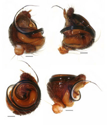
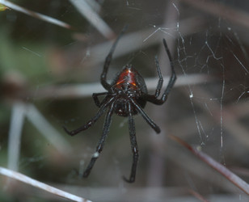
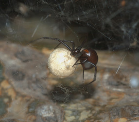

---
aliases:
  - antheratus
title: Latrodectus antheratus
---

## Phylogeny 

-   « Ancestral Groups  
    -  [Latrodectus](../Latrodectus.md) 
    -  [Theridiidae](../../Theridiidae.md) 
    -  [Orbiculariae](../../../Orbiculariae.md) 
    -  [Entelegynae](../../../../Entelegynae.md) 
    -  [Araneomorphae](../../../../../Araneomorphae.md) 
    -   [Spider](../../../../../../Spider.md)
    -  [Arachnida](../../../../../../../Arachnida.md) 
    -  [Arthropoda](../../../../../../../../../Arthropoda.md) 
    -  [Bilateria](../../../../../../../../../../Bilateria.md) 
    -  [Animals](../../../../../../../../../../../Animals.md) 
    -  [Eukarya](../../../../../../../../../../../../Eukarya.md) 
    -   [Tree of Life](../../../../../../../../../../../../Tree_of_Life.md)

-   ◊ Sibling Groups of  Latrodectus
    -   [Latrodectus geometricus](Latrodectus_geometricus)
    -   [Latrodectus diaguita](Latrodectus_diaguita)
    -   Latrodectus antheratus
    -   [Latrodectus mirabilis](Latrodectus_mirabilis)
    -   [Latrodectus         renivulvatus](Latrodectus_renivulvatus)
    -   [Latrodectus         indistinctus](Latrodectus_indistinctus)
    -   [Latrodectus quartus](Latrodectus_quartus)

-   » Sub-Groups 

# *Latrodectus antheratus* 

[Jeremy Miller]()

)))

Containing group: [Latrodectus](../Latrodectus.md))*

## Title Illustrations

)

  ---------------------------------------------------------------------------------------
  Scientific Name ::     Latrodectus antheratus
  Location ::           Quimilí, Santiago del Estero Prov., Argentina
  Comments             Photograph of specimen in alcohol. Note that red coloration fades in alcohol. See live photographs for true color. Scale bar = 1.0 mm.
  Specimen Condition   Dead Specimen
  Identified By        Jeremy Miller
  Sex ::                Female, male
  Life Cycle Stage ::     Adult
  Copyright ::            © [Jeremy Miller](http://www.calacademy.org/research/entomology/personnel/jmiller/index.htm) 
 
  ---------------------------------------------------------------------------------------
)

  ---------------------------------------------------------------------------------------
  Scientific Name ::     Latrodectus antheratus
  Location ::           Quimilí, Santiago del Estero Prov., Argentina
  Comments             Scale bar = 0.1 mm.
  Specimen Condition   Dead Specimen
  Identified By        Jeremy Miller
  Sex ::                Male
  Life Cycle Stage ::     Adult
  Body Part            Male palp
  Copyright ::            © [Jeremy Miller](http://www.calacademy.org/research/entomology/personnel/jmiller/index.htm) 
 
  ---------------------------------------------------------------------------------------
)

  ---------------------------------------------------------------------------------------
  Scientific Name ::     Latrodectus antheratus
  Location ::           Sierra de las Quijadas, San Luis Prov., Argentina
  Specimen Condition   Live Specimen
  Identified By        Jeremy Miller
  Sex ::                Female
  Life Cycle Stage ::     Adult with egg case
  Copyright ::            © [Jeremy Miller](http://www.calacademy.org/research/entomology/personnel/jmiller/index.htm) 
 
  ---------------------------------------------------------------------------------------
)

  ---------------------------------------------------------------------------------------
  Scientific Name ::     Latrodectus antheratus
  Location ::           Quimilí, Santiago del Estero Prov., Argentina
  Specimen Condition   Live Specimen
  Identified By        Jeremy Miller
  Sex ::                Female
  Life Cycle Stage ::     Adult with egg case
  Copyright ::            © [Jeremy Miller](http://www.calacademy.org/research/entomology/personnel/jmiller/index.htm) 
 
  ---------------------------------------------------------------------------------------

## Confidential Links & Embeds: 

### #is_/same_as :: [antheratus](/_Standards/bio/bio~Domain/Eukarya/Animal/Bilateria/Arthropoda/Chelicerata/Arachnida/Spider/Araneomorphae/Entelegynae/Orbiculariae/Theridiidae/Latrodectus/antheratus.md) 

### #is_/same_as :: [antheratus.public](/_public/bio/bio~Domain/Eukarya/Animal/Bilateria/Arthropoda/Chelicerata/Arachnida/Spider/Araneomorphae/Entelegynae/Orbiculariae/Theridiidae/Latrodectus/antheratus.public.md) 

### #is_/same_as :: [antheratus.internal](/_internal/bio/bio~Domain/Eukarya/Animal/Bilateria/Arthropoda/Chelicerata/Arachnida/Spider/Araneomorphae/Entelegynae/Orbiculariae/Theridiidae/Latrodectus/antheratus.internal.md) 

### #is_/same_as :: [antheratus.protect](/_protect/bio/bio~Domain/Eukarya/Animal/Bilateria/Arthropoda/Chelicerata/Arachnida/Spider/Araneomorphae/Entelegynae/Orbiculariae/Theridiidae/Latrodectus/antheratus.protect.md) 

### #is_/same_as :: [antheratus.private](/_private/bio/bio~Domain/Eukarya/Animal/Bilateria/Arthropoda/Chelicerata/Arachnida/Spider/Araneomorphae/Entelegynae/Orbiculariae/Theridiidae/Latrodectus/antheratus.private.md) 

### #is_/same_as :: [antheratus.personal](/_personal/bio/bio~Domain/Eukarya/Animal/Bilateria/Arthropoda/Chelicerata/Arachnida/Spider/Araneomorphae/Entelegynae/Orbiculariae/Theridiidae/Latrodectus/antheratus.personal.md) 

### #is_/same_as :: [antheratus.secret](/_secret/bio/bio~Domain/Eukarya/Animal/Bilateria/Arthropoda/Chelicerata/Arachnida/Spider/Araneomorphae/Entelegynae/Orbiculariae/Theridiidae/Latrodectus/antheratus.secret.md)

