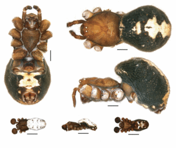
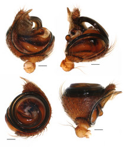
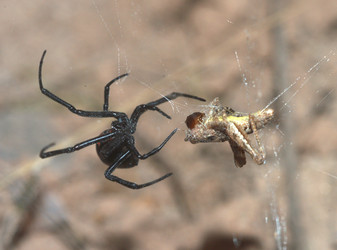
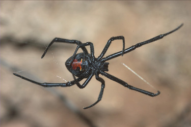

## Phylogeny 

-   « Ancestral Groups  
    -  [Latrodectus](../Latrodectus.md))
    -  [Theridiidae](../../Theridiidae.md))
    -  [Orbiculariae](../../../Orbiculariae.md))
    -  [Entelegynae](../../../../Entelegynae.md))
    -  [Araneomorphae](../../../../../Araneomorphae.md))
    -   [Spider](../../../../../../Spider.md)
    -  [Arachnida](../../../../../../../Arachnida.md))
    -  [Arthropoda](../../../../../../../../../Arthropoda.md))
    -  [Bilateria](../../../../../../../../../../Bilateria.md))
    -  [Animals](../../../../../../../../../../../Animals.md))
    -  [Eukarya](../../../../../../../../../../../../Eukarya.md))
    -   [Tree of Life](../../../../../../../../../../../../Tree_of_Life.md)

-   ◊ Sibling Groups of  Latrodectus
    -   [Latrodectus geometricus](Latrodectus_geometricus)
    -   Latrodectus diaguita
    -   [Latrodectus antheratus](Latrodectus_antheratus)
    -   [Latrodectus mirabilis](Latrodectus_mirabilis)
    -   [Latrodectus         renivulvatus](Latrodectus_renivulvatus)
    -   [Latrodectus         indistinctus](Latrodectus_indistinctus)
    -   [Latrodectus quartus](Latrodectus_quartus)

-   » Sub-Groups 

# *Latrodectus diaguita* 

[Jeremy Miller]()

)

Containing group: [Latrodectus](../Latrodectus.md))*

## Title Illustrations

)

  ---------------------------------------------------------------------------------------
  Scientific Name ::     Latrodectus diaguita
  Location ::           Ruta 4, Km 9, Catamarca Prov., Argentina
  Comments             Photograph of specimen in alcohol. Note that red coloration fades in alcohol. See live photographs for true color. Scale bar = 1.0 mm.
  Specimen Condition   Dead Specimen
  Identified By        Jeremy Miller
  Life Cycle Stage ::     Adult
  Copyright ::            © [Jeremy Miller](http://www.calacademy.org/research/entomology/personnel/jmiller/index.htm) 
  ---------------------------------------------------------------------------------------
)

  ---------------------------------------------------------------------------------------
  Scientific Name ::     Latrodectus diaguita
  Location ::           Ruta 4, Km 9, Catamarca Prov., Argentina
  Comments             Scale bar = 0.1 mm.
  Specimen Condition   Dead Specimen
  Identified By        Jeremy Miller
  Sex ::                Male
  Life Cycle Stage ::     Adult
  Body Part            Male palp
  Copyright ::            © [Jeremy Miller](http://www.calacademy.org/research/entomology/personnel/jmiller/index.htm) 
  ---------------------------------------------------------------------------------------
)

  ---------------------------------------------------------------------------------------
  Scientific Name ::     Latrodectus diaguita
  Location ::           Ruta 4, Km 9, Catamarca Prov., Argentina
  Specimen Condition   Live Specimen
  Identified By        Jeremy Miller
  Behavior             Wrapping prey
  Sex ::                Female
  Life Cycle Stage ::     Adult
  Copyright ::            © [Jeremy Miller](http://www.calacademy.org/research/entomology/personnel/jmiller/index.htm) 
  ---------------------------------------------------------------------------------------
)

  ---------------------------------------------------------------------------------------
  Scientific Name ::     Latrodectus diaguita
  Location ::           Ruta 4, Km 9, Catamarca Prov., Argentina
  Specimen Condition   Live Specimen
  Identified By        Jeremy Miller
  Sex ::                Female
  Life Cycle Stage ::     Adult
  Copyright ::            © [Jeremy Miller](http://www.calacademy.org/research/entomology/personnel/jmiller/index.htm) 
  ---------------------------------------------------------------------------------------

## Confidential Links & Embeds: 

### #is_/same_as :: [diaguita](/_Standards/bio/bio~Domain/Eukarya/Animal/Bilateria/Arthropoda/Chelicerata/Arachnida/Spider/Araneomorphae/Entelegynae/Orbiculariae/Theridiidae/Latrodectus/diaguita.md) 

### #is_/same_as :: [diaguita.public](/_public/bio/bio~Domain/Eukarya/Animal/Bilateria/Arthropoda/Chelicerata/Arachnida/Spider/Araneomorphae/Entelegynae/Orbiculariae/Theridiidae/Latrodectus/diaguita.public.md) 

### #is_/same_as :: [diaguita.internal](/_internal/bio/bio~Domain/Eukarya/Animal/Bilateria/Arthropoda/Chelicerata/Arachnida/Spider/Araneomorphae/Entelegynae/Orbiculariae/Theridiidae/Latrodectus/diaguita.internal.md) 

### #is_/same_as :: [diaguita.protect](/_protect/bio/bio~Domain/Eukarya/Animal/Bilateria/Arthropoda/Chelicerata/Arachnida/Spider/Araneomorphae/Entelegynae/Orbiculariae/Theridiidae/Latrodectus/diaguita.protect.md) 

### #is_/same_as :: [diaguita.private](/_private/bio/bio~Domain/Eukarya/Animal/Bilateria/Arthropoda/Chelicerata/Arachnida/Spider/Araneomorphae/Entelegynae/Orbiculariae/Theridiidae/Latrodectus/diaguita.private.md) 

### #is_/same_as :: [diaguita.personal](/_personal/bio/bio~Domain/Eukarya/Animal/Bilateria/Arthropoda/Chelicerata/Arachnida/Spider/Araneomorphae/Entelegynae/Orbiculariae/Theridiidae/Latrodectus/diaguita.personal.md) 

### #is_/same_as :: [diaguita.secret](/_secret/bio/bio~Domain/Eukarya/Animal/Bilateria/Arthropoda/Chelicerata/Arachnida/Spider/Araneomorphae/Entelegynae/Orbiculariae/Theridiidae/Latrodectus/diaguita.secret.md)

