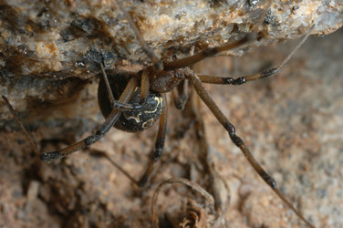

---
aliases:
  - geometricus
title: Latrodectus geometricus
---

## Phylogeny 

-   « Ancestral Groups  
    -  [Latrodectus](../Latrodectus.md) 
    -  [Theridiidae](../../Theridiidae.md) 
    -  [Orbiculariae](../../../Orbiculariae.md) 
    -  [Entelegynae](../../../../Entelegynae.md) 
    -  [Araneomorphae](../../../../../Araneomorphae.md) 
    -   [Spider](../../../../../../Spider.md)
    -  [Arachnida](../../../../../../../Arachnida.md) 
    -  [Arthropoda](../../../../../../../../../Arthropoda.md) 
    -  [Bilateria](../../../../../../../../../../Bilateria.md) 
    -  [Animals](../../../../../../../../../../../Animals.md) 
    -  [Eukarya](../../../../../../../../../../../../Eukarya.md) 
    -   [Tree of Life](../../../../../../../../../../../../Tree_of_Life.md)

-   ◊ Sibling Groups of  Latrodectus
    -   Latrodectus geometricus
    -   [Latrodectus diaguita](Latrodectus_diaguita)
    -   [Latrodectus antheratus](Latrodectus_antheratus)
    -   [Latrodectus mirabilis](Latrodectus_mirabilis)
    -   [Latrodectus         renivulvatus](Latrodectus_renivulvatus)
    -   [Latrodectus         indistinctus](Latrodectus_indistinctus)
    -   [Latrodectus quartus](Latrodectus_quartus)

-   » Sub-Groups 

# *Latrodectus geometricus* 

[Jeremy Miller]()
)))

Containing group: [Latrodectus](../Latrodectus.md))*

## Title Illustrations

)

  ---------------------------------------------------------------------------------------
  Scientific Name ::     Latrodectus geometricus
  Location ::           Geogap Nature Reserve, Northern Cape, South Africa
  Specimen Condition   Live Specimen
  Identified By        Jeremy Miller
  Sex ::                Female
  Life Cycle Stage ::     Adult
  Copyright ::            © [Jeremy Miller](http://www.calacademy.org/research/entomology/personnel/jmiller/index.htm) 
 
  ---------------------------------------------------------------------------------------
)

  ---------------------------------------------------------------------------------------
  Scientific Name ::     Latrodectus geometricus
  Location ::           Parque National Chaco, Chaco Prov., Argentina
  Specimen Condition   Live Specimen
  Identified By        Jeremy Miller
  Sex ::                Female
  Life Cycle Stage ::     Adult
  Copyright ::            © [Jeremy Miller](http://www.calacademy.org/research/entomology/personnel/jmiller/index.htm) 
 
  ---------------------------------------------------------------------------------------
)

  ---------------------------------------------------------------------------------------
  Scientific Name ::     Latrodectus geometricus
  Location ::           Alabama, USA
  Specimen Condition   Egg case
  Identified By        Jeremy Miller
  Copyright ::            © [Jeremy Miller](http://www.calacademy.org/research/entomology/personnel/jmiller/index.htm) 
 
  ---------------------------------------------------------------------------------------

## Confidential Links & Embeds: 

### #is_/same_as :: [[/_Standards/bio/bio~Domain/Eukarya/Animal/Bilateria/Arthropoda/Chelicerata/Arachnida/Spider/Araneomorphae/Entelegynae/Orbiculariae/Theridiidae/Latrodectus/geometricus|geometricus]] 

### #is_/same_as :: [[/_public/bio/bio~Domain/Eukarya/Animal/Bilateria/Arthropoda/Chelicerata/Arachnida/Spider/Araneomorphae/Entelegynae/Orbiculariae/Theridiidae/Latrodectus/geometricus.public|geometricus.public]] 

### #is_/same_as :: [[/_internal/bio/bio~Domain/Eukarya/Animal/Bilateria/Arthropoda/Chelicerata/Arachnida/Spider/Araneomorphae/Entelegynae/Orbiculariae/Theridiidae/Latrodectus/geometricus.internal|geometricus.internal]] 

### #is_/same_as :: [[/_protect/bio/bio~Domain/Eukarya/Animal/Bilateria/Arthropoda/Chelicerata/Arachnida/Spider/Araneomorphae/Entelegynae/Orbiculariae/Theridiidae/Latrodectus/geometricus.protect|geometricus.protect]] 

### #is_/same_as :: [[/_private/bio/bio~Domain/Eukarya/Animal/Bilateria/Arthropoda/Chelicerata/Arachnida/Spider/Araneomorphae/Entelegynae/Orbiculariae/Theridiidae/Latrodectus/geometricus.private|geometricus.private]] 

### #is_/same_as :: [[/_personal/bio/bio~Domain/Eukarya/Animal/Bilateria/Arthropoda/Chelicerata/Arachnida/Spider/Araneomorphae/Entelegynae/Orbiculariae/Theridiidae/Latrodectus/geometricus.personal|geometricus.personal]] 

### #is_/same_as :: [[/_secret/bio/bio~Domain/Eukarya/Animal/Bilateria/Arthropoda/Chelicerata/Arachnida/Spider/Araneomorphae/Entelegynae/Orbiculariae/Theridiidae/Latrodectus/geometricus.secret|geometricus.secret]] 

