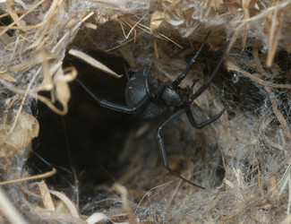
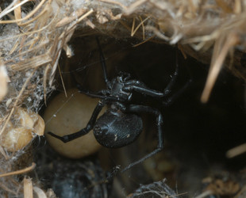
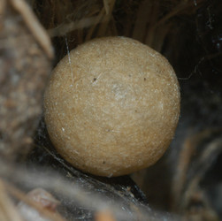

---
aliases:
  - indistinctus
title: Latrodectus indistinctus
---

## Phylogeny 

-   « Ancestral Groups  
    -  [Latrodectus](../Latrodectus.md) 
    -  [Theridiidae](../../Theridiidae.md) 
    -  [Orbiculariae](../../../Orbiculariae.md) 
    -  [Entelegynae](../../../../Entelegynae.md) 
    -  [Araneomorphae](../../../../../Araneomorphae.md) 
    -   [Spider](../../../../../../Spider.md)
    -  [Arachnida](../../../../../../../Arachnida.md) 
    -  [Arthropoda](../../../../../../../../../Arthropoda.md) 
    -  [Bilateria](../../../../../../../../../../Bilateria.md) 
    -  [Animals](../../../../../../../../../../../Animals.md) 
    -  [Eukarya](../../../../../../../../../../../../Eukarya.md) 
    -   [Tree of Life](../../../../../../../../../../../../Tree_of_Life.md)

-   ◊ Sibling Groups of  Latrodectus
    -   [Latrodectus geometricus](Latrodectus_geometricus)
    -   [Latrodectus diaguita](Latrodectus_diaguita)
    -   [Latrodectus antheratus](Latrodectus_antheratus)
    -   [Latrodectus mirabilis](Latrodectus_mirabilis)
    -   [Latrodectus         renivulvatus](Latrodectus_renivulvatus)
    -   Latrodectus indistinctus
    -   [Latrodectus quartus](Latrodectus_quartus)

-   » Sub-Groups 

# *Latrodectus indistinctus* 

[Jeremy Miller]()
)

Containing group: [Latrodectus](../Latrodectus.md))*

## Title Illustrations

)

  ---------------------------------------------------------------------------------------
  Scientific Name ::     Latrodectus indistinctus
  Location ::           Mamre, 49 km N Cape Town, Western Cape, South Africa
  Specimen Condition   Live Specimen
  Identified By        Jeremy Miller
  Sex ::                Female
  Life Cycle Stage ::     Adult
  Copyright ::            © [Jeremy Miller](http://www.calacademy.org/research/entomology/personnel/jmiller/index.htm) 
 
  ---------------------------------------------------------------------------------------
)

  ---------------------------------------------------------------------------------------
  Scientific Name ::     Latrodectus indistinctus
  Location ::           Mamre, 49 km N Cape Town, Western Cape, South Africa
  Specimen Condition   Live Specimen
  Identified By        Jeremy Miller
  Sex ::                Female
  Life Cycle Stage ::     Adult
  Copyright ::            © [Jeremy Miller](http://www.calacademy.org/research/entomology/personnel/jmiller/index.htm) 
 
  ---------------------------------------------------------------------------------------
)

  ---------------------------------------------------------------------------------------
  Scientific Name ::     Latrodectus indistinctus
  Location ::           Mamre, 49 km N Cape Town, Western Cape, South Africa
  Specimen Condition   Live Specimen
  Life Cycle Stage ::     Egg case
  Copyright ::            © [Jeremy Miller](http://www.calacademy.org/research/entomology/personnel/jmiller/index.htm) 
 
  ---------------------------------------------------------------------------------------

## Confidential Links & Embeds: 

### #is_/same_as :: [[/_Standards/bio/bio~Domain/Eukarya/Animal/Bilateria/Arthropoda/Chelicerata/Arachnida/Spider/Araneomorphae/Entelegynae/Orbiculariae/Theridiidae/Latrodectus/indistinctus|indistinctus]] 

### #is_/same_as :: [[/_public/bio/bio~Domain/Eukarya/Animal/Bilateria/Arthropoda/Chelicerata/Arachnida/Spider/Araneomorphae/Entelegynae/Orbiculariae/Theridiidae/Latrodectus/indistinctus.public|indistinctus.public]] 

### #is_/same_as :: [[/_internal/bio/bio~Domain/Eukarya/Animal/Bilateria/Arthropoda/Chelicerata/Arachnida/Spider/Araneomorphae/Entelegynae/Orbiculariae/Theridiidae/Latrodectus/indistinctus.internal|indistinctus.internal]] 

### #is_/same_as :: [[/_protect/bio/bio~Domain/Eukarya/Animal/Bilateria/Arthropoda/Chelicerata/Arachnida/Spider/Araneomorphae/Entelegynae/Orbiculariae/Theridiidae/Latrodectus/indistinctus.protect|indistinctus.protect]] 

### #is_/same_as :: [[/_private/bio/bio~Domain/Eukarya/Animal/Bilateria/Arthropoda/Chelicerata/Arachnida/Spider/Araneomorphae/Entelegynae/Orbiculariae/Theridiidae/Latrodectus/indistinctus.private|indistinctus.private]] 

### #is_/same_as :: [[/_personal/bio/bio~Domain/Eukarya/Animal/Bilateria/Arthropoda/Chelicerata/Arachnida/Spider/Araneomorphae/Entelegynae/Orbiculariae/Theridiidae/Latrodectus/indistinctus.personal|indistinctus.personal]] 

### #is_/same_as :: [[/_secret/bio/bio~Domain/Eukarya/Animal/Bilateria/Arthropoda/Chelicerata/Arachnida/Spider/Araneomorphae/Entelegynae/Orbiculariae/Theridiidae/Latrodectus/indistinctus.secret|indistinctus.secret]] 

