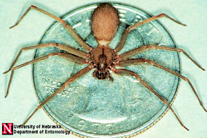
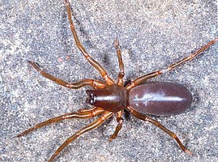

---
aliases:
  - Haplogynae
title: Haplogynae
---

# [[Haplogynae]] 

   

## #has_/text_of_/abstract 

> The **Haplogynae** or haplogynes are one of the two main groups 
> into which araneomorph spiders have traditionally been divided, the other being the Entelegynae. 
> 
> Morphological phylogenetic studies suggested that the Haplogynae formed a clade; 
> more recent molecular phylogenetic studies refute this, 
> although many of the ecribellate haplogynes do appear to form a clade, Synspermiata.
>
> Unlike the Entelegynae, haplogynes lack hardened (sclerotized) female genitalia (epigynes).
>
> Most of the species within this group have six eyes, as opposed to most other spiders. 
> Spiders in the genus Tetrablemma (Tetrablemmidae) have only four eyes, 
> as do some members of the family Caponiidae; 
> caponiids may even have only two eyes. However, spiders in the family Plectreuridae have the normal eight eyes.
>
> [Wikipedia](https://en.wikipedia.org/wiki/Haplogynae) 

## Phylogeny 

-   « Ancestral Groups  
    -  [Araneomorphae](../Araneomorphae.md) 
    -   [Spider](../../Spider.md)
    -  [Arachnida](../../../Arachnida.md) 
    -  [Arthropoda](../../../../../Arthropoda.md) 
    -  [Bilateria](../../../../../../Bilateria.md) 
    -  [Animals](../../../../../../../Animals.md) 
    -  [Eukarya](../../../../../../../../Eukarya.md) 
    -   [Tree of Life](../../../../../../../../Tree_of_Life.md)

-   ◊ Sibling Groups of  Araneomorphae
    -   Haplogynae
    -  [Hypochilidae](Hypochilidae.md) 
    -  [Entelegynae](Entelegynae.md) 

-   » Sub-Groups
    -  [Sicariidae](Haplogynae/Sicariidae.md) 

## Title Illustrations

---------------------------------------------------------------------- 
 
Scientific Name ::  Loxosceles reclusa
Comments          Brown recluse spider
Copyright ::         © [Jim Kalisch](http://entomology.unl.edu/) 

----------------------------------------------------------------------------

Scientific Name ::     Arachnida:Spider:Dysderidae: Dysdera erythrina
Location ::           "Corno alle Scale" Park, Bologna Province, Emilia Romagna, Italy
Specimen Condition   Live Specimen
Image Use ::    [Attribution-NonCommercial 2.0 Creative Commons License](http://creativecommons.org/licenses/by-nc/2.0/).
Copyright ::            © 2005 [Cesare Brizio](http://xoomer.virgilio.it/cebrizio/) 

## Confidential Links & Embeds: 

### #is_/same_as :: [[/_Standards/bio/bio~Domain/Eukarya/Animal/Bilateria/Arthropoda/Chelicerata/Arachnida/Spider/Araneomorphae/Haplogynae|Haplogynae]] 

### #is_/same_as :: [[/_public/bio/bio~Domain/Eukarya/Animal/Bilateria/Arthropoda/Chelicerata/Arachnida/Spider/Araneomorphae/Haplogynae.public|Haplogynae.public]] 

### #is_/same_as :: [[/_internal/bio/bio~Domain/Eukarya/Animal/Bilateria/Arthropoda/Chelicerata/Arachnida/Spider/Araneomorphae/Haplogynae.internal|Haplogynae.internal]] 

### #is_/same_as :: [[/_protect/bio/bio~Domain/Eukarya/Animal/Bilateria/Arthropoda/Chelicerata/Arachnida/Spider/Araneomorphae/Haplogynae.protect|Haplogynae.protect]] 

### #is_/same_as :: [[/_private/bio/bio~Domain/Eukarya/Animal/Bilateria/Arthropoda/Chelicerata/Arachnida/Spider/Araneomorphae/Haplogynae.private|Haplogynae.private]] 

### #is_/same_as :: [[/_personal/bio/bio~Domain/Eukarya/Animal/Bilateria/Arthropoda/Chelicerata/Arachnida/Spider/Araneomorphae/Haplogynae.personal|Haplogynae.personal]] 

### #is_/same_as :: [[/_secret/bio/bio~Domain/Eukarya/Animal/Bilateria/Arthropoda/Chelicerata/Arachnida/Spider/Araneomorphae/Haplogynae.secret|Haplogynae.secret]] 

