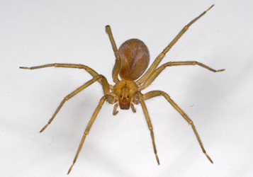
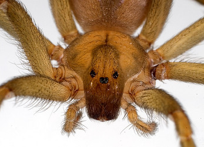
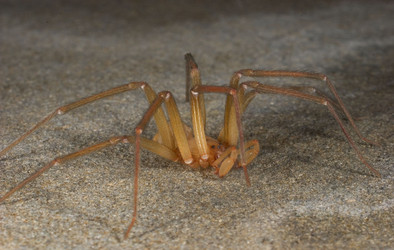

---
aliases:
  - Sicariidae
title: Sicariidae
has_id_wikidata: Q11717
---
# [[Sicariidae]] 
) )   

## #has_/text_of_/abstract 

> **Sicariidae** is a family of six-eyed venomous spiders known for their potentially necrotic bites. 
> The family consists of three genera and about 160 species. 
> Well known spiders in this family include the brown recluse spider and the six-eyed sand spider.
>
> [Wikipedia](https://en.wikipedia.org/wiki/Sicariidae) 

### Characteristics

Note the violin shaped mark on the cephalothorax (front half of body)
and the six eyes, grouped in pairs.\

## Phylogeny 

-   « Ancestral Groups  
    -  [Haplogynae](../Haplogynae.md) 
    -  [Araneomorphae](../../Araneomorphae.md) 
    -   [Spider](../../../Spider.md)
    -  [Arachnida](../../../../Arachnida.md) 
    -  [Arthropoda](../../../../../../Arthropoda.md) 
    -  [Bilateria](../../../../../../../Bilateria.md) 
    -  [Animals](../../../../../../../../Animals.md) 
    -  [Eukarya](../../../../../../../../../Eukarya.md) 
    -   [Tree of Life](../../../../../../../../../Tree_of_Life.md)

-   ◊ Sibling Groups of  Haplogynae
    -   Sicariidae

-   » Sub-Groups 

## Title Illustrations

--------------------------------------------------------------------------------- 
 
scientific_name ::     Loxosceles laeta
location ::           ex Instituto Butanan, Sao Paulo, Brazil
specimen_condition ::  Live Specimen
Identified By        Jonathan Coddington
Sex ::                Female
Life Cycle Stage ::     adult
copyright ::            © [Jonathan Coddington](http://entomology.si.edu/StaffPages/coddington.html) 

--------------------------------------------------------------------------------- 
 
scientific_name ::     Loxoscleles laeta
location ::           ex Instituto Butanan, Sao Paulo, Brazil
specimen_condition ::  Live Specimen
Identified By        Jonathan Coddington
Sex ::                Female
Life Cycle Stage ::     adult
copyright ::            © [Jonathan Coddington](http://entomology.si.edu/StaffPages/coddington.html) 

--------------------------------------------------------------------------------- 
 
scientific_name ::   Loxosceles laeta
location ::         ex Instituto Butanan, Sao Paulo Brazil
Identified By      Jonathan Coddington
Sex ::              Male
Life Cycle Stage ::   adult
copyright ::          © [Jonathan Coddington](http://entomology.si.edu/StaffPages/coddington.html) 

## Confidential Links & Embeds: 

### #is_/same_as :: [[/_Standards/bio/bio~Domain/Eukarya/Animal/Bilateria/Arthropoda/Chelicerata/Arachnida/Spider/Araneomorphae/Haplogynae/Sicariidae|Sicariidae]] 

### #is_/same_as :: [[/_public/bio/bio~Domain/Eukarya/Animal/Bilateria/Arthropoda/Chelicerata/Arachnida/Spider/Araneomorphae/Haplogynae/Sicariidae.public|Sicariidae.public]] 

### #is_/same_as :: [[/_internal/bio/bio~Domain/Eukarya/Animal/Bilateria/Arthropoda/Chelicerata/Arachnida/Spider/Araneomorphae/Haplogynae/Sicariidae.internal|Sicariidae.internal]] 

### #is_/same_as :: [[/_protect/bio/bio~Domain/Eukarya/Animal/Bilateria/Arthropoda/Chelicerata/Arachnida/Spider/Araneomorphae/Haplogynae/Sicariidae.protect|Sicariidae.protect]] 

### #is_/same_as :: [[/_private/bio/bio~Domain/Eukarya/Animal/Bilateria/Arthropoda/Chelicerata/Arachnida/Spider/Araneomorphae/Haplogynae/Sicariidae.private|Sicariidae.private]] 

### #is_/same_as :: [[/_personal/bio/bio~Domain/Eukarya/Animal/Bilateria/Arthropoda/Chelicerata/Arachnida/Spider/Araneomorphae/Haplogynae/Sicariidae.personal|Sicariidae.personal]] 

### #is_/same_as :: [[/_secret/bio/bio~Domain/Eukarya/Animal/Bilateria/Arthropoda/Chelicerata/Arachnida/Spider/Araneomorphae/Haplogynae/Sicariidae.secret|Sicariidae.secret]] 

