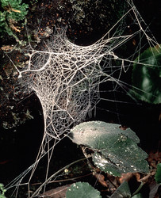

---
title: Hypochilidae
---

# [[Hypochilidae]]  
)

Containing group:[Araneomorphae](../Araneomorphae.md))

## #has_/text_of_/abstract 

> Lampshade spiders, family **Hypochilidae**, are among the most primitive of araneomorph spiders. There are two genera and twelve species currently recognized. Like mygalomorphs, most hypochilids have two pairs of book lungs, but like araneomorphs they have intersecting fangs, with the exception of some species which have chelicerae in an angle that is neither orthognathous or labidognathous. These long-legged spiders build typical "lampshade" style webs under overhangs and in caves. In the United States the fauna is primarily associated with the Appalachian, Rocky and California Mountains. Ten of the known species are found in these ranges, all in the genus Hypochilus. The genus Ectatosticta is found in China.
>
> In one analysis, the Hypochilidae are a sister clade to the Neocribellatae, which contains all other spider species in the Araneomorphae (Coddington & Levi, 1991, p. 576). A more recent study groups them with the Haplogynae.
>
> [Wikipedia](https://en.wikipedia.org/wiki/Lampshade%20spider) 

## Phylogeny 

-   « Ancestral Groups  
    -  [Araneomorphae](../Araneomorphae.md))
    -   [Spider](../../Spider.md)
    -  [Arachnida](../../../Arachnida.md))
    -  [Arthropoda](../../../../../Arthropoda.md))
    -  [Bilateria](../../../../../../Bilateria.md))
    -  [Animals](../../../../../../../Animals.md))
    -  [Eukarya](../../../../../../../../Eukarya.md))
    -   [Tree of Life](../../../../../../../../Tree_of_Life.md)

-   ◊ Sibling Groups of  Araneomorphae
    -  [Haplogynae](Haplogynae.md))
    -   Hypochilidae
    -  [Entelegynae](Entelegynae.md))

-   » Sub-Groups 

## Title Illustrations

---------------------------------------------------------------------------------)
Scientific Name ::     Hypochilus pococki
Location ::           Great Smoky Mountains, North Carolina
Specimen Condition   Live Specimen
Identified By        Jonathan Coddington
Sex ::                Female
Life Cycle Stage ::     adult
Copyright ::            © [Jonathan Coddington](http://entomology.si.edu/StaffPages/coddington.html) 

## Confidential Links & Embeds: 

### #is_/same_as ::[Hypochilidae](Hypochilidae.md)) 

### #is_/same_as :: [Hypochilidae.public](/_public/bio/bio~Domain/Eukarya/Animal/Bilateria/Arthropoda/Chelicerata/Arachnida/Spider/Araneomorphae/Hypochilidae.public.md) 

### #is_/same_as :: [Hypochilidae.internal](/_internal/bio/bio~Domain/Eukarya/Animal/Bilateria/Arthropoda/Chelicerata/Arachnida/Spider/Araneomorphae/Hypochilidae.internal.md) 

### #is_/same_as :: [Hypochilidae.protect](/_protect/bio/bio~Domain/Eukarya/Animal/Bilateria/Arthropoda/Chelicerata/Arachnida/Spider/Araneomorphae/Hypochilidae.protect.md) 

### #is_/same_as :: [Hypochilidae.private](/_private/bio/bio~Domain/Eukarya/Animal/Bilateria/Arthropoda/Chelicerata/Arachnida/Spider/Araneomorphae/Hypochilidae.private.md) 

### #is_/same_as :: [Hypochilidae.personal](/_personal/bio/bio~Domain/Eukarya/Animal/Bilateria/Arthropoda/Chelicerata/Arachnida/Spider/Araneomorphae/Hypochilidae.personal.md) 

### #is_/same_as :: [Hypochilidae.secret](/_secret/bio/bio~Domain/Eukarya/Animal/Bilateria/Arthropoda/Chelicerata/Arachnida/Spider/Araneomorphae/Hypochilidae.secret.md)

