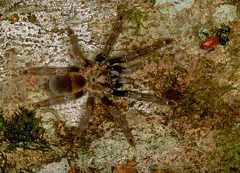

---
aliases:
- Migali
- Migalomorf
- migalomorfs
- Migalomorfuloj
- Miqalomorf hörümçəklər
- Mygales
- Mygalomorphae
- Mygalomorphes
- Naałʼaashii
- Négytüdős pókok
- putnēdājzirnekļi
- sklípkani
- Vagelspinnendeerter
- vogelspinachtigen
- Vogelspinnenartige
- Štvorpľúcne
- Μυγαλομόρφα
- мигаломорфни паяци
- Мигаломорфные пауки
- מיגלומורפה
- خدنق
- رتيلاء الشكل
- رتیلریختان
- ಮೈಗಾಲೊಮಾರ್ಫ
- トタテグモ下目
- 原蛛下目
- 原蛛亚目
- 猛蛛下目
- 원실젖거미하목
has_id_wikidata: Q12081
title: Mygalomorphae
does_not_have_part: '[[_Standards/WikiData/WD~Cribellum,1139884]]'
taxon_rank:
- '[[_Standards/WikiData/WD~infraorder,2889003]]'
- '[[_Standards/WikiData/WD~suborder,5867959]]'
parent_taxon: '[[_Standards/WikiData/WD~Opisthothelae,12072]]'
instance_of: '[[_Standards/WikiData/WD~taxon,16521]]'
ITIS_TSN: 82733
image:
- http://commons.wikimedia.org/wiki/Special:FilePath/Mouse%20spider.jpg
- http://commons.wikimedia.org/wiki/Special:FilePath/Sphodros%20rufipes.JPG
UMLS_CUI: C0998347
Commons_gallery: Mygalomorphae
Commons_category: Mygalomorphae
taxon_name: Mygalomorphae
taxon_common_name:
- Migalomorf
- sklípkani
- Vogelspinnenartige
- Mygales
- Mygalomorphes
- Négytüdős pókok
- Migali
- Мигаломорфные пауки
- Štvorpľúcne
dv_has_:
  name_:
    an: Mygalomorphae
    ar: خدنق
    arz: رتيلاء الشكل
    ast: Mygalomorphae
    az: Miqalomorf hörümçəklər
    be: Mygalomorphae
    bg: мигаломорфни паяци
    ca: migalomorfs
    ceb: Mygalomorphae
    cs: sklípkani
    de: Vogelspinnenartige
    el: Μυγαλομόρφα
    en: Mygalomorphae
    eo: Migalomorfuloj
    es: Mygalomorphae
    eu: Mygalomorphae
    ext: Mygalomorphae
    fa: رتیلریختان
    fi: Mygalomorphae
    fr: Mygalomorphae
    ga: Mygalomorphae
    gl: Mygalomorphae
    he: מיגלומורפה
    hu: négytüdős pókok
    ia: Mygalomorphae
    id: Mygalomorphae
    ie: Mygalomorphae
    io: Mygalomorphae
    is: Mygalomorphae
    it: Mygalomorphae
    ja: トタテグモ下目
    kn: ಮೈಗಾಲೊಮಾರ್ಫ
    ko: 원실젖거미하목
    la: Mygalomorphae
    lv: putnēdājzirnekļi
    mul: Mygalomorphae
    nb: Mygalomorphae
    nds: Vagelspinnendeerter
    nl: vogelspinachtigen
    nv: Naałʼaashii
    oc: Mygalomorphae
    pl: Mygalomorphae
    pt: Mygalomorphae
    pt_br: Mygalomorphae
    ro: Mygalomorphae
    ru: мигаломорфные пауки
    sk: Štvorpľúcne
    sl: Mygalomorphae
    sq: Mygalomorphae
    sr: Mygalomorphae
    sv: Mygalomorphae
    tr: Mygalomorphae
    uk: Mygalomorphae
    vi: Mygalomorphae
    vo: Mygalomorphae
    war: Mygalomorphae
    zh: 猛蛛下目
    zh_cn: 原蛛下目
    zh_hans: 原蛛亚目
    zh_tw: 猛蛛下目
---

# [[Mygalomorphae]]  

 

#is_/same_as :: [[../../../../../../../../../WikiData/WD~Mygalomorphae,12081|WD~Mygalomorphae,12081]] 

## Phylogeny 

-   « Ancestral Groups  
    -   [Spider](../Spider.md)
    -  [Arachnida](../../Arachnida.md) 
    -  [Arthropoda](../../../../Arthropoda.md) 
    -  [Bilateria](../../../../../Bilateria.md) 
    -  [Animals](../../../../../../Animals.md) 
    -  [Eukarya](../../../../../../../Eukarya.md) 
    -   [Tree of Life](../../../../../../../Tree_of_Life.md)

-   ◊ Sibling Groups of  Spider
    -   Mygalomorphae
    -  [Araneomorphae](Araneomorphae.md) 

-   » Sub-Groups 
Tree from Coddington, J.A. 2005. Phylogeny and Classification of
Spiders. In D. Ubick, P. Paquin, P. E. Cushing, and V. Roth (eds.)
Spiders of North America: an identification manual, American
Arachnological Society. 377 pages. Chapter 2, pp. 18-24.

Containing group: [Spider](../Spider.md)

### References

Coddington, J. A. and H. W. Levi. 1991. Systematics and evolution of
spiders (Spider). Annual Review of Ecology and Systematics 22:565-592.

Miller, J. A. and F. A. Coyle. 1996. Cladistic analysis of the Atypoides
plus Antrodiaetus lineage of mygalomorph spiders (Spider,
Antrodiaetidae). Journal of Arachnology 24:201-213.

## Title Illustrations

 

  -----------------------------------------------------------------------------
  scientific_name ::     Theraphosidae and Dendrobatidae
  location ::           La Selva, Costa Rica
  Comments             Tarantula and poison-dart frog on tree trunk
  specimen_condition ::  Live Specimen
  copyright ::            © [Greg and Marybeth Dimijian](http://www.dimijianimages.com/) 
 
  -----------------------------------------------------------------------------

## Confidential Links & Embeds: 

### #is_/same_as :: [[/_Standards/bio/bio~Domain/Eukarya/Animal/Bilateria/Arthropoda/Chelicerata/Arachnida/Spider/Mygalomorphae|Mygalomorphae]] 

### #is_/same_as :: [[/_public/bio/bio~Domain/Eukarya/Animal/Bilateria/Arthropoda/Chelicerata/Arachnida/Spider/Mygalomorphae.public|Mygalomorphae.public]] 

### #is_/same_as :: [[/_internal/bio/bio~Domain/Eukarya/Animal/Bilateria/Arthropoda/Chelicerata/Arachnida/Spider/Mygalomorphae.internal|Mygalomorphae.internal]] 

### #is_/same_as :: [[/_protect/bio/bio~Domain/Eukarya/Animal/Bilateria/Arthropoda/Chelicerata/Arachnida/Spider/Mygalomorphae.protect|Mygalomorphae.protect]] 

### #is_/same_as :: [[/_private/bio/bio~Domain/Eukarya/Animal/Bilateria/Arthropoda/Chelicerata/Arachnida/Spider/Mygalomorphae.private|Mygalomorphae.private]] 

### #is_/same_as :: [[/_personal/bio/bio~Domain/Eukarya/Animal/Bilateria/Arthropoda/Chelicerata/Arachnida/Spider/Mygalomorphae.personal|Mygalomorphae.personal]] 

### #is_/same_as :: [[/_secret/bio/bio~Domain/Eukarya/Animal/Bilateria/Arthropoda/Chelicerata/Arachnida/Spider/Mygalomorphae.secret|Mygalomorphae.secret]] 

