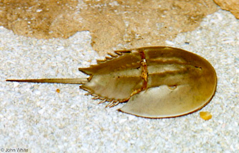

---
aliases:
- atlanti tőrfarkú rák
- Atlantic horseshoe crab
- Atlantiese hoefysterkrap
- Atlantik atnalı yengəci
- Atlantikoko ferra-karramarroa
- Atlantische degenkrab
- atlantska podkvasta rakovica
- Belangkas Atlantik
- Cangrejo herradura
- Cassola de l'Atlàntic
- Dolkhale
- dolksvans
- limulo polifema
- Limulus
- Limulus polyphemus
- Limulus_polyphemus
- Límulo
- molukkirapu
- Odasaba
- ostrorep americký
- rak bodljaš
- Skrzypłocz
- мечоопашат рак
- סרטן פרסת-סוס אטלנטי
- خرچنگ نعلی
- سلطعون حدوة الحصان الاطلسى
- അരശുഞണ്ട്
- แมงดาแอตแลนติก
- アメリカカブトガニ
- 美洲鱟
- 美洲鲎
- 대서양투구게
title: Limulus polyphemus
has_id_wikidata: Q1133152
dv_has_:
  name_:
    af: Atlantiese hoefysterkrap
    arz: سلطعون حدوة الحصان الاطلسى
    ast: Limulus polyphemus
    az: Atlantik atnalı yengəci
    bg: мечоопашат рак
    ca: Cassola de l'Atlàntic
    ceb: Limulus
    cs: ostrorep americký
    da: Dolkhale
    de: Limulus polyphemus
    en: Atlantic horseshoe crab
    eo: limulo polifema
    es: Cangrejo herradura
    et: Odasaba
    eu: Atlantikoko ferra-karramarroa
    fa: خرچنگ نعلی
    fi: molukkirapu
    fr: Limulus polyphemus
    ga: Limulus polyphemus
    gl: Limulus polyphemus
    he: סרטן פרסת-סוס אטלנטי
    hr: rak bodljaš
    hu: atlanti tőrfarkú rák
    id: Belangkas Atlantik
    ig: Atlantic horseshoe crab
    it: Limulus polyphemus
    ja: アメリカカブトガニ
    ko: 대서양투구게
    la: Limulus polyphemus
    ml: അരശുഞണ്ട്
    ms: Belangkas Atlantik
    mul: Limulus polyphemus
    nl: Atlantische degenkrab
    pl: Skrzypłocz
    pt: Límulo
    ro: Limulus polyphemus
    ru: Limulus polyphemus
    sl: atlantska podkvasta rakovica
    sq: Limulus polyphemus
    sr: Limulus polyphemus
    sr-ec: Limulus polyphemus
    sr-el: Limulus polyphemus
    sv: dolksvans
    th: แมงดาแอตแลนติก
    uk: Limulus polyphemus
    vi: Limulus polyphemus
    war: Limulus polyphemus
    zh: 美洲鱟
    zh-hans: 美洲鲎
    zh-hant: 美洲鱟
    zh-hk: 美洲鱟
---
## Phylogeny 

-   « Ancestral Groups  
    -   [Limuloidea](../Limuloidea.md)
    -   [Horseshoe_Crab](../../Horseshoe_Crab.md)
    -  [Arthropoda](../../../../Arthropoda.md) 
    -  [Bilateria](../../../../../Bilateria.md) 
    -  [Animals](../../../../../../Animals.md) 
    -  [Eukarya](../../../../../../../Eukarya.md) 
    -   [Tree of Life](../../../../../../../Tree_of_Life.md)

-   ◊ Sibling Groups of  Limuloidea
    -   Limulus polyphemus

-   » Sub-Groups 

# Limulus polyphemus 

## #has_/text_of_/abstract 

> The Atlantic horseshoe crab (**Limulus polyphemus**), 
> also known as the American horseshoe crab, is a species of horseshoe crab, 
> a kind of marine and brackish chelicerate arthropod. 
> 
> It is found in the Gulf of Mexico and along the Atlantic coast of North America. 
> The main area of annual migration is Delaware Bay along the South Jersey Delaware Bayshore.
>
> Their eggs were eaten by Native Americans, 
> but today Atlantic horseshoe crabs are caught for use as fishing bait, 
> in biomedicine (especially for Limulus amebocyte lysate) and science. 
> 
> They play a major role in the local ecosystems, 
> with their eggs providing an important food source for shorebirds, 
> and the juveniles and adults being eaten by sea turtles.
>
> The other three extant (living) species in the family Limulidae 
> are also called horseshoe crabs, but they are restricted to Asia. 
> 
> Despite the name, horseshoe crabs are more closely related to arachnids 
> like spiders and scorpions than they are to crabs or other crustaceans.
>
> [Wikipedia](https://en.wikipedia.org/wiki/Atlantic%20horseshoe%20crab) 

### Information on the Internet

-   [The Horseshoe Crab](http://www.horseshoecrab.org/). Ecological
    Research and Development Group (ERDG).
-   [Horseshoe Crab](http://www.ocean.udel.edu/horseshoecrab/).
    University of Delaware Sea Grant College Program.

## Title Illustrations

------------------- 
 
scientific_name ::    Limulus polyphemus
location ::          Washington D.C., USA
Source Collection   [CalPhotos](http://calphotos.berkeley.edu/)
copyright ::           © 2000 [John White](mailto:reptiles@erols.com)

## Confidential Links & Embeds: 

### #is_/same_as :: [[/_Standards/bio/bio~Domain/Eukarya/Animal/Bilateria/Arthropoda/Chelicerata/Horseshoe_Crab/Limuloidea/Limulus_polyphemus|Limulus_polyphemus]] 

### #is_/same_as :: [[/_public/bio/bio~Domain/Eukarya/Animal/Bilateria/Arthropoda/Chelicerata/Horseshoe_Crab/Limuloidea/Limulus_polyphemus.public|Limulus_polyphemus.public]] 

### #is_/same_as :: [[/_internal/bio/bio~Domain/Eukarya/Animal/Bilateria/Arthropoda/Chelicerata/Horseshoe_Crab/Limuloidea/Limulus_polyphemus.internal|Limulus_polyphemus.internal]] 

### #is_/same_as :: [[/_protect/bio/bio~Domain/Eukarya/Animal/Bilateria/Arthropoda/Chelicerata/Horseshoe_Crab/Limuloidea/Limulus_polyphemus.protect|Limulus_polyphemus.protect]] 

### #is_/same_as :: [[/_private/bio/bio~Domain/Eukarya/Animal/Bilateria/Arthropoda/Chelicerata/Horseshoe_Crab/Limuloidea/Limulus_polyphemus.private|Limulus_polyphemus.private]] 

### #is_/same_as :: [[/_personal/bio/bio~Domain/Eukarya/Animal/Bilateria/Arthropoda/Chelicerata/Horseshoe_Crab/Limuloidea/Limulus_polyphemus.personal|Limulus_polyphemus.personal]] 

### #is_/same_as :: [[/_secret/bio/bio~Domain/Eukarya/Animal/Bilateria/Arthropoda/Chelicerata/Horseshoe_Crab/Limuloidea/Limulus_polyphemus.secret|Limulus_polyphemus.secret]] 

