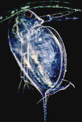
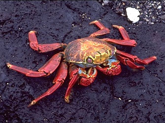
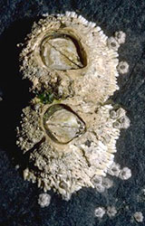

---
aliases:
- Chʼosh bikágí dantłʼizí
- Cramennog
- Crostacei
- Crustacea
- crustacean
- crustaceans
- crustacee
- crustacis
- Crustacèu
- crustacé
- Crustaseo
- Crustáceo
- crustáceos
- crústach
- dwaarsloper
- Gegereka
- Id bu-wwqqcur
- Kabuklular
- Kah-khak-lūi
- Kevjal
- korýši
- Kraaben
- Krabbadýr
- Krabechtige
- krebsdyr
- Krebstiere
- Kreeftachtigen
- Kreefte
- krepsdyr
- Kresteneg
- Krestennek
- Kriftachtign
- Kriibsen
- Krustaceo
- krustacoj
- Krustasea
- Krustazeo
- krustaċej
- Krustentier
- Krustentiere
- kräftdjur
- Kôrovce
- marisko
- Qaraqruyuwa
- Qisqichbaqasimonlar
- raki
- rakovi
- rapuelleeh
- reabbáeallit
- rákok
- Skaaldier
- skorupiaki
- Soqoleeyyii (Crustacean)
- Tiruca
- vähilaadsed
- Vēžveidīgie
- Vėžiagyviai
- Xərçəngkimilər
- äyriäiset
- động vật giáp xác
- Καρκινοειδή
- кысласыманнар
- Мыдзбырхуызтæ
- Рак евĕрли
- Рак сымалдар
- ракападобныя
- ракови
- ракообразни
- ракообразные
- ракоподібні
- Рӓк ганьывлӓ
- Шаянтәрізділер
- Ҡыҫала
- խեցգետնանմաններ
- סרטנאים
- سختپوستان
- قابؽق لیلار
- قشريات
- قشریات
- كلک پوستى ژوي
- क्रस्टेशिया
- ஓடுடைய இனங்கள்
- ക്രസ്റ്റേഷ്യൻ
- ครัสเตเชียน
- ပူ
- კიბოსნაირნი
- 甲壳亚门
- 甲殻類
- 甲殼亞門
- 甲殼動物
- 갑각아문
has_id_wikidata: Q25364
Biology_Online_Biology_Dictionary_entry: crustacean
Commons_category: Crustacea
described_by_source:
- '[[../../../../../../WikiData/WD~Brockhaus_and_Efron_Encyclopedic_Dictionary,602358]]'
- '[[_Standards/WikiData/WD~Encyclopædia_Britannica_11th_edition,867541]]'
- '[[_Standards/WikiData/WD~New_International_Encyclopedia,1029706]]'
- '[[_Standards/WikiData/WD~Q2041543,2041543]]'
- '[[_Standards/WikiData/WD~Armenian_Soviet_Encyclopedia,2657718]]'
- '[[_Standards/WikiData/WD~The_Encyclopedia_Americana,19085957]]'
- '[[_Standards/WikiData/WD~Small_Brockhaus_and_Efron_Encyclopedic_Dictionary,19180675]]'
EPPO_Code: 1CRUSQ
GS1_GPC_code: 10005450
Iconclass_notation: 25F716
image: http://commons.wikimedia.org/wiki/Special:FilePath/Crustacea%20diversity.jpg
instance_of: '[[_Standards/WikiData/WD~taxon,16521]]'
ITIS_TSN: 83677
Krugosvet_article: biologiya/rakoobraznye
MeSH_tree_code: B01.050.500.131.365
montage_image: http://commons.wikimedia.org/wiki/Special:FilePath/Crustacea%20collage.png
OmegaWiki_Defined_Meaning: 799
parent_taxon: '[[_Standards/WikiData/WD~Pancrustacea,671280]]'
start_time: -511000000-01-01
studied_by: '[[_Standards/WikiData/WD~carcinology,2183296]]'
taxon_common_name:
- krepsdyr
- Kreeftachtigen
- skorupiaki
- ракообразные
- raki
- Krebstiere
taxon_name: Crustacea
taxon_rank: '[[_Standards/WikiData/WD~subphylum,1153785]]'
this_taxon_is_source_of: '[[_Standards/WikiData/WD~shellfish,6501235]]'
title: Crustacea
topic_s_main_category: '[[_Standards/WikiData/WD~Q8922920,8922920]]'
topic_s_main_Wikimedia_portal: '[[_Standards/WikiData/WD~Portal_Crustaceans,20630742]]'
Wikidata_property: time in the pouch
dv_has_:
  name_:
    af: Skaaldier
    an: Crustacea
    ar: قشريات
    arz: قشريات
    ast: Crustacea
    az: Xərçəngkimilər
    azb: قابؽق لیلار
    ba: Ҡыҫала
    bar: Crustacea
    be: ракападобныя
    be-tarask: ракападобныя
    bg: ракообразни
    br: Kresteneg
    bs: Rakovi
    ca: crustacis
    ceb: Crustacea
    co: Crustacea
    cs: korýši
    cv: Рак евĕрли
    cy: Cramennog
    da: krebsdyr
    de: Krebstiere
    de-at: Crustacea
    de-ch: Krebstiere
    el: Καρκινοειδή
    en: Crustacea
    en-ca: Crustacean
    en-gb: Crustacean
    en-us: Crustacean
    eo: krustacoj
    es: crustáceos
    et: vähilaadsed
    eu: Krustazeo
    ext: Crustacea
    fa: سختپوستان
    fi: äyriäiset
    fr: crustacé
    frp: Crustacea
    frr: Kraaben
    fur: Crustacea
    ga: crústach
    gd: Crustacea
    gl: crustáceos
    gsw: Crustacea
    he: סרטנאים
    hi: क्रस्टेशिया
    hr: Rakovi
    hu: rákok
    hy: խեցգետնանմաններ
    ia: Crustacea
    id: Krustasea
    ie: Crustacea
    io: Krustaceo
    is: Krabbadýr
    it: Crostacei
    ja: 甲殻類
    jv: Crustacea
    ka: კიბოსნაირნი
    kab: Tiruca
    kg: Crustacea
    kk: Шаянтәрізділер
    ko: 갑각아문
    ku: Kevjal
    kw: Krestennek
    ky: Рак сымалдар
    la: Crustacea
    lb: Kriibsen
    lfn: Crustaseo
    li: Krabechtige
    lij: Crustacea
    lt: Vėžiagyviai
    lv: Vēžveidīgie
    mg: Crustacea
    min: Crustacea
    mk: ракови
    ml: ക്രസ്റ്റേഷ്യൻ
    mrj: Рӓк ганьывлӓ
    ms: Krustasea
    mt: krustaċej
    mul: Crustacea
    nan: Kah-khak-lūi
    nap: Crustacea
    nb: krepsdyr
    nds: Kreefte
    nds-nl: dwaarsloper
    nl: kreeftachtigen
    nn: krepsdyr
    nrm: Crustacea
    nv: Chʼosh bikágí dantłʼizí
    nys: Crustacea
    oc: Crustacèu
    om: Soqoleeyyii (Crustacean)
    os: Мыдзбырхуызтæ
    pap: marisko
    pcd: Crustacea
    pl: skorupiaki
    pms: Crustacea
    ps: كلک پوستى ژوي
    pt: crustáceo
    pt-br: Crustáceo
    qu: Qaraqruyuwa
    rm: Crustacea
    ro: crustacee
    ru: ракообразные
    sc: Crustacea
    scn: Crustacea
    sco: crustacean
    se: reabbáeallit
    sh: rakovi
    shi: Id bu-wwqqcur
    shn: ပူ
    sk: Kôrovce
    sl: raki
    smn: rapuelleeh
    sq: Crustacea
    sr: ракови
    sv: kräftdjur
    sw: Gegereka
    ta: ஓடுடைய இனங்கள்
    th: ครัสเตเชียน
    tl: Crustacea
    tr: Kabuklular
    tt: кысласыманнар
    uk: ракоподібні
    ur: قشریات
    uz: Qisqichbaqasimonlar
    vec: Crustacea
    vi: động vật giáp xác
    vls: Kriftachtign
    vo: Crustacea
    wa: Crustacea
    war: Crustacea
    wo: Crustacea
    wuu: 甲壳亚门
    yue: 甲殼動物
    zh: 甲壳亚门
    zh-cn: 甲壳亚门
    zh-hans: 甲壳亚门
    zh-tw: 甲殼亞門
    zu: Crustacea
---
# [[Crustacea]]

Crabs, lobsters, shrimp, barnacles, sow bugs, etc. 

     

#is_/same_as :: [[../../../../../../WikiData/WD~Crustacea,25364|WD~Crustacea,25364]]  

## #has_/text_of_/abstract 

> **Crustacea**ns (from Latin meaning: "those with shells" or "crusted ones") 
> are invertebrate animals that constitute one group of arthropods 
> that are traditionally a part of the subphylum Crustacea, 
> a large, diverse group of mainly aquatic arthropods including decapods 
> (shrimps, prawns, crabs, lobsters and crayfish), seed shrimp, branchiopods, fish lice, krill, 
> remipedes, isopods, barnacles, copepods, opossum shrimps, amphipods and mantis shrimp. 
> 
> The crustacean group can be treated as a subphylum under the clade Mandibulata. 
> 
> It is now well accepted that the hexapods (insects and entognathans) emerged deep in the Crustacean group, 
> with the completed pan-group referred to as Pancrustacea. 
> 
> The three classes Cephalocarida, Branchiopoda and Remipedia are more closely related to the hexapods 
> than they are to any of the other crustaceans (oligostracans and multicrustaceans).
>
> The 67,000 described species range in size from Stygotantulus stocki at 0.1 mm (0.004 in), 
> to the Japanese spider crab with a leg span of up to 3.8 m (12.5 ft) and a mass of 20 kg (44 lb). 
> 
> Like other arthropods, crustaceans have an exoskeleton, which they moult to grow. 
> They are distinguished from other groups of arthropods, 
> such as insects, myriapods and chelicerates, by the possession of biramous (two-parted) limbs, 
> and by their larval forms, such as the nauplius stage of branchiopods and copepods.
>
> Most crustaceans are free-living aquatic animals, but some are terrestrial (e.g. woodlice, sandhoppers), 
> some are parasitic (e.g. Rhizocephala, fish lice, tongue worms) and some are sessile (e.g. barnacles). 
> 
> The group has an extensive fossil record, reaching back to the Cambrian. 
> More than 7.9 million tons of crustaceans per year are harvested by fishery or farming for human consumption, 
> consisting mostly of shrimp and prawns. 
> 
> Krill and copepods are not as widely fished, but may be the animals with the greatest biomass on the planet, 
> and form a vital part of the food chain. 
> 
> The scientific study of crustaceans is known as carcinology 
> (alternatively, malacostracology, crustaceology or crustalogy), 
> and a scientist who works in carcinology is a carcinologist.
>
> [Wikipedia](https://en.wikipedia.org/wiki/Crustacean) 

### Information on the Internet

-   [crustacea.net](http://crustacea.net/index.htm). An information retrieval system for crustaceans of the world. Australian Museum online.
-   [The Crustacean Society](http://www.vims.edu/tcs/)
-   [Crustacea at the Natural History Museum of Los Angeles     County](http://crustacea.nhm.org/).
-   [Marine Crustaceans of Southern     Australia](http://www.museum.vic.gov.au/crust/page1a.html). Museum Victoria.

## Phylogeny 

-   « Ancestral Groups  
    -  [Arthropoda](../Arthropoda.md) 
    -  [Bilateria](../../Bilateria.md) 
    -  [Animals](../../../Animals.md) 
    -  [Eukarya](../../../../Eukarya.md) 
    -   [Tree of Life](../../../../Tree_of_Life.md)

-   ◊ Sibling Groups of  Arthropoda
    -  [Hexapoda](Hexapoda.md) 
    -   Crustacea
    -  [Pauropoda](Myriapoda/Pauropoda.md) 
    -  [Diplopoda](Myriapoda/Diplopoda.md) 
    -  [Centipede](Myriapoda/Centipede.md) 
    -  [Symphyla](Myriapoda/Symphyla.md) 
    -  [Arachnida](Chelicerata/Arachnida.md) 
    -   [Sea_Scorpion](Chelicerata/Sea_Scorpion.md)
    -   [Horseshoe_Crab](Chelicerata/Horseshoe_Crab.md)
    -   [Sea_Spider](Chelicerata/Sea_Spider.md)
    -  [Trilobites](Trilobites.md) 

-   » Sub-Groups
    -  [Branchiopoda](Crustacea/Branchiopoda.md) 
    -  [Remipedia](Crustacea/Remipedia.md) 
    -  [Cephalocarida](Crustacea/Cephalocarida.md) 
    -  [Copepoda](Crustacea/Copepoda.md) 
    -  [Ostracoda](Crustacea/Ostracoda.md) 
    -  [Branchiura](Crustacea/Branchiura.md) 
    -  [Thecostraca](Crustacea/Thecostraca.md) 
    -  [Malacostraca](Crustacea/Malacostraca.md) 

## Title Illustrations

-   Water flea, Daphnia pulex (Branchiopoda, Cladocera).\
    Photograph by Jean-François Cornuet, copyright ©
    [BIODIDAC](http://biodidac.bio.uottawa.ca/).
) 
-   Sally Lightfoot crab, Grapsus grapsus (Malacostraca,
    Decapoda). Punta Espinosa (Ecuador).\
    Photograph by Gerald and Buff Corsi, courtesy
    [CalPhotos](http://elib.cs.berkeley.edu/photos/), copyright © 2001
    [California Academy of Sciences](mailto:manzanita@calacademy.org).
 
-   Barnacle, Semibalanus cariosus (Thecostraca, Cirripedia).  Ketchikan
    (Alaska, US).\
    Photograph by Gerald and Buff Corsi, courtesy
    [CalPhotos](http://elib.cs.berkeley.edu/photos/), copyright © 1999
    [California Academy of Sciences](mailto:manzanita@calacademy.org).
	 

## Confidential Links & Embeds: 

### #is_/same_as :: [[/_Standards/bio/bio~Domain/Eukarya/Animal/Bilateria/Arthropoda/Crustacea|Crustacea]] 

### #is_/same_as :: [[/_public/bio/bio~Domain/Eukarya/Animal/Bilateria/Arthropoda/Crustacea.public|Crustacea.public]] 

### #is_/same_as :: [[/_internal/bio/bio~Domain/Eukarya/Animal/Bilateria/Arthropoda/Crustacea.internal|Crustacea.internal]] 

### #is_/same_as :: [[/_protect/bio/bio~Domain/Eukarya/Animal/Bilateria/Arthropoda/Crustacea.protect|Crustacea.protect]] 

### #is_/same_as :: [[/_private/bio/bio~Domain/Eukarya/Animal/Bilateria/Arthropoda/Crustacea.private|Crustacea.private]] 

### #is_/same_as :: [[/_personal/bio/bio~Domain/Eukarya/Animal/Bilateria/Arthropoda/Crustacea.personal|Crustacea.personal]] 

### #is_/same_as :: [[/_secret/bio/bio~Domain/Eukarya/Animal/Bilateria/Arthropoda/Crustacea.secret|Crustacea.secret]] 

