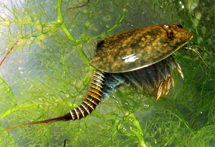

---
aliases:
Commons_category: Branchiopoda
described_by_source:
  - "[[../../../../../../../WikiData/WD~Brockhaus_and_Efron_Encyclopedic_Dictionary,602358]]"
  - "[[_Standards/WikiData/WD~Meyers_Konversations_Lexikon,_4th_edition_(1885_1890),19219752]]"
EPPO_Code: 1BRANC
has_id_wikidata: Q188360
image:
  - http://commons.wikimedia.org/wiki/Special:FilePath/Triops%20longicaudatus.jpg
  - http://commons.wikimedia.org/wiki/Special:FilePath/Branchiopoda%20collage%202x2.png
instance_of: "[[_Standards/WikiData/WD~taxon,16521]]"
ITIS_TSN: 83687
taxon_common_name:
  - ramenonožci
  - Kieuwpootkreeften
taxon_name: Branchiopoda
taxon_rank: "[[_Standards/WikiData/WD~class,37517]]"
title: Branchiopoda
UMLS_CUI: C0596222
---

# [[Branchiopoda]] 

)

#is_/same_as :: [[../../../../../../../WikiData/WD~Branchiopoda,188360|WD~Branchiopoda,188360]] 

## #has_/text_of_/abstract 

> **Branchiopoda**, from Ancient Greek βράγχια (bránkhia), meaning "gill", and πούς (poús), meaning "foot", is a class of crustaceans. It comprises fairy shrimp, clam shrimp, Diplostraca (or Cladocera), Notostraca, the Devonian Lepidocaris and possibly the Cambrian Rehbachiella. They are mostly small, freshwater animals that feed on plankton and detritus.
>
> [Wikipedia](https://en.wikipedia.org/wiki/Branchiopoda) 

### Information on the Internet

-   [Cladocera](http://www.cladocera.uoguelph.ca/). Chad Rowe and Paul Hebert.

## Phylogeny 

-   « Ancestral Groups  
    -  [Crustacea](../Crustacea.md) 
    -  [Arthropoda](../../Arthropoda.md) 
    -  [Bilateria](../../../Bilateria.md) 
    -  [Animals](../../../../Animals.md) 
    -  [Eukarya](../../../../../Eukarya.md) 
    -   [Tree of Life](../../../../../Tree_of_Life.md)

-   ◊ Sibling Groups of  Crustacea
    -   Branchiopoda
    -  [Remipedia](Remipedia.md) 
    -  [Cephalocarida](Cephalocarida.md) 
    -  [Copepoda](Copepoda.md) 
    -  [Ostracoda](Ostracoda.md) 
    -  [Branchiura](Branchiura.md) 
    -  [Thecostraca](Thecostraca.md) 
    -  [Malacostraca](Malacostraca.md) 

-   » Sub-Groups
    -  [Anostraca](Branchiopoda/Anostraca.md) 

## Title Illustrations

--------------------- 
)
Scientific Name ::     Lepidurus packardi
Location ::           Shasta County, California, USA
Comments             Tadpole shrimp
Specimen Condition   Live Specimen
Source Collection    [CalPhotos](http://calphotos.berkeley.edu/)
Copyright ::            © 1999 [William Leonard](mailto:mollusca1@attbi.com)

## Confidential Links & Embeds: 

### #is_/same_as :: [Branchiopoda](/_Standards/bio/bio~Domain/Eukarya/Animal/Bilateria/Arthropoda/Crustacea/Branchiopoda.md) 

### #is_/same_as :: [Branchiopoda.public](/_public/bio/bio~Domain/Eukarya/Animal/Bilateria/Arthropoda/Crustacea/Branchiopoda.public.md) 

### #is_/same_as :: [Branchiopoda.internal](/_internal/bio/bio~Domain/Eukarya/Animal/Bilateria/Arthropoda/Crustacea/Branchiopoda.internal.md) 

### #is_/same_as :: [Branchiopoda.protect](/_protect/bio/bio~Domain/Eukarya/Animal/Bilateria/Arthropoda/Crustacea/Branchiopoda.protect.md) 

### #is_/same_as :: [Branchiopoda.private](/_private/bio/bio~Domain/Eukarya/Animal/Bilateria/Arthropoda/Crustacea/Branchiopoda.private.md) 

### #is_/same_as :: [Branchiopoda.personal](/_personal/bio/bio~Domain/Eukarya/Animal/Bilateria/Arthropoda/Crustacea/Branchiopoda.personal.md) 

### #is_/same_as :: [Branchiopoda.secret](/_secret/bio/bio~Domain/Eukarya/Animal/Bilateria/Arthropoda/Crustacea/Branchiopoda.secret.md)

